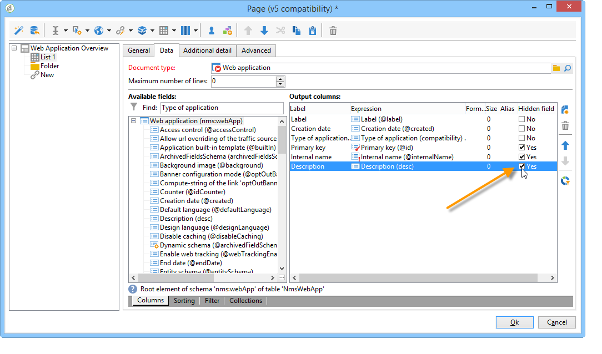

# Casi di utilizzo: creare pagine di panoramica{#use-cases-creating-overviews}


Nell&#39;esempio seguente verranno create applicazioni Web di tipo panoramica per visualizzare tutte le applicazioni Web del database. Configura i seguenti elementi:

* un filtro sulla cartella (fare riferimento a [Aggiunta di un filtro su una cartella](#adding-a-filter-on-a-folder)),
* un pulsante per la creazione di una nuova applicazione Web (fare riferimento a [Aggiunta di un pulsante per configurare una nuova applicazione Web](#adding-a-button-to-configure-a-new-web-application)),
* visualizzazione dei dettagli per ogni voce dell&#39;elenco (consultare [Aggiunta di dettagli a un elenco](#adding-detail-to-a-list)),
* un filtro per ogni strumento di modifica dei collegamenti (fare riferimento a [Creazione di un filtro tramite un editor di collegamenti](#creating-a-filter-using-a-link-editor)),
* un collegamento di aggiornamento (fare riferimento a [Creazione di un collegamento di aggiornamento](#creating-a-refresh-link)).


## Creazione di un&#39;applicazione Web a pagina singola {#creating-a-single-page-web-application}

1. Creare una singola applicazione Web **[!UICONTROL Page]** e disabilitare le transizioni in uscita e le transizioni alla pagina successiva.

   

1. Changing the page title.

   This title will appear in the overview header and in the Web application overview.

1. Nelle proprietà dell&#39;applicazione Web, modificare il rendering dell&#39;applicazione selezionando il modello **[!UICONTROL Single-page Web application]**.

   

1. Aprire l&#39;attività **[!UICONTROL Page]** dell&#39;applicazione Web e aprire un elenco (**[!UICONTROL Static element > List]**).
1. Nella scheda **[!UICONTROL Data]** dell&#39;elenco, selezionare il tipo di documento **[!UICONTROL Web applications]** e le colonne di output **[!UICONTROL Label]** , **[!UICONTROL Creation date]** e **[!UICONTROL Type of application]**.
1. Nella scheda secondaria **[!UICONTROL Filter]**, crea il filtro seguente come mostrato di seguito per visualizzare solo le applicazioni Web ed escludere i modelli dalla visualizzazione.

   

1. Chiudere la finestra di configurazione della pagina e fare clic su **[!UICONTROL Preview]**.

   Viene visualizzato l&#39;elenco delle applicazioni Web disponibili nel database.

   

## Aggiunta di un filtro a una cartella {#adding-a-filter-on-a-folder}

In una panoramica, puoi scegliere di accedere ai dati a seconda della loro posizione nella struttura Adobe Campaign. Questo è un filtro su una cartella. Applica il seguente processo per aggiungerlo alla panoramica.

1. Posizionare il cursore sul nodo **[!UICONTROL Page]** dell&#39;applicazione Web e aggiungere un elemento **[!UICONTROL Select folder]** (**[!UICONTROL Advanced controls > Select folder]**).
1. Nella finestra **[!UICONTROL Storage]** visualizzata, fare clic sul collegamento **[!UICONTROL Edit variables]**.
1. Modifica l’etichetta della variabile in base alle tue esigenze.
1. Modifica il nome della variabile con il valore **folder**.

   >[!NOTE]
   >
   >Il nome della variabile deve corrispondere al nome dell&#39;elemento collegato alla cartella (definito nello schema), ovvero **cartella** in questo caso. È necessario riutilizzare questo nome quando si fa riferimento alla tabella.

1. Applica il tipo **[!UICONTROL XML]** alla variabile.

   

1. Selezionare l&#39;interazione **[!UICONTROL Refresh page]**.

   

1. Posizionare il cursore nell&#39;elenco e nella scheda **[!UICONTROL Advanced]** fare riferimento alla variabile creata in precedenza nella scheda **[!UICONTROL Folder filter XPath]** dell&#39;elenco. È necessario utilizzare il nome dell&#39;elemento interessato dal collegamento alla cartella, ovvero **cartella**.

   

   >[!NOTE]
   >
   >In questa fase, l’applicazione web non rientra nel suo contesto applicativo, pertanto il filtro non può essere testato sulla cartella.

## Adding a button to configure a new Web application {#adding-a-button-to-configure-a-new-web-application}

1. Place your cursor on the **[!UICONTROL Page]** element and add a link (**[!UICONTROL Static elements > Link]**).
1. Modify the link label since it will appear on the button in the overview.

   Nel nostro esempio, l&#39;etichetta è **New**.

1. Inserire l&#39;URL seguente nel campo URL: **xtk://open/?schema=nms:webApp&amp;form=nms:newWebApp**.

   >[!NOTE]
   >
   >**nms:webApp** coincide con lo schema dell&#39;applicazione Web.
   >
   >**nms:newWebApp** coincide con il nuovo assistente per la creazione di applicazioni Web.

1. Scegli di visualizzare l’URL nella stessa finestra.
1. Aggiungere l&#39;icona dell&#39;applicazione Web nel campo immagine: **/nms/img/webApp.png**.

   Questa icona verrà visualizzata sul pulsante **[!UICONTROL New]**.

1. Immetti **pulsante** nel campo **[!UICONTROL Style]**.

   Questo stile è indicato nel modello **[!UICONTROL Single-page Web application]** selezionato in precedenza.

   

## Aggiunta di dettagli a un elenco {#adding-detail-to-a-list}

Quando configuri un elenco nella panoramica, puoi scegliere di visualizzare ulteriori dettagli per ogni voce dell’elenco.

1. Posizionare il cursore sull&#39;elemento elenco creato in precedenza.
1. Nella scheda **[!UICONTROL General]**, selezionare la modalità di visualizzazione **[!UICONTROL Columns and additional detail]** nell&#39;elenco a discesa.

   

1. In the **[!UICONTROL Data]** tab, add the **[!UICONTROL Primary key]** , **[!UICONTROL Internal name]** and **[!UICONTROL Description]** column and select the **[!UICONTROL Hidden field]** option for each one.

   

   This way, this information will only be visible in the detail of each entry.

1. In the **[!UICONTROL Additional detail]** tab, add the following code:

   ```
   <div class="detailBox">
     <div class="actionBox">
       <span class="action"><a title="Open" class="linkAction" href="xtk://open/?schema=nms:webApp&form=nms:webApp&pk=
       <%=webApp.id%>">Open...</a></span>
       <% 
       if( webApp.@appType == 1 ) { //survey
       %>
       <span class="action"><a target="_blank" title="Reports" class="linkAction" href="/xtk/report.jssp?_context=selection&
         _schema=nms:webApp&_selection=<%=webApp.@id%>
         &__sessiontoken=<%=document.controller.getSessionToken()%>">Reports</a></span>
       <% 
       } 
       %>
     </div>
     <div>
       Internal name: <%= webApp.@internalName %>
     </div>
     <%
     if( webApp.desc != "" )
     {
     %>
     <div>
       Description: <%= webApp.desc %>
     </div>
     <% 
     } 
     %>
   </div>
   ```

>[!NOTE]
>
>JavaScript libraries take five minutes to refresh on the server. È possibile riavviare il server per evitare di attendere questo ritardo.

## Filtraggio e aggiornamento dell’elenco {#filtering-and-updating-the-list}

In questa sezione verrà creato un filtro per visualizzare la panoramica delle applicazioni Web create da un operatore specifico. Questo filtro viene creato con un editor di collegamenti. Dopo aver selezionato un operatore, aggiorna l’elenco per applicare il filtro; è necessario creare un collegamento di aggiornamento.

Questi due elementi saranno raggruppati nello stesso contenitore per essere raggruppati graficamente nella panoramica.

1. Posizionare il cursore sull&#39;elemento **[!UICONTROL Page]** e selezionare **[!UICONTROL Container > Standard]**.
1. Impostare il numero di colonne su **2**, in modo che l&#39;editor dei collegamenti e il collegamento siano adiacenti.

   

   Per informazioni sul layout degli elementi, fare riferimento a [questa sezione](about-web-forms.md).

1. Applica **dottedFilter**.

   Questo stile è indicato nel modello **[!UICONTROL Single-page Web application]** selezionato in precedenza.

   

### Creazione di un filtro tramite un editor di collegamenti {#creating-a-filter-using-a-link-editor}

1. Posiziona il cursore sul contenitore creato durante la fase precedente e inserisci un editor di collegamenti tramite il menu **[!UICONTROL Advanced controls]**.
1. Nella finestra di archiviazione che si apre automaticamente, selezionare l&#39;opzione **[!UICONTROL Variables]**, quindi fare clic sul collegamento **[!UICONTROL Edit variables]** e creare una variabile XML per filtrare i dati.

   

1. Modifica l’etichetta.

   Verrà visualizzato accanto al campo **[!UICONTROL Filter]** nella panoramica.

1. Scegliere la tabella Operatore come schema dell&#39;applicazione.

   

1. Posizionare il cursore sull&#39;elemento elenco e creare un filtro tramite la scheda **[!UICONTROL Data > Filter]**:

   * **Espressione:** Chiave esterna del collegamento &#39;Creato da&#39;
   * **Operatore:** è uguale a
   * **Valore:** Variabili (variabili)
   * **Taken into account if:** &#39;$(var2/@id)&#39;!=&#39;&#39;

   

>[!CAUTION]
>
>The Web application user must be an identified operator with the appropriate Adobe Campaign rights to access the information. This type of configuration will not work for anonymous Web applications.

### Creazione di un collegamento di aggiornamento {#creating-a-refresh-link}

1. Posizionare il cursore sul contenitore e inserire **[!UICONTROL Link]** tramite il menu **[!UICONTROL Static elements]**.
1. Modifica l’etichetta.
1. Seleziona **[!UICONTROL Refresh data in a list]**.
1. Aggiungi l’elenco creato in precedenza.

   

1. Aggiungere l&#39;icona di aggiornamento nel campo **[!UICONTROL Image]**: **/xtk/img/refresh.png**.
1. Utilizzando le frecce di ordinamento, riorganizzare i vari elementi dell&#39;applicazione Web come illustrato di seguito.

   

L&#39;applicazione Web è ora configurata. Fare clic sulla scheda **[!UICONTROL Preview]** per visualizzarne l&#39;anteprima.


