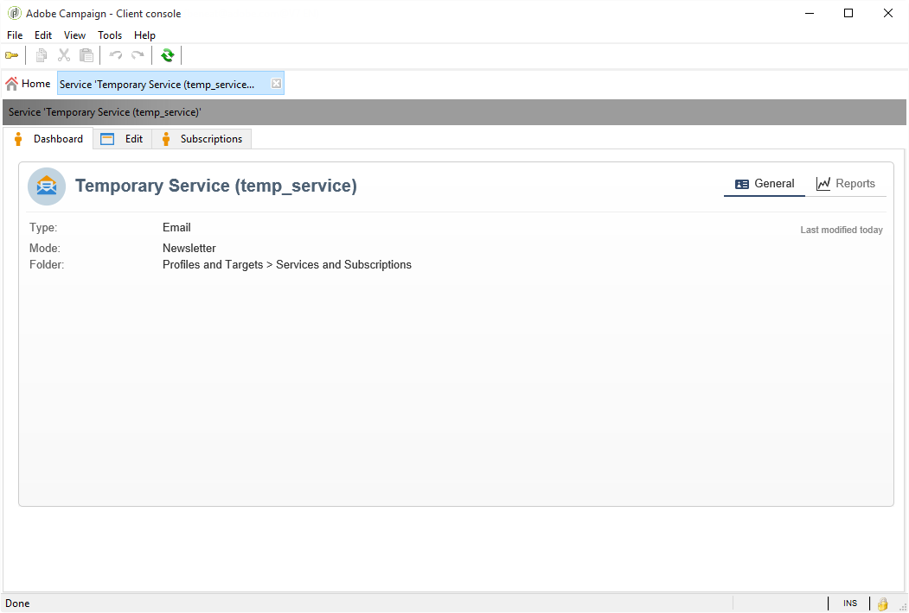
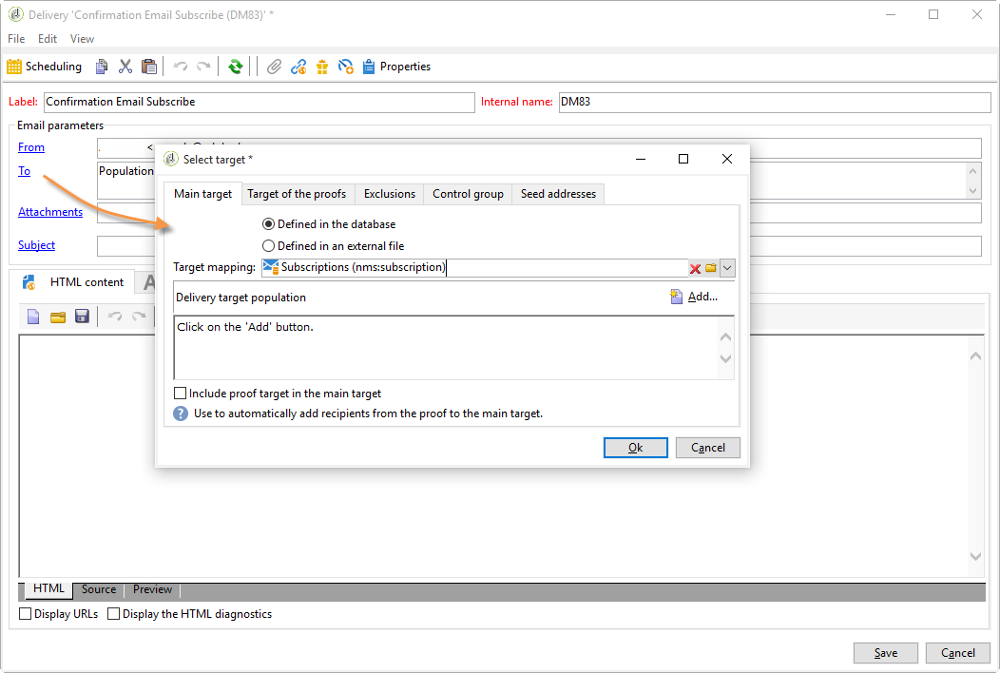
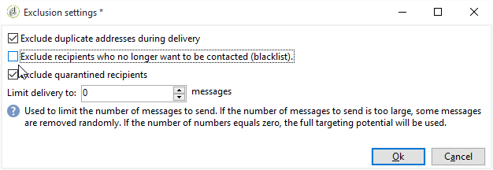
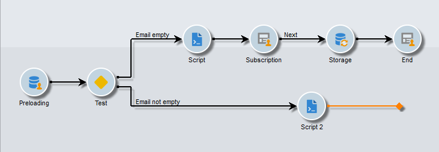

# Casi d’uso: moduli web{#use-cases-web-forms}


## Creare un modulo di abbonamento con doppio consenso {#create-a-subscription--form-with-double-opt-in}

Quando offri servizi di informazione, i destinatari devono iscriversi per ricevere tutte le comunicazioni collegate. Per evitare comunicazioni improprie e assicurarti che il destinatario si sia iscritto intenzionalmente, ti consigliamo di inviare una richiesta di conferma dell’abbonamento per creare un doppio consenso. L’abbonamento sarà effettivo solo dopo che l’utente avrà fatto clic sul collegamento incluso nel messaggio di conferma.

Questo esempio si basa sullo scenario seguente:

1. Creazione di un modulo di abbonamento a una newsletter su un sito Web che contiene una casella di controllo per l’abbonamento a un servizio temporaneo. Questo servizio consente di inviare messaggi di conferma dell&#39;abbonamento.
1. Creazione della consegna di conferma dell’abbonamento con un modello di consegna collegato al modulo web. Contiene il collegamento di conferma che richiama il modulo per l’abbonamento alla newsletter e visualizza un messaggio di approvazione dell’abbonamento.

### Passaggio 1: creazione di servizi informativi {#step-1---creating-information-services}

1. Crea il servizio di abbonamento alla newsletter da offrire ai destinatari. Per ulteriori informazioni su come creare una newsletter, consulta [questa sezione](../../delivery/using/about-services-and-subscriptions.md).

   

1. Crea un secondo servizio di informazioni, un servizio temporaneo collegato a un modello di consegna per inviare messaggi di conferma dell’abbonamento.

   

### Passaggio 2: creazione di messaggi di conferma {#step-2---creating-confirmation-messages}

I messaggi di conferma vengono inviati tramite un modello di consegna dedicato a cui si fa riferimento a livello di servizio temporaneo.

1. In **[!UICONTROL Explorer]** , seleziona **[!UICONTROL Resources > Templates > Delivery templates]**.
1. Crea un modello di consegna per l’invio dei messaggi di conferma dell’abbonamento.
1. Fai clic su **[!UICONTROL To]** pulsante in **[!UICONTROL Email parameters]** per associare il modello di consegna al mapping di destinazione Sottoscrizioni anziché Destinatari.

   

1. Poiché i destinatari di questa consegna non hanno confermato la loro approvazione, si trovano ancora nel inserisco nell&#39;elenco Bloccati di database di. Affinché possano ricevere questa comunicazione, devi autorizzare le consegne basate su questo modello per eseguire il targeting dei destinatari in base al inserisco nell&#39;elenco Bloccati di.

   A questo scopo, fai clic su **[!UICONTROL Exclusions]** scheda.

1. Fai clic su **[!UICONTROL Edit...]** collega e deseleziona la **[!UICONTROL Exclude recipients who no longer want to be contacted]** opzione.

   <!-- -->

   >[!IMPORTANT]
   >
   >Questa opzione può essere disabilitata solo in questo tipo di contesto.

1. Personalizza la consegna e inserisci il collegamento di conferma nel contenuto del messaggio. Questo collegamento consente di accedere al modulo Web per registrare la conferma dell&#39;abbonamento.

   

1. Con il DCE, collega l’URL al modulo web. Poiché il modulo Web non è ancora stato creato, sostituisci il valore non appena lo crei.

   

1. Infine, collega questo modello al servizio temporaneo creato in precedenza.

   

### Passaggio 3: creazione del modulo di abbonamento {#step-3---creating-the-subscription-form}

Il modulo Web abilita sia la sottoscrizione del destinatario che la conferma della sottoscrizione.

Il flusso di lavoro del modulo web includerà le seguenti attività:


A questo scopo, segui la procedura indicata di seguito:

1. Creare un modulo Web e scegliere il modello **[!UICONTROL Newsletter subscription (subNewsletter)]**.

   

1. In **[!UICONTROL Edit]** , è necessario configurare il flusso di lavoro esistente perché si desidera aggiungere un messaggio di conferma ai destinatari che desiderano abbonarsi.

   A tale scopo, fare doppio clic sul pulsante **[!UICONTROL Preloading]** e configurarlo come segue.

   

   Ciò significa che se l’utente accede al modulo tramite il collegamento presente nel messaggio di conferma, le informazioni sul profilo verranno caricate. Se accedono al modulo web tramite una pagina del sito web, non verrà caricata alcuna informazione.

1. Aggiungi un **[!UICONTROL Test]** al flusso di lavoro.

   

   Il **[!UICONTROL Test]** L’attività può riguardare l’e-mail del destinatario. In questo caso, configuralo come segue:

   

1. Aggiungi due **[!UICONTROL Script]** attività nel flusso di lavoro.

   

   Il primo **[!UICONTROL Script]** l’attività aggiungerà i destinatari a elenco Bloccati fino a quando non confermeranno il loro abbonamento alla newsletter. Il suo contenuto deve essere il seguente:

   ```
   ctx.recipient.@blackList=1
   ```

   

   Il secondo **[!UICONTROL Script]** l’attività autorizza l’invio delle consegne agli utenti e li iscrive alla newsletter. Le ultime due righe dello script ti consentiranno di trasferire i destinatari dalla cartella temporanea a un’altra cartella e di riconciliarli con i profili esistenti non appena avranno confermato l’abbonamento.

   ```
   ctx.recipient.@blackList=0
   nms.subscription.Subscribe("INTERNAL_NAME_OF_THE_NEWSLETTER", ctx.recipient, false)
   ctx.recipient.folder = <folder name="nmsRootRecipient"/>
   nms.subscription.Unsubscribe("TEMP", ctx.recipient)
   ```

   >[!NOTE]
   >
   >Il **[!UICONTROL Temp]** La partizione può anche essere eliminata regolarmente utilizzando un flusso di lavoro.

   

1. Fai doppio clic su **[!UICONTROL Subscription]** attività per personalizzare il modulo di abbonamento e collegare una casella di controllo al servizio temporaneo creato in precedenza.

   

1. Configurare **[!UICONTROL Storage]** per salvare le informazioni immesse nella pagina del modulo.

   Questa attività ti consente di creare i profili dei destinatari in una cartella temporanea dedicata per distinguerli dai profili nel database a cui possono essere inviate le comunicazioni.

   

   >[!NOTE]
   >
   >Non è necessario definire opzioni di riconciliazione.

1. Aggiungi due **[!UICONTROL End]** attività per visualizzare un messaggio per l’utente.

   Il secondo **[!UICONTROL End]** verrà visualizzato il messaggio di conferma al termine dell’abbonamento.

   

1. Una volta creato e configurato il modulo web, è ora possibile farvi riferimento nel modello di consegna per inviare messaggi di conferma.

   

### Passaggio 4: pubblicazione e verifica del modulo {#step-4---publishing-and-testing-the-form}

È ora possibile pubblicare il modulo per renderlo accessibile agli utenti.


L’abbonamento alla newsletter prevede i seguenti passaggi:

1. L’utente del sito web accede alla pagina di abbonamento e approva il modulo.

   

   Viene loro notificato tramite un messaggio nel browser che la loro richiesta è stata presa in considerazione.

   

   L’utente viene aggiunto al database di Adobe Campaign nel **[!UICONTROL Temp]** e il loro profilo è in inserita nell&#39;elenco Bloccati di conferma dell’abbonamento tramite l’e-mail.

   

1. Viene inviato loro un messaggio di conferma contenente un collegamento per approvare l’abbonamento.

   

1. Facendo clic su questo collegamento, la pagina di approvazione viene visualizzata nel browser.

   

   In Adobe Campaign, il profilo utente viene aggiornato:

   * non sono più in inserita nell&#39;elenco Bloccati di,
   * sono abbonati al servizio di informazione.

     

## Visualizzazione di opzioni diverse a seconda dei valori selezionati {#displaying-different-options-depending-on-the-selected-values}

Nell’esempio seguente, viene richiesto all’utente di selezionare un tipo di veicolo. È possibile visualizzare le categorie di veicoli disponibili in base al tipo selezionato. Ciò significa che gli elementi visualizzati nella colonna di destra dipendono dalla selezione dell’utente:


* Quando l&#39;utente seleziona &#39;veicolo privato&#39;, viene offerta la scelta tra &quot;Compatto&quot; e &quot;Minivan&quot;.

  

* Quando l’utente seleziona &quot;veicolo commerciale&quot;, viene visualizzata una selezione in un elenco a discesa:

  

In questo esempio, il tipo di veicolo non viene memorizzato nel database. L’elenco a discesa è configurato come segue:


Queste informazioni vengono memorizzate in una variabile locale.

La visualizzazione condizionale della colonna di destra è configurata nei contenitori:


* Visibilità condizionata dei campi per un veicolo privato:

  

* Visibilità condizionata dei campi per un veicolo commerciale:

  
