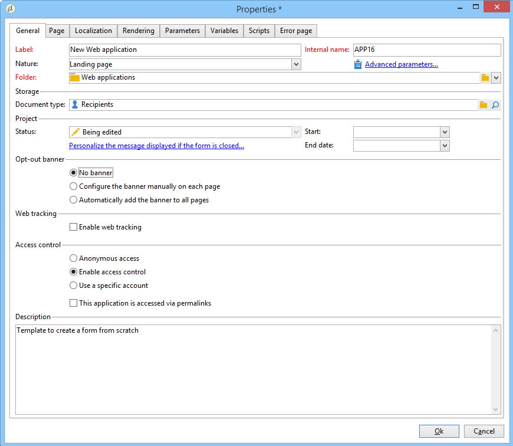

# Rinuncia al tracciamento delle applicazioni web{#web-application-tracking-opt-out}


Adobe Campaign consente di interrompere il tracciamento dei comportamenti web degli utenti finali che rinunciano al tracciamento comportamentale tramite cookie o web beacon. La funzione include la possibilità di visualizzare un banner per presentare all’utente finale tale opzione; è possibile aggiungere questi banner nelle applicazioni web o nelle pagine di destinazione.

Se un utente finale rinuncia al tracciamento comportamentale tramite cookie o web beacon, tali informazioni vengono trasmesse al server di tracciamento di Adobe Campaign con le API di JavaScript. Tieni presente che alcune giurisdizioni potrebbero richiedere che il Cliente presenti agli utenti finali un consenso prima che sia possibile offrire un rifiuto (o altri requisiti legali), ed è responsabilità del Cliente conformarsi alle leggi applicabili.

>[!NOTE]
>
>Durante la creazione degli script, seguire sempre le linee guida descritte nell&#39;[Elenco di controllo protezione e privacy](https://helpx.adobe.com/campaign/kb/acc-security.html#dev).

## Configurazione del banner {#configuring-the-banner-}

Per essere visualizzato nelle applicazioni web o nelle pagine di destinazione, è necessario configurare il banner.

Adobe Campaign viene fornito con un banner di esempio da adattare in base alle tue esigenze. Questa versione del banner viene visualizzata come un blocco di personalizzazione che si trova nella cartella del modello di contenuto. consulta la [documentazione di Campaign v8](https://experienceleague.adobe.com/docs/campaign/campaign-v8/send/personalize/personalization-blocks.html){target="_blank"}.

>[!IMPORTANT]
>
>Per creare un banner personalizzato, devi personalizzare il banner predefinito.

Per attivare il banner, è necessario configurare le proprietà dell&#39;applicazione Web. Consulta la sezione [Progettazione di un&#39;applicazione Web](designing-a-web-application.md).

Se il tracciamento web è attivato, puoi avere:

* Nessun banner.
* Configura il banner manualmente su ogni pagina: seleziona questa opzione e seleziona il banner in ogni pagina nelle proprietà della pagina.

  

* Aggiungi automaticamente il banner a tutte le pagine: seleziona il banner direttamente nelle proprietà dell&#39;applicazione Web.

  

>[!NOTE]
>
>È disponibile una modalità di compatibilità per l&#39;applicazione Web v5 con lo stesso comportamento.

Il banner predefinito ha la seguente struttura:

```
<div onClick="NL.ClientWebTracking.closeOptOutBanner(this);" id="defaultOptOutBanner">
  <p>Please insert your message here
   <a onClick="NL.ClientWebTracking.allow();" class="optout-accept">Accept</a>
   <a onClick="NL.ClientWebTracking.forbid();" class="optout-decline">Refuse</a>
  </p>
</div>
      
```

È necessario sostituire **Inserire qui il messaggio** con il blocco contenente le informazioni di tracciamento. Questa sostituzione deve essere eseguita nel nuovo blocco di personalizzazione relativo al banner di rinuncia.

Il banner viene consegnato con un CSS specifico. Tuttavia, è possibile sovrascrivere gli stili durante la creazione e la configurazione di una pagina Web. Consulta [questa pagina](content-editor-interface.md).

## Impostazione del cookie di rinuncia tramite API {#setting-the-opt-out-cookie-using-api}

Adobe Campaign viene fornito con API che ti consentono di gestire il valore dei cookie e di recuperare le preferenze dell’utente.

Il nome del cookie è **acoptout**. I valori comuni sono:

* 0: l’utente ha consentito il tracciamento web (valore predefinito)
* 1: l’utente ha vietato il tracciamento web
* null: l&#39;utente non ha scelto, ma il tracciamento Web è consentito in quanto è il valore predefinito

Le API lato client disponibili per personalizzare il banner sono:

* **NL.ClientWebTracking.allow()**: imposta il valore del cookie di rinuncia per consentire il tracciamento Web. Il tracciamento web è consentito per impostazione predefinita.
* **NL.ClientWebTracking.forbid()**: imposta il valore del cookie di rinuncia per impedire il tracciamento Web. Il tracciamento web richiede che un input dell’utente sia vietato.
* **NL.ClientWebTracking.closeOptOutBanner(bannerDomElt)**: chiude il banner del cookie di rinuncia dopo che l&#39;utente ha fatto clic sul pulsante Accetta o Rifiuta. (durante la fase di bubbling dell’evento clic)

  bannerDomElt {DOMElement} l&#39;elemento DOM principale del banner del cookie da rimuovere

* **NL.ClientWebTracking.hasUserPrefs()**: restituisce true se l&#39;utente ha scelto le proprie preferenze per il tracciamento Web.
* **NL.ClientWebTracking.getUserPrefs()**: restituisce il valore del cookie di rinuncia che definisce le preferenze dell&#39;utente.

Se devi scrivere un JSSP, sono disponibili le API lato server:

* **NL.ServerWebTracking.generateOptOutBanner(escapeJs)**: genera il markup per il banner di rinuncia da inserire nella pagina JSSP

  **escapeJs{Boolean}**: true quando il markup generato deve essere escape per essere utilizzato in JavaScript.

  Restituisce il HTML del markup del banner di rinuncia da stampare nella pagina.

* **NL.ServerWebTracking._displayOptOutBanner()**

  Restituisce &quot;true&quot; se il banner di rinuncia deve essere visualizzato dopo che l’amministratore ha selezionato un banner di rinuncia

  Questo codice viene richiamato quando l’amministratore ha già scelto di utilizzare il banner di rinuncia al tracciamento web.

  Se l&#39;utente non ha ancora scelto di essere tracciato, il banner deve essere visualizzato.

* **NL.ServerWebTracking.renderOptOutBanner(escapeJs)**

  Esegue il rendering del markup per il banner di rinuncia inserendolo nella pagina JSSP. Viene chiamato così com&#39;è in Jssp tra &lt;% %>

  **escapeJs{Boolean}**: true quando il markup generato deve essere escape per essere utilizzato in JavaScript

Esempio JSSP:

```
<%@ page import="/nl/core/shared/nl.js" %>
<!doctype html>
<%
NL.require('/nl/core/shared/webTracking.js');
NL.client.require('/nl/core/shared/webTracking.js');
%>
<html>
<head>
<%==NL.client.deps()%>
</head>

<body>

<!-- TEST USING SERVER API IN JSSP -->
<% 
var webTracking = new NL.ServerWebTracking(request, 'optOutBanner');
webTracking.renderOptOutBanner();
%>

<!-- TEST USING SERVER API IN A SCRIPT -->
<!--
<% 
var webTracking = new NL.ServerWebTracking(request, 'optOutBanner');
%>
<script>var el = document.createElement('div'); el.innerHTML =  "<% webTracking.renderOptOutBanner(true); %>";document.body.appendChild(el);</script>
-->

<!-- TEST OF THE CLIENT API -->
<!--
<div onClick="NL.ClientWebTracking.closeOptOutBanner(this);" id="defaultOptOutBanner">
  <p>Please insert your message here
   <a onClick="NL.ClientWebTracking.allow();" class="optout-accept">Accept</a>
   <a onClick="NL.ClientWebTracking.forbid();" class="optout-decline">Refuse</a>
  </p>
</div>
-->
</body>
</html>
```
