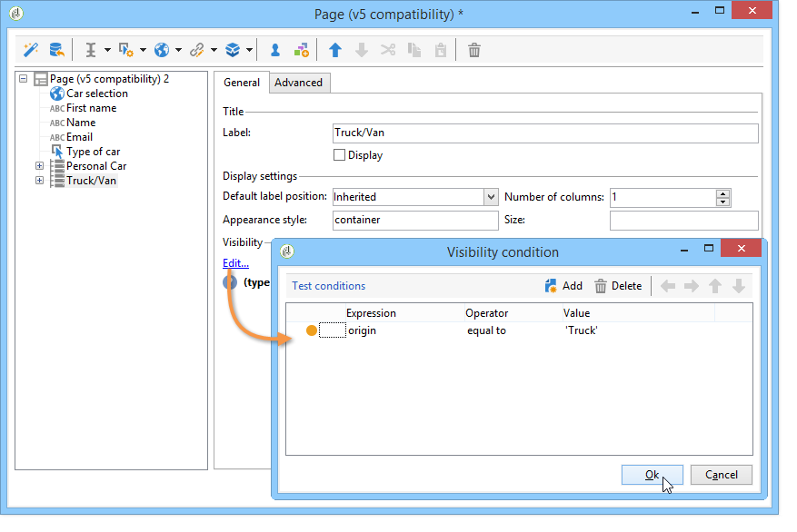

# Risposte ai moduli web{#web-forms-answers}


## Campi di archiviazione delle risposte {#response-storage-fields}

Le risposte ai moduli possono essere salvate temporaneamente in un campo del database o in una variabile locale. La modalità di archiviazione delle risposte viene scelta durante la creazione del campo. Può essere modificato tramite il collegamento **[!UICONTROL Edit storage...]**.

Per ogni campo di input di un modulo sono disponibili le seguenti opzioni di archiviazione:


* **[!UICONTROL Edit a recipient]**

  È possibile selezionare un campo del database: le risposte degli utenti verranno memorizzate in questo campo. Per ogni utente, viene salvato solo l&#39;ultimo valore immesso: viene aggiunto al profilo: fare riferimento a [Memorizzazione dei dati nel database](#storing-data-in-the-database).

* **[!UICONTROL Variable]**

  Se non si desidera memorizzare informazioni nel database, è possibile utilizzare una variabile. Le variabili locali possono essere dichiarate a monte. Fare riferimento a [Memorizzazione dei dati in una variabile locale](#storing-data-in-a-local-variable).

### Memorizzazione dei dati nel database {#storing-data-in-the-database}

Per salvare i dati in un campo esistente del database, fare clic sull&#39;icona **[!UICONTROL Edit expression]** e selezionarla dall&#39;elenco dei campi disponibili.


>[!NOTE]
>
>Il documento di riferimento predefinito è lo schema **nms:recipient**. Per visualizzarlo o sceglierne uno nuovo, selezionare il modulo dall&#39;elenco e fare clic sul pulsante **[!UICONTROL Properties]**.

### Memorizzazione dei dati in una variabile locale {#storing-data-in-a-local-variable}

È possibile utilizzare le variabili locali in modo che, anche se i dati non sono memorizzati nel database, possano essere riutilizzati nella pagina o nelle altre pagine, ad esempio per inserire condizioni nella visualizzazione di un campo o per personalizzare un messaggio.

Ciò significa che puoi utilizzare il valore di un campo non salvato per autorizzare la visualizzazione di un gruppo di opzioni sulla pagina. Nella pagina seguente, il tipo di veicolo non è memorizzato nella banca dati:


Viene memorizzato in una variabile che deve essere selezionata al momento della creazione della casella a discesa o tramite il collegamento **[!UICONTROL Edit storage...]**.


Puoi visualizzare le variabili esistenti e crearne di nuove tramite il collegamento **[!UICONTROL Edit variables...]**. Fare clic sul pulsante **[!UICONTROL Add]** per creare una nuova variabile.


La variabile aggiunta sarà disponibile nell’elenco delle variabili locali quando vengono creati i campi di input della pagina.

>[!NOTE]
>
>Per ogni modulo è possibile creare variabili a monte. A tale scopo, selezionare il modulo e fare clic sul pulsante **[!UICONTROL Properties]**. La scheda **[!UICONTROL Variables]** contiene le variabili locali per il modulo.

**Esempio di archiviazione locale con condizionamento**

Nell&#39;esempio precedente, il contenitore che include i dati relativi ai veicoli privati viene visualizzato solo se l&#39;opzione **[!UICONTROL Private]** è selezionata dall&#39;elenco a discesa, come indicato nella condizione di visibilità:


Se l’utente seleziona un veicolo privato, il modulo web offre le seguenti opzioni:


Il contenitore contenente i dati relativi ai veicoli commerciali sarà visualizzato se si seleziona l&#39;opzione Professionista, come espresso nella condizione di visibilità:



Ciò significa che, se l’utente seleziona un veicolo commerciale, il modulo offre le seguenti opzioni:


## Utilizzo delle informazioni raccolte {#using-collected-information}

Per ogni modulo, le risposte fornite possono essere riutilizzate nei campi o nelle etichette. Devono essere utilizzate le seguenti sintassi:

* Per un contenuto memorizzato in un campo del database:

  ```
  <%=ctx.recipient.@field name%
  ```

* Per un contenuto archiviato in una variabile locale:

  ```
  <%= ctx.vars.variable name %
  ```

* Per un contenuto memorizzato in un campo di testo HTML:

  ```
  <%== HTML field name %
  ```

  >[!NOTE]
  >
  >A differenza degli altri campi per i quali `<%=` caratteri vengono sostituiti con caratteri di escape, il contenuto HTML viene salvato così com&#39;è utilizzando la sintassi `<%==`.

## Salvataggio delle risposte ai moduli Web {#saving-web-forms-answers}

Per salvare le informazioni raccolte nelle pagine di un modulo, è necessario inserire una casella di memorizzazione nel diagramma.


Esistono due modi per utilizzare questa casella:

* Se il modulo Web è accessibile tramite un collegamento inviato in un messaggio di posta elettronica e l&#39;utente che accede all&#39;applicazione si trova già nel database, è possibile selezionare l&#39;opzione **[!UICONTROL Update the preloaded record]**. Per ulteriori informazioni, consulta [Consegna di un modulo tramite e-mail](publishing-a-web-form.md#delivering-a-form-via-email).

  In questo caso, Adobe Campaign utilizza la chiave primaria crittografata del profilo utente, un identificatore univoco assegnato a ciascun profilo da Adobe Campaign. È necessario configurare le informazioni da precaricare tramite la casella di precaricamento. Per ulteriori informazioni, consulta [Precaricamento dei dati del modulo](publishing-a-web-form.md#pre-loading-the-form-data).

  >[!CAUTION]
  >
  >Questa opzione sostituisce i dati utente, incluso l’indirizzo e-mail se è presente un campo in cui immetterlo. Non può essere utilizzato per creare nuovi profili e richiede l’utilizzo di una casella di precaricamento nel modulo.

* Per arricchire i dati dei destinatari nel database, modifica la casella di archiviazione e seleziona la chiave di riconciliazione. Per uso interno (in genere un sistema Intranet) o per un modulo utilizzato per creare nuovi profili, ad esempio, puoi selezionare i campi di riconciliazione. Nella casella sono disponibili tutti i campi del database utilizzati nelle varie pagine dell&#39;applicazione Web:

  

Per impostazione predefinita, i dati vengono importati nel database da un&#39;operazione **[!UICONTROL Update or insertion]**: se esiste nel database, l&#39;elemento viene aggiornato (ad esempio, la newsletter selezionata o l&#39;indirizzo e-mail inserito). Se non esiste, le informazioni vengono aggiunte.

Tuttavia, è possibile modificare questo comportamento. A questo scopo, seleziona la radice dell’elemento e l’operazione da eseguire dall’elenco a discesa:


Puoi selezionare una cartella di ricerca per la riconciliazione e la cartella di creazione per i nuovi profili. Se questi campi sono vuoti, i profili vengono cercati e creati nella cartella predefinita dell’operatore.

>[!NOTE]
>
>Operazioni possibili: **[!UICONTROL Simple reconciliation]**, **[!UICONTROL Update or insertion]**, **[!UICONTROL Insertion]**, **[!UICONTROL Update]**, **[!UICONTROL Deletion]**.\
>La cartella predefinita dell&#39;operatore è la prima cartella per la quale l&#39;operatore dispone dell&#39;autorizzazione di scrittura.\
>Fai riferimento a [questa sezione](../../platform/using/access-management.md).
