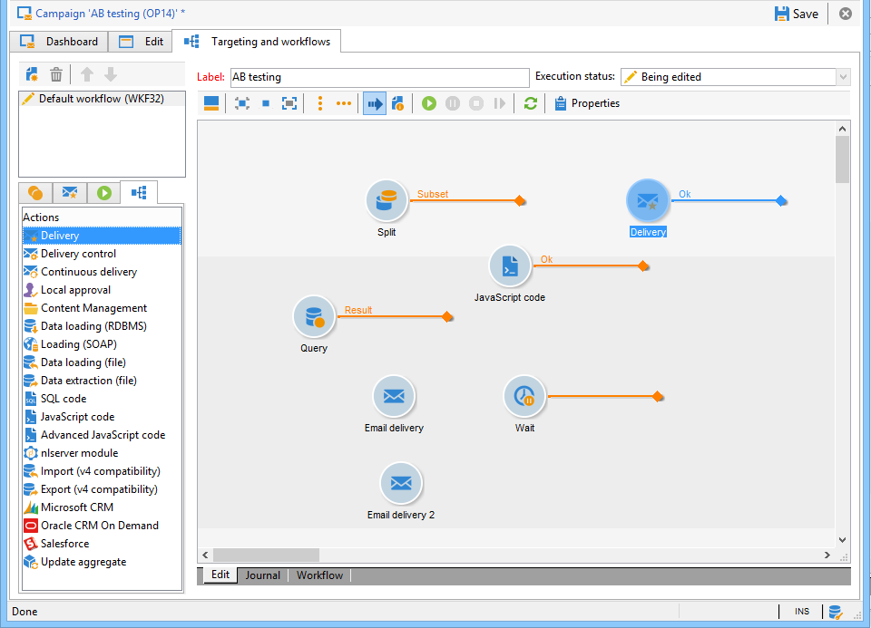
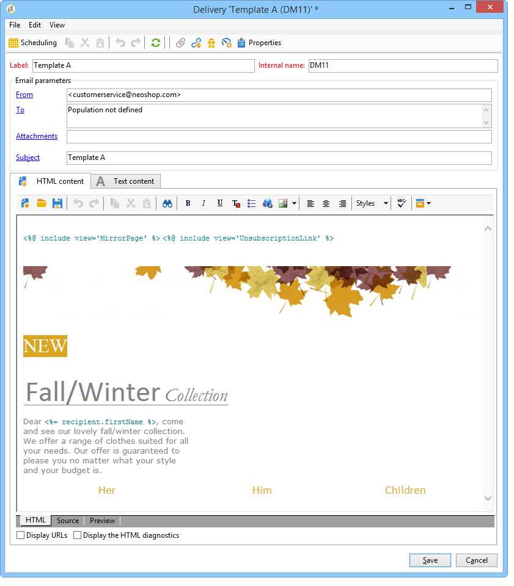

# Test A/B{#a-b-testing}

Se disponete di diversi contenuti per la consegna di un&#39;e-mail e desiderate scoprire quale versione avrà il maggiore impatto sulla popolazione di destinazione, potete inviare le diverse versioni ad alcuni dei vostri destinatari, quindi selezionare quello con il tasso di successo più alto e inviarlo agli altri destinatari.

In questo caso di utilizzo, confronteremo due contenuti di distribuzione delle e-mail tramite un flusso di lavoro di targeting. Il messaggio e il testo sono identici in entrambe le consegne: cambia solo il layout.

La popolazione interessata è divisa in tre parti: due gruppi di test e la popolazione rimanente. A ogni gruppo di test viene inviata una versione diversa della consegna. Dopo la consegna, viene configurato un periodo di attesa di 5 giorni prima di raccogliere i risultati delle migliori tariffe aperte. Il contenuto della distribuzione con il punteggio più alto viene quindi recuperato da uno script e inviato alla popolazione che non è stata utilizzata come gruppo di test.

Si prega di notare che i criteri che decideranno quale consegna è migliore possono essere modificati per soddisfare le vostre esigenze. Può trattarsi del tasso di apertura, del tasso di click-through, del tasso di sottoscrizione, della reattività, ecc.

Inoltre, il test dettagliato in questo caso d&#39;uso riguarda solo due consegne, ma potete testare tutte le versioni necessarie. È sufficiente aggiungere attività al flusso di lavoro.

Per creare il test A/B, eseguite i seguenti passaggi:

* [Passaggio 1: Creazione di un flusso di lavoro di targeting](#step-1--creating-a-targeting-workflow)
* [Passaggio 2: Configurazione dei campioni di popolazione](#step-2--configuring-population-samples)
* [Passaggio 3: Creazione di due modelli di consegna](#step-3--creating-two-delivery-templates)
* [Passaggio 4: Configurazione delle consegne nel flusso di lavoro](#step-4--configuring-the-deliveries-in-the-workflow)
* [Passaggio 5: Creazione dello script](#step-5--creating-the-script)
* [Passaggio 7: Avvio del flusso di lavoro](#step-7--starting-the-workflow)
* [Passaggio 8: Analisi del risultato](#step-8--analyzing-the-result).

## Passaggio 1: Creazione di un flusso di lavoro di targeting {#step-1--creating-a-targeting-workflow}

È necessario creare il flusso di lavoro nella scheda **[!UICONTROL Targeting and Workflows]** di una campagna. È composta da un&#39;attività **[!UICONTROL Query]**, un&#39;attività **[!UICONTROL Split]** collegata a due attività **[!UICONTROL Email delivery]**, un&#39;attività **[!UICONTROL Wait]**, un&#39;attività **[!UICONTROL JavaScript code]** e un&#39;attività **[!UICONTROL Delivery]**.

1. Se non lo avete ancora fatto, create una campagna (per ulteriori informazioni, fate riferimento a questa [sezione](../../campaign/using/setting-up-marketing-campaigns.md#creating-a-campaign)).

   

1. Vai alla scheda **[!UICONTROL Targeting and Workflows]**. 

   

1. Modificate l&#39;etichetta del flusso di lavoro esistente o fate clic su **[!UICONTROL Add]** per crearne uno nuovo (per ulteriori informazioni, consultate questa [sezione](../../campaign/using/marketing-campaign-deliveries.md#selecting-the-target-population)).

   

1. Utilizzare il mouse per trascinare le attività nel diagramma del flusso di lavoro, inclusa una **[!UICONTROL Query]** (**[!UICONTROL Target]** scheda), una **[!UICONTROL Split]** (**[!UICONTROL Target]** scheda), due **[!UICONTROL Email deliveries]** (**[!UICONTROL Deliveries]** scheda), un&#39;attività **[!UICONTROL Wait]** (**[!UICONTROL Flow Control]** scheda), un&#39;attività **[!UICONTROL JavaScript code]** (**[!UICONTROL Actions]** scheda) e una &lt;a110/> attività (**[!UICONTROL Actions]** scheda).**[!UICONTROL Delivery]**



## Passaggio 2: Configurazione dei campioni popolazione {#step-2--configuring-population-samples}

### Configurazione dell&#39;attività Query {#configuring-the-query-activity}

* Fate doppio clic sull&#39;attività **[!UICONTROL Query]**.

   

* Fare clic sul collegamento **[!UICONTROL Edit query]** e selezionare i destinatari desiderati.

   

* Collegate l&#39;attività **[!UICONTROL Query]** all&#39;attività **[!UICONTROL Split]**.

   

### Configurazione dell&#39;attività divisa {#configuring-the-split-activity}

Questa attività consente di creare diverse popolazioni: quella che riceve la consegna A, quella che riceve la consegna B, e la popolazione rimanente. Utilizzando la selezione casuale è possibile eseguire il targeting di una parte della popolazione di ciascuna consegna.

1. Creazione popolazione A:

   * Fate doppio clic sull&#39;attività **[!UICONTROL Split]**.

      

   * Nella scheda esistente, modificare l&#39;etichetta nella popolazione A.

      

   * Selezionare l&#39;opzione **[!UICONTROL Limit the selected records]**.

      

   * Fare clic sul collegamento **[!UICONTROL Edit]**, selezionare **[!UICONTROL Activate random sampling]**, quindi fare clic su **[!UICONTROL Next]**.

      

   * Impostate la soglia su 10%, quindi fate clic su **[!UICONTROL Finish]**.

      

1. Creazione popolazione B:

   * Fare clic su **[!UICONTROL Add]** per creare una nuova scheda per la popolazione B.

      

   * Limitare la popolazione al 10% come in precedenza.

      

1. Creazione della popolazione rimanente:

   * Vai alla scheda **[!UICONTROL General]**. 

      

   * Seleziona **[!UICONTROL Generate complement]**.

      

   * Modificate l&#39;etichetta per specificare che la popolazione non include né A né B, quindi fate clic su **[!UICONTROL OK]** per chiudere l&#39;attività.

      

## Passaggio 3: Creazione di due modelli di consegna {#step-3--creating-two-delivery-templates}

Ora vogliamo creare due modelli di consegna. A ogni modello verrà fatto riferimento in un&#39;attività **[!UICONTROL Email delivery]** collegata all&#39;attività **[!UICONTROL Split]**. Per ulteriori informazioni, consulta questa [sezione](../../delivery/using/about-templates.md).

1. Andate alla cartella **[!UICONTROL Resources > Delivery template]**.
1. Duplica il modello di consegna **[!UICONTROL Email]**.

   

1. Create il contenuto da utilizzare per la consegna A.

   

1. Ripetete questa procedura per creare un modello per la consegna B.

   

## Passaggio 4: Configurazione delle consegne nel flusso di lavoro {#step-4--configuring-the-deliveries-in-the-workflow}

Il passo successivo consiste nel configurare le consegne. Sono destinati alle tre popolazioni create nella fase precedente: [Passaggio 2: Configurazione dei campioni popolazione](#step-2--configuring-population-samples). Le prime due consegne consentono di inviare contenuti diversi alla popolazione A e B. La terza consegna è destinata alla popolazione che non ha ricevuto né A né B. Il contenuto verrà calcolato da uno script e sarà identico a A o B, a seconda di quale dei due avrà ottenuto il punteggio più alto. Dobbiamo configurare un periodo di attesa per la terza consegna, per conoscere il risultato delle consegne A e B. Questo è il motivo per cui il terzo invio include un&#39;attività **[!UICONTROL Wait]**.

1. Andate all&#39;attività **[!UICONTROL Split]** e collegate la transizione per la popolazione A a una delle consegne di e-mail già presenti nel flusso di lavoro.

   

1. Fate doppio clic sulla consegna per aprirla.
1. Utilizzando l&#39;elenco a discesa, selezionate il modello per la consegna A.

   

1. Fare clic su **[!UICONTROL Continue]** per visualizzare la consegna, quindi salvarla.

   

1. Collegate la transizione dell&#39;attività **[!UICONTROL Split]** destinata alla popolazione B alla seconda consegna tramite e-mail.

   

1. Aprite la consegna e selezionate il modello nella consegna B, quindi salvate la consegna.

   

1. Collegare la transizione destinata alla popolazione rimanente all&#39;attività **[!UICONTROL Wait]**.

   

1. Aprite l&#39;attività **[!UICONTROL Wait]** e configurate un periodo di attesa di 5 giorni.

   

1. Collegate l&#39;attività **[!UICONTROL Wait]** all&#39;attività **[!UICONTROL JavaScript code]**.

   

## Passaggio 5: Creazione dello script {#step-5--creating-the-script}

La scelta del contenuto di distribuzione destinato alla popolazione rimanente viene calcolata da uno script. Questo script recupera le informazioni relative alla distribuzione con la frequenza più elevata di aperture e copia il contenuto nella distribuzione finale.

### Esempio di script {#example-of-a-script}

Lo script seguente può essere utilizzato come nel flusso di lavoro di targeting. Per ulteriori informazioni, vedere [Implementazione](#implementation).

```
 // query the database to find the winner (best open rate)
   var winner = xtk.queryDef.create(
     <queryDef schema="nms:delivery" operation="get">
       <select>
         <node expr="@id"/>
         <node expr="@label"/>
         <node expr="[@operation-id]"/>
         <node expr="[@workflow-id]"/>
       </select>
       <where>
         <condition expr={"@FCP=0 and [@workflow-id]= " + instance.id}/>
       </where>
       <orderBy>
         <node expr="[indicators/@estimatedRecipientOpenRatio]" sortDesc="true"/>
       </orderBy>
     </queryDef>).ExecuteQuery()
   
   // create a new delivery object and initialize it by doing a copy of
   // the winner delivery
   var delivery = nms.delivery.create()
   delivery.Duplicate("nms:delivery|" + winner.@id)

   // append 'final' to the delivery label
   delivery.label = winner.@label + " final"

   // link the delivery to the operation to make sure it will be displayed in
   // the campaign dashboard. This attribute needs to be set manually here since 
   // the Duplicate() method has reset it to its default value => 0
   delivery.operation_id = winner.@["operation-id"]
   delivery.workflow_id = winner.@["workflow-id"]

   // adjust some delivery parameters to make it compatible with the 
   // "Prepare and start" option selected in the Delivery tab of this activity
   delivery.scheduling.validationMode = "manual"
   delivery.scheduling.delayed = 0
 
   // save the delivery in database
   delivery.save()
 
   // store the new delivery Id in event variables
   vars.deliveryId = delivery.id
```

Per una spiegazione dettagliata dello script, fare riferimento a [Dettagli dello script](#details-of-the-script).

### Implementazione {#implementation}

1. Aprite l&#39;attività **[!UICONTROL JavaScript code]**.
1. Copiare lo script offerto in [Esempio di script](#example-of-a-script) nella finestra **[!UICONTROL JavaScript code]**.

   

1. Nel campo **[!UICONTROL Label]**, immettere il nome dello script, ovvero

   ```
   <%= vars.deliveryId %>
   ```

   

1. Chiudere l&#39;attività **[!UICONTROL JavaScript code]**.
1. Salva il flusso di lavoro.

### Dettagli dello script {#details-of-the-script}

In questa sezione vengono descritte le varie parti dello script e la relativa modalità operativa.

* La prima parte dello script è una query. Il comando **queryDef** consente di recuperare dalla tabella **NmsDelivery** le consegne create mediante l&#39;esecuzione del flusso di lavoro di targeting e di ordinarle in base al tasso stimato di apertura, quindi le informazioni relative alla consegna con il tasso più alto di aperture vengono recuperate.

   ```
   // query the database to find the winner (best open rate)
      var winner = xtk.queryDef.create(
        <queryDef schema="nms:delivery" operation="get">
          <select>
            <node expr="@id"/>
            <node expr="@label"/>
            <node expr="[@operation-id]"/>
          </select>
          <where>
            <condition expr={"@FCP=0 and [@workflow-id]= " + instance.id}/>
          </where>
          <orderBy>
            <node expr="[indicators/@estimatedRecipientOpenRatio]" sortDesc="true"/>
          </orderBy>
        </queryDef>).ExecuteQuery()
   ```

* La distribuzione con la frequenza più elevata di aperture viene duplicata.

   ```
    // create a new delivery object and initialize it by doing a copy of
    // the winner delivery
   var delivery = nms.delivery.create()
   delivery.Duplicate("nms:delivery|" + winner.@id)
   ```

* L&#39;etichetta della consegna duplicata viene modificata e vi viene aggiunta la parola **final**.

   ```
   // append 'final' to the delivery label
   delivery.label = winner.@label + " final"
   ```

* La distribuzione viene copiata nel dashboard della campagna.

   ```
   // link the delivery to the operation to make sure it will be displayed in
   // the campaign dashboard. This attribute needs to be set manually here since 
   // the Duplicate() method has reset it to its default value => 0
   delivery.operation_id = winner.@["operation-id"]
   delivery.workflow_id = winner.@["workflow-id"]
   ```

   ```
   // adjust some delivery parameters to make it compatible with the 
   // "Prepare and start" option selected in the Delivery tab of this activity
   delivery.scheduling.validationMode = "manual"
   delivery.scheduling.delayed = 0
   ```

* La consegna viene salvata nel database.

   ```
   // save the delivery in database
   delivery.save()
   ```

* L’identificatore univoco della consegna duplicata viene memorizzato nella variabile del flusso di lavoro.

   ```
   // store the new delivery Id in event variables
   vars.deliveryId = delivery.id
   ```

### Altri criteri di selezione {#other-selection-criteria}

L&#39;esempio precedente consente di selezionare il contenuto di una consegna in base al tasso di apertura delle e-mail. Puoi adattarlo in base ad altri indicatori specifici per la consegna:

* Velocità effettiva clic ottimale: `[indicators/@recipientClickRatio]`,
* Velocità di reattività più elevata (apertura e clic dell’e-mail nel messaggio): `[indicators/@reactivity]`,
* Tasso di reclamo più basso: `[indicators/@refusedRatio]` (utilizzate il valore false per l&#39;attributo sortDesc),
* Tasso di conversione più elevato: `[indicators/@transactionRatio]`,
* Numero di pagine visitate dopo la ricezione di un messaggio: `[indicators/@totalWebPage]`,
* Tasso di annullamento sottoscrizione inferiore: `[indicators/@optOutRatio]`,
* Importo transazione: `[indicators/@amount]`.

## Passaggio 6: Definizione della consegna finale {#step-6--defining-the-final-delivery}

Una volta creato lo script per selezionare il vincitore del test A/B, è possibile definire i parametri del recapito finale.

1. Collegare l&#39;attività **[!UICONTROL JavaScript code]** all&#39;attività **[!UICONTROL Delivery]** rimanente.
1. Aprite l&#39;attività **[!UICONTROL Delivery]**.
1. Deselezionate l&#39;opzione **[!UICONTROL Generate an outbound transition]** per completare il flusso di lavoro con questa attività.
1. Lasciate le altre opzioni ai valori predefiniti.

   

Preparando la consegna specificata nella transizione (definita tramite l&#39;attività **[!UICONTROL Javascript Code]**), potrai quindi approvarla e avviare l&#39;invio, come descritto nel passaggio successivo.

## Passaggio 7: Avvio del flusso di lavoro {#step-7--starting-the-workflow}

1. Fare clic su **[!UICONTROL Start]** il flusso di lavoro.

   

1. Approvare target e contenuti per le consegne A e B tramite il dashboard della campagna.
1. Conferma la consegna.
1. Attendete fino alla fine del periodo di 5 giorni per scoprire quale contenuto è stato calcolato dopo i risultati dell&#39;apertura della consegna.

   

   In questo caso, è stato scelto il modello B.

1. Una volta determinato il contenuto della terza distribuzione, approvate la destinazione e il contenuto.

## Passaggio 8: Analisi del risultato {#step-8--analyzing-the-result}

Una volta inviate le consegne di test, potete verificare a quali destinatari sono stati inviati e se sono stati aperti o meno.

* Per scoprire quali destinatari sono stati assegnati, apri una consegna tramite il dashboard della campagna e fai clic sulla scheda **[!UICONTROL Delivery]**.

   

* Per verificare se la consegna è stata aperta, andate alla scheda **[!UICONTROL Tracking]**.

   

* Confronta con l&#39;altra consegna.

   

Nel nostro esempio, la consegna B ha ottenuto il massimo tasso di apertura. Ciò significa che il contenuto B verrà utilizzato per la distribuzione finale.


