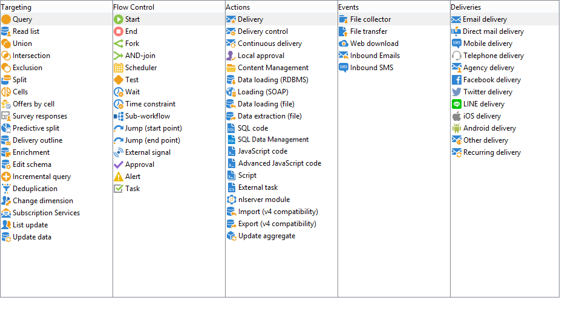

# Attività del flussi di lavoro{#wf-activities}

Questa sezione descrive tutte le attività disponibili. Le attività disponibili possono variare a seconda del nodo o del contesto in cui viene creato/modificato il flusso di lavoro. Ad esempio, i flussi di lavoro creati in una campagna presentano attività di consegna specifiche per il canale.

Le attività del flusso di lavoro sono raggruppate per categoria. Sono disponibili quattro schede contemporaneamente.

Nei flussi di lavoro della campagna, la scheda **[!UICONTROL Events]** è sostituita dalla scheda **[!UICONTROL Deliveries]**. Le attività in questa scheda sono descritte in dettaglio nella sezione [Attività azione](about-action-activities.md).

Ulteriori informazioni:

* [Informazioni sulle attività di targeting](about-targeting-activities.md)
* [Esecuzione di un flusso di lavoro](starting-a-workflow.md)
* [Best practice per i flussi di lavoro](workflow-best-practices.md)
