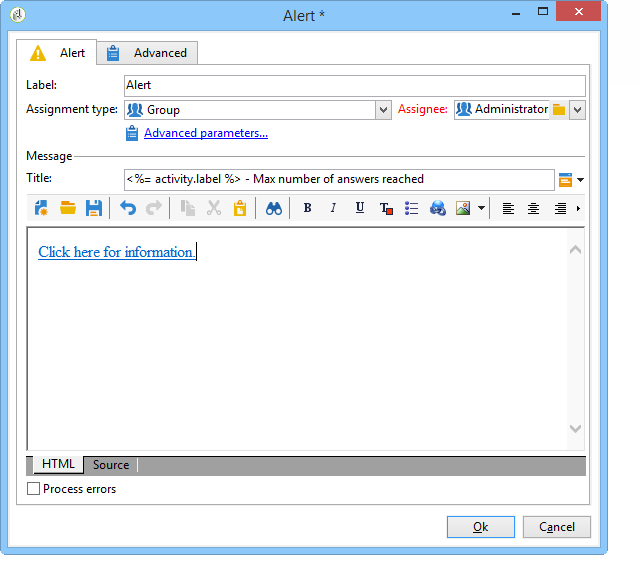

# Attività Alert{#alert}

Un&#39;attività **Alert** invia un messaggio a un gruppo di operatori. Funziona allo stesso modo di un’attività di approvazione, ma in questo caso non è prevista alcuna risposta.

Un avviso non è persistente e non è pertanto visibile dalla console. Per ricevere la notifica, gli operatori del gruppo assegnato devono disporre di un indirizzo e-mail completo. La configurazione di questa attività è simile a quella di una **approvazione**. Il modello di consegna predefinito utilizzato per avvisare gli operatori è &quot;alertAssignee&quot;.
