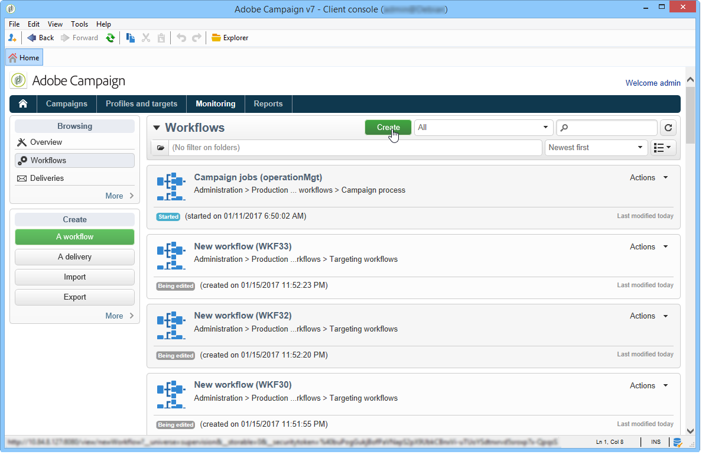
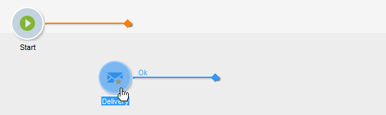
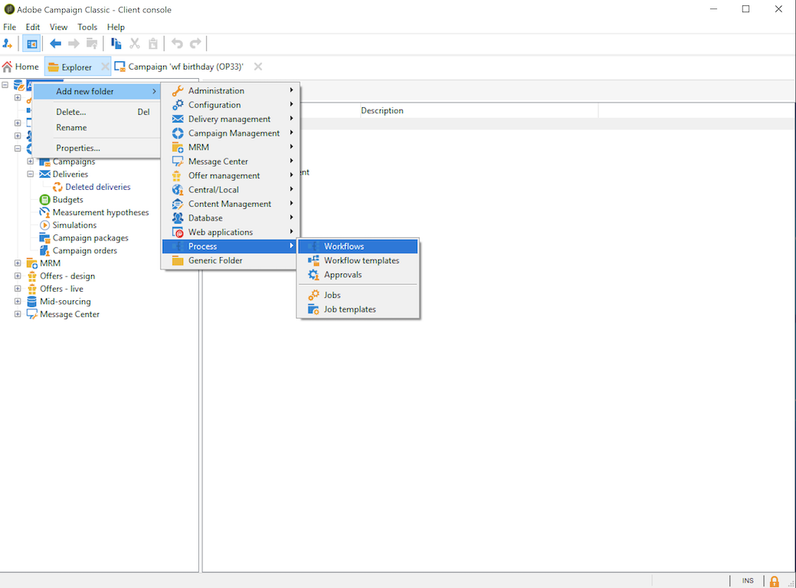

# Creare un flusso di lavoro {#building-a-workflow}

Questa sezione descrive i principi chiave e le best practice per creare un flusso di lavoro in Campaign.

* Creare un flusso di lavoro, vedi [Creazione di un nuovo flusso di lavoro](#creating-a-new-workflow)
* Progettare il diagramma del flusso di lavoro, vedere [Aggiunta e collegamento di attività](#adding-and-linking-activities)
* Accedere ai parametri e alle proprietà delle attività, vedi [Configurazione delle attività](#configuring-activities)
* Progettare flussi di lavoro di targeting, vedi [Workflow di targeting](#targeting-workflows)
* Utilizzare i flussi di lavoro per eseguire una campagna, vedi [Flussi di lavoro per campagne](#campaign-workflows)
* Accedi e crea flussi di lavoro tecnici, consulta [Flussi di lavoro tecnici](#technical-workflows)
* Utilizzare i modelli per creare flussi di lavoro, vedi [Modelli di flusso di lavoro](#workflow-templates)

## Crea un nuovo flusso di lavoro {#creating-a-new-workflow}

Dalla sezione **[!UICONTROL Explorer]**, accedere a una cartella del flusso di lavoro. Per impostazione predefinita, puoi utilizzare **[!UICONTROL Profiles and Targets]** > **[!UICONTROL Jobs]** > **[!UICONTROL Targeting workflows]**.

Fai clic su **[!UICONTROL New]** si trova sopra l’elenco dei flussi di lavoro.

In alternativa, è possibile utilizzare anche **[!UICONTROL Create]** nella panoramica del flusso di lavoro (**[!UICONTROL Monitoring]** > **[!UICONTROL Workflow]** link).

Inserisci un’etichetta e fai clic su **[!UICONTROL Save]**.

>[!NOTE]
>
>Quando modifichi il nome interno di un’attività del flusso di lavoro o del flusso di lavoro stesso, accertati di salvare il flusso di lavoro prima di chiuderlo in modo che il nuovo nome interno venga preso in considerazione correttamente.

## Aggiungere e collegare attività {#adding-and-linking-activities}

Ora devi definire le varie attività e collegarle nel diagramma. In questa fase della configurazione, è possibile visualizzare l’etichetta del diagramma e lo stato del flusso di lavoro (Modifica in corso). La sezione inferiore della finestra viene utilizzata solo per modificare il diagramma. Contiene una barra degli strumenti, una palette di attività (a sinistra) e il diagramma stesso (a destra).

>[!NOTE]
>
>Se la palette non viene visualizzata, fai clic sul primo pulsante sulla barra degli strumenti per visualizzarla.

Le attività sono raggruppate per categoria all’interno delle diverse schede della palette. Le schede e le attività disponibili possono variare a seconda del tipo di flusso di lavoro (tecnico, di targeting o del flusso di lavoro della campagna).

* La prima scheda contiene attività di targeting e manipolazione dei dati. Queste attività sono descritte in dettaglio [Attività di targeting](about-targeting-activities.md).
* La seconda scheda contiene le attività di pianificazione, utilizzate principalmente per coordinare altre attività. Queste attività sono descritte in dettaglio [Attività di controllo del flusso](about-flow-control-activities.md).
* La terza scheda contiene gli strumenti e le azioni che possono essere utilizzati nel flusso di lavoro. Queste attività sono descritte in dettaglio [Attività azione](about-action-activities.md).
* La quarta scheda contiene attività che dipendono da un dato evento, ad esempio la ricezione di un messaggio e-mail o l’arrivo di un file su un server. Queste attività sono descritte in dettaglio [Attività di eventi](about-event-activities.md).

Per creare il diagramma

1. Aggiungi un’attività selezionandola nella palette e spostandola nel diagramma con un’operazione di trascinamento della selezione.

   Aggiungi un **Inizio** attività e quindi un **Consegna** attività nel diagramma.

   

1. Collega le attività trascinando la **Inizio** transizione di attività e rilasciarla sulla **Consegna** attività.

   

   Puoi collegare automaticamente un’attività alla precedente inserendo la nuova attività alla fine della transizione.

1. Aggiungi le attività necessarie e collegale come mostrato nel diagramma seguente.

   

>[!CAUTION]
>
>Puoi copiare e incollare le attività all’interno dello stesso flusso di lavoro. Tuttavia, si sconsiglia di copiare e incollare le attività tra flussi di lavoro diversi. Alcune impostazioni associate ad attività come Consegne e Modulo di pianificazione potrebbero causare conflitti ed errori durante l’esecuzione del flusso di lavoro di destinazione. Ti consigliamo invece di  **Duplica** flussi di lavoro. Per ulteriori informazioni, consulta [Flussi di lavoro duplicati](#duplicating-workflows).

È possibile modificare la visualizzazione e il layout del grafico utilizzando i seguenti elementi:

* **Utilizzare la barra degli strumenti**

  La barra degli strumenti di modifica del diagramma consente di accedere alle funzioni di layout ed esecuzione del flusso di lavoro.

  

  Questo consente di adattare il layout dello strumento di modifica: visualizzazione della palette e panoramica, dimensioni e allineamento degli oggetti grafici.

  

  Le icone relative all’avanzamento e alla visualizzazione dei registri sono descritte in dettaglio nelle sezioni seguenti:

   * [Visualizzazione dell&#39;avanzamento](../../workflow/using/monitoring-workflow-execution.md#displaying-progress)
   * [Visualizzazione dei registri](../../workflow/using/monitoring-workflow-execution.md#displaying-logs)

* **Allineamento degli oggetti**

  Per allineare le icone, selezionarle e fare clic sul pulsante **[!UICONTROL Align vertically]** o **[!UICONTROL Align horizontally]** icona.

  Utilizza il **CTRL** chiave per selezionare più attività sparse o per deselezionare una o più attività. Fare clic sullo sfondo del diagramma per deselezionare tutto.

* **Gestione delle immagini**

  Puoi personalizzare l’immagine di sfondo del diagramma e quelle relative alle varie attività. Fai riferimento a [Modificare le immagini dell’attività](managing-activity-images.md).

## Configurare le attività {#configuring-activities}

Fai doppio clic su un’attività per configurarla oppure fai clic con il pulsante destro del mouse e seleziona **[!UICONTROL Open...]**.

>[!NOTE]
>
>Le attività del flusso di lavoro di Campaign sono descritte in dettaglio [questa sezione](about-activities.md).

La prima scheda contiene la configurazione di base. Il **[!UICONTROL Advanced]** La scheda contiene i parametri aggiuntivi, utilizzati in particolare per definire il comportamento in caso di errore, specificare la durata di esecuzione di un’attività e immettere uno script di inizializzazione.

Per comprendere meglio le attività e migliorare la leggibilità del flusso di lavoro, puoi inserire commenti nelle attività: questi verranno visualizzati automaticamente quando gli operatori scorrono l’attività.

## Flussi di lavoro di targeting {#targeting-workflows}

I flussi di lavoro di targeting consentono di creare diversi target di consegna. Grazie alle attività del flusso di lavoro, puoi creare query, definire unioni o esclusioni in base a criteri specifici, aggiungere pianificazioni. Il risultato di questo targeting può essere trasferito automaticamente a un elenco che può fungere da target delle azioni di consegna

Oltre a queste attività, le opzioni di Gestione dati consentono di manipolare i dati e di accedere a funzioni avanzate per soddisfare problemi di targeting complessi. Per ulteriori informazioni, consulta [Gestione dati](targeting-data.md#data-management).

Tutte queste attività si trovano nella prima scheda del flusso di lavoro.

>[!NOTE]
>
>Le attività di targeting sono descritte in [questa sezione](about-activities.md).

I flussi di lavoro di targeting possono essere creati e modificati tramite **[!UICONTROL Profiles and Targets > Jobs > Targeting workflows]** della struttura Adobe Campaign o tramite il **[!UICONTROL Profiles and Targets > Targeting workflows]** della home page.

I flussi di lavoro di targeting all’interno del framework di una campagna sono memorizzati con tutti i flussi di lavoro della campagna.

### Passaggi chiave per creare un flusso di lavoro di targeting {#implementation-steps-}

I passaggi per creare un flusso di lavoro di targeting sono descritti in queste sezioni:

1. **Identificare** dati nel database - Consulta [Creare le query](targeting-data.md#creating-queries)
1. **Prepara** dati per soddisfare le esigenze di consegna - Consulta [Arricchire e modificare i dati](targeting-data.md#enriching-and-modifying-data)
1. **Utilizzare** dati per eseguire aggiornamenti o all’interno di una consegna - Consulta [Aggiornare il database](how-to-use-workflow-data.md#updating-the-database)

I risultati di tutti gli arricchimenti e di tutte le operazioni eseguite durante il targeting sono memorizzati e accessibili nei campi di personalizzazione, in particolare per l’utilizzo durante la creazione di messaggi personalizzati. Per ulteriori informazioni, consulta [Dati di destinazione](data-life-cycle.md#target-data)

### Dimensioni di targeting e filtro {#targeting-and-filtering-dimensions}

Durante le operazioni di segmentazione dei dati, la chiave di targeting è mappata su una dimensione filtro. La dimensione targeting consente di definire la popolazione target dell’operazione: destinatari, beneficiari del contratto, operatore, abbonati, ecc. La dimensione filtro consente di selezionare la popolazione in base a determinati criteri: titolari di contratti, abbonati a newsletter, ecc.

Ad esempio, per selezionare i clienti che hanno sottoscritto una polizza di assicurazione vita per oltre 5 anni, seleziona la seguente dimensione di targeting: **Client** e la seguente dimensione filtro: **Titolare del contratto**. Puoi quindi definire le condizioni di filtro all’interno dell’attività di query

Durante la fase di selezione delle dimensioni di targeting, nell’interfaccia vengono offerte solo dimensioni di filtro compatibili.

Queste due dimensioni devono essere correlate. Pertanto, il contenuto **[!UICONTROL Filtering dimension]** dipende dalla dimensione di targeting specificata nel primo campo.

Ad esempio, per i destinatari (**destinatario**), saranno disponibili le seguenti dimensioni filtro:

Mentre per **Applicazioni web**, l’elenco conterrà le seguenti dimensioni di filtro:

## Flussi di lavoro della campagna {#campaign-workflows}

Per ogni campagna, puoi creare flussi di lavoro da eseguire dal **[!UICONTROL Targeting and workflows]** scheda. Questi flussi di lavoro sono specifici per la campagna.

Questa scheda contiene le stesse attività di tutti i flussi di lavoro. [Ulteriori informazioni](#implementation-steps-)

Oltre alle campagne di targeting, i flussi di lavoro delle campagne consentono di creare e configurare le consegne completamente per tutti i canali disponibili. Una volta create nel flusso di lavoro, queste consegne sono disponibili dal dashboard della campagna. [Ulteriori informazioni](../../campaign/using/marketing-campaign-deliveries.md)

Tutti i flussi di lavoro delle campagne sono centralizzati nel **[!UICONTROL Administration > Production > Objects created automatically > Campaign workflows]** nodo.

I flussi di lavoro e gli esempi di implementazione di Campaign sono descritti in dettaglio nella [questa pagina](../../campaign/using/marketing-campaign-deliveries.md#building-the-main-target-in-a-workflow).

## Flussi di lavoro tecnici {#technical-workflows}

I flussi di lavoro tecnici sono forniti con Adobe Campaign. Si tratta di operazioni o processi pianificati per l&#39;esecuzione periodica sul server. Consentono di eseguire attività di manutenzione sul database, inoltrare informazioni di tracciamento sulle consegne e impostare processi provvisori per le consegne. I flussi di lavoro tecnici vengono configurati tramite **[!UICONTROL Administration > Production > Technical workflows]** nodo.

Sono disponibili modelli nativi per la creazione di flussi di lavoro tecnici. Possono essere configurati in base alle tue esigenze.

Il **[!UICONTROL Campaign process]** la sottocartella centralizza i flussi di lavoro necessari per l’esecuzione dei processi all’interno delle campagne: notifica delle attività, gestione delle scorte, calcolo dei costi, ecc.

>[!NOTE]
>
>L’elenco dei flussi di lavoro tecnici installati con ciascun modulo è disponibile in una [sezione dedicata](about-technical-workflows.md).

Puoi creare altri flussi di lavoro tecnici nella sezione **[!UICONTROL Administration > Production > Technical workflows]** nodo della struttura ad albero. Tuttavia, questo processo è riservato agli utenti esperti.

Le attività offerte sono le stesse dei flussi di lavoro di targeting. [Ulteriori informazioni](#implementation-steps-)

## Modelli di flusso di lavoro {#workflow-templates}

I modelli di flusso di lavoro contengono la configurazione generale delle proprietà e possibilmente una serie di attività concatenate all’interno di un diagramma. Questa configurazione può essere riutilizzata per creare nuovi flussi di lavoro contenenti un certo numero di elementi preconfigurati

Puoi creare nuovi modelli di flusso di lavoro basati su modelli esistenti o modificare direttamente un flusso di lavoro in un modello.

I modelli di flusso di lavoro sono memorizzati nel **[!UICONTROL Resources > Templates > Workflow templates]** della struttura Adobe Campaign.

Oltre alle consuete proprietà del flusso di lavoro, le proprietà del modello consentono di specificare il file di esecuzione per i flussi di lavoro creati in base a questo modello.

## Flussi di lavoro duplicati {#duplicating-workflows}

Puoi duplicare diversi tipi di flussi di lavoro. Una volta eseguita la duplicazione, le modifiche del flusso di lavoro non vengono riportate nella copia del flusso di lavoro.

>[!CAUTION]
>
>La funzione di copia e incolla è disponibile nei flussi di lavoro, ma si consiglia di utilizzare **Duplica**. Una volta copiata un’attività, ne viene mantenuta l’intera configurazione. Per le attività di consegna (e-mail, SMS, notifica push...), viene copiato anche l’oggetto di consegna associato all’attività, che può causare l’arresto anomalo.

1. Fai clic con il pulsante destro del mouse su un flusso di lavoro.
1. Clic **Duplica**.

   

1. Nella finestra del flusso di lavoro, modifica l’etichetta del flusso di lavoro.
1. Fai clic su **Salva**.

La funzione di duplicazione non è direttamente disponibile nella visualizzazione di una campagna.

Tuttavia, puoi creare una visualizzazione per visualizzare tutti i flussi di lavoro nell’istanza. In questa vista puoi duplicare i flussi di lavoro utilizzando **Duplica a**.

**Creare una visualizzazione**

1. In entrata **Esplora**, passa alla cartella in cui creare la visualizzazione.
1. Fai clic con il pulsante destro del mouse e vai a **Aggiungi una nuova cartella** > **Processo**, seleziona **Flussi di lavoro**.

   

La nuova cartella **Flussi di lavoro** viene creato.

1. Fai clic con il pulsante destro del mouse e seleziona (Copia negli Appunti) **Proprietà**.
1. In entrata **Limitazione**, spunta **La cartella è una visualizzazione** e fai clic su **Salva**.

   

La cartella ora è compilata con tutti i flussi di lavoro dell’istanza.

**Duplicare un flusso di lavoro per una campagna**

1. Seleziona un flusso di lavoro della campagna nella vista flusso di lavoro.
1. Clic con il pulsante destro **Duplica a**.
   
1. Cambiarne l’etichetta.
1. Fai clic su **Salva**.

Puoi visualizzare il flusso di lavoro duplicato nella vista flusso di lavoro.
