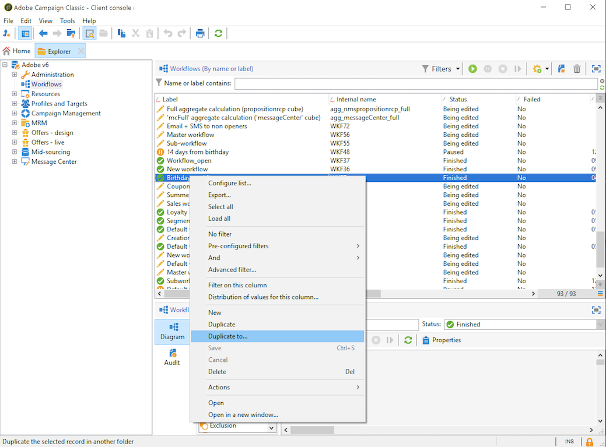

# Creazione di un flusso di lavoro {#building-a-workflow}

Questa sezione descrive i principi chiave e le procedure ottimali per creare un flusso di lavoro in Campaign.

* Creare un flusso di lavoro, vedere [Creazione di un nuovo flusso di lavoro](#creating-a-new-workflow)
* Progettare il diagramma del flusso di lavoro, vedere [Aggiunta e collegamento di attività](#adding-and-linking-activities)
* Accedere ai parametri e alle proprietà delle attività, vedere [Configurazione delle attività](#configuring-activities)
* Progettazione di flussi di lavoro di targeting, vedere [Flussi di lavoro di targeting](#targeting-workflows)
* Utilizza i flussi di lavoro per eseguire una campagna. Vedi [Flussi di lavoro campagna](#campaign-workflows)
* Accesso e creazione di flussi di lavoro tecnici, vedere [Flussi di lavoro tecnici](#technical-workflows)
* Utilizzare i modelli per creare flussi di lavoro, vedere [Modelli di flusso di lavoro](#workflow-templates)

## Creazione di un nuovo flusso di lavoro {#creating-a-new-workflow}

Da **[!UICONTROL Explorer]**, accedete a una cartella del flusso di lavoro. Per impostazione predefinita, è possibile utilizzare **[!UICONTROL Profiles and Targets]** > **[!UICONTROL Jobs]** > **[!UICONTROL Targeting workflows]**.

Fate clic sul pulsante **[!UICONTROL New]** situato sopra l&#39;elenco dei flussi di lavoro.

In alternativa, è possibile utilizzare il pulsante **[!UICONTROL Create]** nella panoramica del flusso di lavoro (**[!UICONTROL Monitoring]** > **[!UICONTROL Workflow]** collegamento).

Immettete un&#39;etichetta e fate clic su **[!UICONTROL Save]**.

>[!NOTE]
>
>Quando modificate il nome interno di un&#39;attività del flusso di lavoro o il flusso di lavoro stesso, accertatevi di salvare il flusso di lavoro prima di chiuderlo in modo che il nuovo nome interno sia correttamente preso in considerazione.

## Aggiunta e collegamento di attività {#adding-and-linking-activities}

Devi ora definire le varie attività e collegarle nel diagramma. A questo punto della configurazione, è possibile visualizzare l’etichetta del diagramma e lo stato del flusso di lavoro (Modifica in corso). La sezione inferiore della finestra viene utilizzata solo per modificare il diagramma. Contiene una barra degli strumenti, una palette di attività (a sinistra) e il diagramma stesso (a destra).

>[!NOTE]
>
>Se la palette non è visualizzata, fare clic sul primo pulsante sulla barra degli strumenti per visualizzarla.

Le attività sono raggruppate per categoria all&#39;interno delle diverse schede della palette. Le schede e le attività disponibili possono variare a seconda del tipo di flusso di lavoro (tecnico, di targeting o del flusso di lavoro della campagna).

* La prima scheda contiene attività di targeting e manipolazione dei dati. Tali attività sono descritte in [Attività di targeting](../../workflow/using/about-targeting-activities.md).
* La seconda scheda contiene le attività di programmazione, utilizzate principalmente per coordinare altre attività. Tali attività sono descritte in [Attività di controllo del flusso](../../workflow/using/about-flow-control-activities.md).
* La terza scheda contiene gli strumenti e le azioni che è possibile utilizzare nel flusso di lavoro. Tali attività sono descritte in [Attività di azione](../../workflow/using/about-action-activities.md).
* La quarta scheda contiene le attività che dipendono da un determinato evento, ad esempio la ricezione di un&#39;e-mail o l&#39;arrivo di un file su un server. Tali attività sono descritte in [Attività evento](../../workflow/using/about-event-activities.md).

Per creare il diagramma

1. Per aggiungere un&#39;attività, selezionatela nella palette e spostatela nel diagramma mediante un&#39;operazione di trascinamento.

   Aggiungere un&#39;attività **Start** e quindi un&#39;attività **Delivery** nel diagramma.

   

1. Collegare le attività trascinando la transizione dell&#39;attività **Avvia** e rilasciandola sull&#39;attività **Consegna**.

   

   Potete collegare automaticamente un&#39;attività alla precedente inserendo la nuova attività alla fine della transizione.

1. Aggiungi le attività necessarie e collegale come mostrato nel diagramma seguente.

   

>[!CAUTION]
>
>Potete copiare e incollare le attività all’interno di uno stesso flusso di lavoro. Tuttavia, non è consigliabile copiare le attività Incolla tra flussi di lavoro diversi. Alcune impostazioni associate ad attività quali Consegne e Utilità di pianificazione potrebbero causare conflitti ed errori durante l&#39;esecuzione del flusso di lavoro di destinazione. È stato invece consigliato di eseguire flussi di lavoro **Duplica**. Per ulteriori informazioni, vedere [Duplicazione dei flussi di lavoro](#duplicating-workflows).

È possibile modificare la visualizzazione e il layout del grafico utilizzando i seguenti elementi:

* **Utilizzo della barra degli strumenti**

   La barra degli strumenti di modifica del diagramma consente di accedere alle funzioni di layout ed esecuzione del flusso di lavoro.

   

   Questo consente di adattare il layout dello strumento di modifica: visualizzazione della palette e panoramica, dimensioni e allineamento degli oggetti grafici.

   

   Le icone relative al tracciamento e all&#39;avvio di un flusso di lavoro di targeting avanzato sono descritte in questa [sezione](../../campaign/using/marketing-campaign-deliveries.md#creating-a-targeting-workflow).

* **Allineamento dell&#39;oggetto**

   Per allineare le icone, selezionatele e fate clic sull&#39;icona **[!UICONTROL Align vertically]** o **[!UICONTROL Align horizontally]**.

   Utilizzare il tasto **CTRL** per selezionare più attività sparse o per deselezionare una o più attività. Fare clic sullo sfondo del diagramma per deselezionare tutti gli elementi.

* **Gestione delle immagini**

   Potete personalizzare l&#39;immagine di sfondo del diagramma e quelle relative alle varie attività. Fare riferimento a [Gestione delle immagini dell&#39;attività](../../workflow/using/managing-activity-images.md).

## Configurazione delle attività {#configuring-activities}

Fate doppio clic su un&#39;attività per configurarla oppure fate clic con il pulsante destro del mouse e selezionate **[!UICONTROL Open...]**.

>[!NOTE]
>
>Le attività del flusso di lavoro delle campagne sono descritte in [questa sezione](../../workflow/using/about-activities.md).

La prima scheda contiene la configurazione di base. La scheda **[!UICONTROL Advanced]** contiene i parametri aggiuntivi, utilizzati in particolare per definire il comportamento quando si verifica un errore, specificare la durata di esecuzione di un&#39;attività e immettere uno script di inizializzazione.

Per una migliore comprensione delle attività e per migliorare la leggibilità del flusso di lavoro, potete inserire commenti nelle attività: questi vengono visualizzati automaticamente quando gli operatori scorrono l&#39;attività.

## Flussi di lavoro di targeting {#targeting-workflows}

I flussi di lavoro di targeting consentono di creare diversi target di consegna. Potete creare query, definire unioni o esclusioni in base a criteri specifici, aggiungere la pianificazione, grazie alle attività del flusso di lavoro. Il risultato di questo targeting può essere trasferito automaticamente a un elenco che può fungere da destinazione delle azioni di consegna

Oltre a queste attività, le opzioni di gestione dei dati consentono di manipolare i dati e accedere a funzioni avanzate per risolvere problemi di targeting complessi. Per ulteriori informazioni, consultare [Gestione dei dati](../../workflow/using/targeting-data.md#data-management).

Tutte queste attività si trovano nella prima scheda del flusso di lavoro.

>[!NOTE]
>
>Le attività di targeting sono descritte in [questa sezione](../../workflow/using/about-activities.md).

I flussi di lavoro di targeting possono essere creati e modificati tramite il nodo **[!UICONTROL Profiles and Targets > Jobs > Targeting workflows]** della struttura di Adobe Campaign  o mediante il menu **[!UICONTROL Profiles and Targets > Targeting workflows]** della home page.

I flussi di lavoro di targeting nel quadro di una campagna vengono memorizzati con tutti i flussi di lavoro delle campagne.

### Passaggi chiave per creare un flusso di lavoro di targeting {#implementation-steps-}

I passaggi per creare un flusso di lavoro di targeting sono descritti in dettaglio nelle seguenti sezioni:

1. **Dati** di identità nel database - Vedere  [Creazione di query](../../workflow/using/targeting-data.md#creating-queries)
1. **Dati** preparati per soddisfare le esigenze di distribuzione - Vedere  [Arricchimento e modifica dei dati](../../workflow/using/targeting-data.md#enriching-and-modifying-data)
1. **Dati** utilizzati per eseguire aggiornamenti o in una consegna - Vedere  [Aggiornamento del database](../../workflow/using/how-to-use-workflow-data.md#updating-the-database)

I risultati di tutti gli arricchimenti e tutte le operazioni eseguite durante il targeting sono memorizzati e accessibili in campi di personalizzazione, in particolare per la creazione di messaggi personalizzati. Per ulteriori informazioni, fare riferimento a [Dati di destinazione](../../workflow/using/data-life-cycle.md#target-data)

### Dimensioni di targeting e filtro {#targeting-and-filtering-dimensions}

Durante le operazioni di segmentazione dei dati, la chiave di targeting è mappata su una dimensione di filtro. La dimensione di targeting consente di definire la popolazione di destinazione dell&#39;operazione: destinatari, beneficiari del contratto, operatori, abbonati, ecc. La dimensione di filtro consente di selezionare la popolazione in base a determinati criteri: titolari di contratti, abbonati a newsletter, ecc.

Ad esempio, per selezionare i clienti che hanno sottoscritto una polizza di assicurazione vita per oltre 5 anni, selezionare la dimensione di targeting seguente: **Client** e le seguenti dimensioni filtro: **Titolare del contratto**. È quindi possibile definire le condizioni di filtraggio all&#39;interno dell&#39;attività di query

Durante la fase di selezione della dimensione di targeting, nell&#39;interfaccia sono disponibili solo dimensioni di filtraggio compatibili.

Queste due dimensioni devono essere correlate. Pertanto, il contenuto dell&#39;elenco **[!UICONTROL Filtering dimension]** dipende dalla dimensione di targeting specificata nel primo campo.

Ad esempio, per i destinatari (**destinatari**) saranno disponibili le seguenti dimensioni di filtro:

Mentre per **Applicazioni Web**, l&#39;elenco conterrà le seguenti dimensioni di filtro:

## Flussi di lavoro campagna {#campaign-workflows}

Per ogni campagna, potete creare flussi di lavoro da eseguire dalla scheda **[!UICONTROL Targeting and workflows]**. Questi flussi di lavoro sono specifici per la campagna.

Questa scheda contiene le stesse attività di tutti i flussi di lavoro. [Ulteriori informazioni](#implementation-steps-)

Oltre alle campagne di targeting, i flussi di lavoro delle campagne consentono di creare e configurare le consegne per tutti i canali disponibili. Una volta creati nel flusso di lavoro, questi invii sono disponibili dal dashboard della campagna. [Ulteriori informazioni](../../campaign/using/marketing-campaign-deliveries.md)

Tutti i flussi di lavoro delle campagne sono centralizzati sotto il nodo **[!UICONTROL Administration > Production > Objects created automatically > Campaign workflows]**.

I flussi di lavoro delle campagne e gli esempi di implementazione sono descritti in [questa pagina](../../campaign/using/marketing-campaign-deliveries.md#building-the-main-target-in-a-workflow).

## Flussi di lavoro tecnici {#technical-workflows}

I flussi di lavoro tecnici vengono forniti con  Adobe Campaign. Si tratta di operazioni o processi pianificati per l&#39;esecuzione periodica sul server. Consentono di eseguire la manutenzione sul database, inoltrare le informazioni di monitoraggio sulle consegne e impostare i processi provvisori sulle consegne. I flussi di lavoro tecnici sono configurati tramite il nodo **[!UICONTROL Administration > Production > Technical workflows]**.

Sono disponibili modelli nativi per la creazione di flussi di lavoro tecnici. Possono essere configurate in base alle vostre esigenze.

La sottocartella **[!UICONTROL Campaign process]** centralizza i flussi di lavoro necessari per eseguire i processi all&#39;interno delle campagne: notifica delle attività, gestione delle scorte, calcolo dei costi, ecc.

>[!NOTE]
>
>L&#39;elenco dei flussi di lavoro tecnici installati con ciascun modulo è disponibile in una [sezione dedicata](../../workflow/using/about-technical-workflows.md).

Puoi creare altri flussi di lavoro tecnici nel nodo **[!UICONTROL Administration > Production > Technical workflows]** della struttura ad albero. Tuttavia, questo processo è riservato agli utenti esperti.

Le attività offerte sono le stesse che per i flussi di lavoro di targeting. [Ulteriori informazioni](#implementation-steps-)

## Modelli di workflow {#workflow-templates}

I modelli di workflow contengono la configurazione globale delle proprietà ed eventualmente una serie di attività concatenate all&#39;interno di un diagramma. Questa configurazione può essere riutilizzata per creare nuovi flussi di lavoro contenenti un certo numero di elementi preconfigurati

Potete creare nuovi modelli di flusso di lavoro basati su modelli esistenti o modificare direttamente un flusso di lavoro in un modello.

I modelli di flusso di lavoro sono memorizzati nel nodo **[!UICONTROL Resources > Templates > Workflow templates]** della struttura di Adobe Campaign .

Oltre alle normali proprietà del flusso di lavoro, le proprietà del modello consentono di specificare il file di esecuzione per i flussi di lavoro creati in base a questo modello.

## Duplicazione dei flussi di lavoro {#duplicating-workflows}

Potete duplicare diversi tipi di flussi di lavoro. Una volta eseguita la duplicazione, le modifiche del flusso di lavoro non vengono riportate nella copia del flusso di lavoro.

>[!CAUTION]
>
>Copia-incolla è disponibile nei flussi di lavoro, ma si consiglia di utilizzare **Duplica**. Una volta copiata un&#39;attività, viene mantenuta l&#39;intera configurazione. Per le attività di consegna (E-mail, SMS, Push Notification...), viene copiato anche l&#39;oggetto di consegna allegato all&#39;attività, il che può causare l&#39;arresto anomalo.

1. Fare clic con il pulsante destro del mouse su un flusso di lavoro.
1. Fare clic su **Duplica**.

   

1. Nella finestra del flusso di lavoro, modificate l’etichetta del flusso di lavoro.
1. Fai clic su **Salva**.

La funzione duplicata non è direttamente disponibile nella visualizzazione di una campagna.

Tuttavia, potete creare una vista per visualizzare tutti i flussi di lavoro sull’istanza. In questa visualizzazione, puoi duplicare i flussi di lavoro utilizzando **Duplica in**.

**Innanzitutto, creiamo una vista:**

1. In **Explorer**, passare alla cartella in cui creare la visualizzazione.
1. Fare clic con il pulsante destro del mouse e passare a **Aggiungi una nuova cartella** > **Processo**, selezionare **Flussi di lavoro**.

   

Viene creata la nuova cartella **Workflows**.

1. Fare clic con il pulsante destro del mouse e selezionare **Proprietà**.
1. In **Restriction**, selezionare **Folder is a view** e fare clic su **Save**.

   

La cartella ora viene compilata con tutti i flussi di lavoro dell&#39;istanza.

**Duplicazione di un flusso di lavoro della campagna**

1. Selezionate un flusso di lavoro della campagna nella visualizzazione del flusso di lavoro.
1. Fare clic con il pulsante destro del mouse su **Duplica su**.
   
1. Modificatene l’etichetta.
1. Fai clic su **Salva**.

Potete visualizzare il flusso di lavoro duplicato nella visualizzazione del flusso di lavoro.
