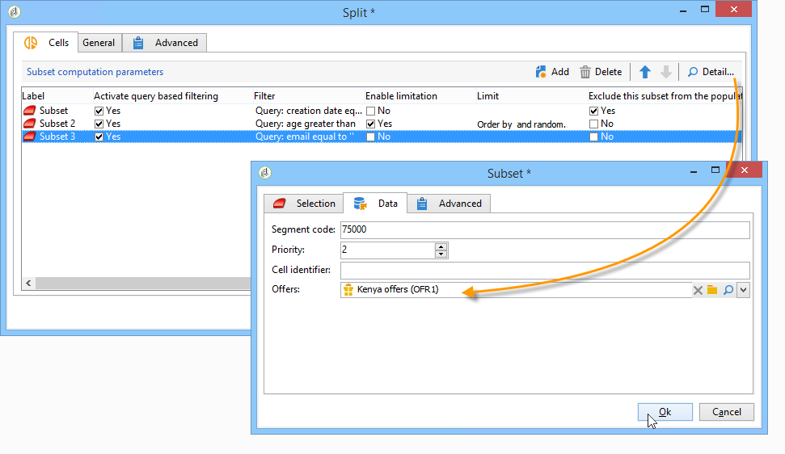

# Celle{#cells}


Il **[!UICONTROL Cells]** activity fornisce una vista dei vari sottoinsiemi sotto forma di colonne di dati. Agevola la manipolazione dei sottoinsiemi ed è progettata anche per incoraggiare le possibilità di personalizzazione.


Questa attività può essere configurata per immettere parametri specifici in base alle esigenze dell’utente. Per impostazione predefinita, i dettagli di ciascun sottoinsieme vengono descritti in una finestra dedicata tramite **[!UICONTROL Selection]** e **[!UICONTROL Advanced]** schede. Nell’esempio seguente, il modulo è stato modificato: a **[!UICONTROL Data]** è stata aggiunta una scheda per abilitare l’associazione di un’offerta e un livello di priorità per ogni sottoinsieme.



Per questa configurazione, le seguenti informazioni sono state aggiunte al modulo del flusso di lavoro (nel **[!UICONTROL Administration > Configurations > Input forms]** della struttura Adobe Campaign):

```
<container img="nms:miniatures/mini-enrich.png" label="Data">
                <input xpath="@code"/>
                <container xpath="select/node[@alias='@numTest']">
                  <input alwaysActive="true" expr="'long'" type="expr" xpath="@type"/>
                  <input alwaysActive="true" expr="'Priority'" type="expr" xpath="@label"/>
                  <input label="Priority" maxValue="12" minValue="0" type="number"
                         xpath="@value" xpathEditFromType="@type"/>
                </container>
                <container xpath="select/node[@alias='@test']">
                  <input alwaysActive="true" expr="'string'" type="expr" xpath="@type"/>
                  <input alwaysActive="true" expr="'Identifier'" type="expr" xpath="@label"/>
                  <input label="Cell identifier" xpath="@value"/>
                </container>
                <container xpath="select/node[@alias='linkTest']">
                  <input alwaysActive="true" expr="'link'" type="expr" xpath="@type"/>
                  <input alwaysActive="true" expr="'nms:offer'" type="expr" xpath="@dataType"/>
                  <input alwaysActive="true" expr="'Offre'" type="expr" xpath="@label"/>
                  <input computeStringAlias="@valueLabel" label="Offers" notifyPathList="@_cs|@valueLabel"
                         schema="nms:offer" type="linkEdit" xpath="@value"/>
                </container>
```

La personalizzazione del modulo di ingresso in Adobe Campaign è riservata agli utenti esperti. Per ulteriori informazioni, consulta questa [sezione](../../configuration/using/identifying-a-form.md).
