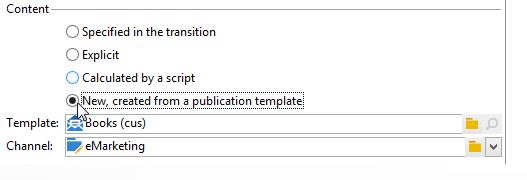

# Gestione dei contenuti{#content-management}

Un&#39;attività di gestione **del** contenuto consente di creare e manipolare un contenuto e di generare file basati su tale contenuto. Questo contenuto può quindi essere distribuito tramite un&#39;attività &quot;Delivery&quot;.

>[!CAUTION]
>
>La gestione dei contenuti è un modulo Adobe Campaign  facoltativo. Controlla il contratto di licenza.

Le proprietà dell&#39;attività sono suddivise in tre fasi:

* **Selezione** del contenuto: il contenuto può essere stato creato in precedenza o può essere creato tramite l&#39;attività.
* **Aggiornamento** contenuto: l&#39;attività può modificare l&#39;oggetto del contenuto o importare tutto il contenuto XML.
* **Azione**: il contenuto risultante può essere salvato o generato.

   

   Per ulteriori informazioni sulla configurazione e l&#39;utilizzo della gestione dei contenuti in  Adobe Campaign, consultare questa [sezione](../../delivery/using/about-content-management.md).

1. **Contenuto**

   * **[!UICONTROL Specified in the transition]**

      Questa opzione consente di utilizzare il contenuto specificato nella transizione, ovvero l&#39;evento che attiva la gestione del contenuto deve contenere una **[!UICONTROL contentId]** variabile. Questa variabile può essere stata impostata da una gestione del contenuto precedente o da qualsiasi script.

   * **[!UICONTROL Explicit]**

      Questa opzione consente di selezionare un contenuto già creato, tramite il **[!UICONTROL Content]** campo. Questo campo è visibile solo quando l&#39; **[!UICONTROL Explicit]** opzione è selezionata.

      

   * **[!UICONTROL Calculated by a script]**

      L&#39;identificatore di contenuto è calcolato da uno script. Il **[!UICONTROL Script]** campo consente di definire un modello JavaScript che valuta l’identificatore (chiave primaria) del contenuto. Questo campo è visibile solo quando l&#39; **[!UICONTROL Calculated by a script]** opzione è selezionata.

      

   * **[!UICONTROL New, created from a publication template]**

      Crea un nuovo contenuto da un modello di pubblicazione. Il nuovo contenuto verrà salvato nel file specificato nel **[!UICONTROL String]** campo. Il **[!UICONTROL Template]** campo specifica il modello di pubblicazione da utilizzare per creare il contenuto.

      

1. **Aggiorna contenuto**

   * **[!UICONTROL Subject]**

      Questo campo consente di modificare l’oggetto del contenuto.

   * **[!UICONTROL Access to data from an XML feed]**

      Questa opzione consente di creare il contenuto da un documento XML scaricato tramite un foglio di stile XSL. Quando questa opzione è selezionata, il **[!UICONTROL URL]** campo specifica l&#39;URL di download del contenuto XML. Consente di **[!UICONTROL XSL stylesheet]** specificare il foglio di stile da utilizzare per trasformare il documento XML scaricato. Questa proprietà è facoltativa.

      

1. **Azione da eseguire**

   * **[!UICONTROL Save]**

      Questa opzione consente di salvare il contenuto creato o modificato.

      La transizione in uscita viene attivata solo una volta, con il contenuto salvato nella **[!UICONTROL contentId]** variabile come parametro.

   * **[!UICONTROL Generate]**

      Questa opzione salva il contenuto, quindi genera i file di output per ciascun modello di trasformazione con pubblicazione di tipo &quot;File&quot;.

      

      La transizione in uscita viene attivata per ciascun file generato con l’identificatore del contenuto salvato nella **[!UICONTROL contentId]** variabile come parametro e il nome del file nella **[!UICONTROL filename]** variabile.

## Parametri di input {#input-parameters}

* contentId

Identificatore del contenuto da utilizzare se l&#39; **[!UICONTROL Specified in the transition]** opzione è abilitata.

## Parametri di output {#output-parameters}

* contentId

   Identificatore contenuto.

* nomefile

   Nome completo del file generato se l’azione selezionata è **[!UICONTROL Generate]**.

## Esempi {#examples}

Esempi sono forniti in questa [sezione](../../delivery/using/automating-via-workflows.md#examples).
