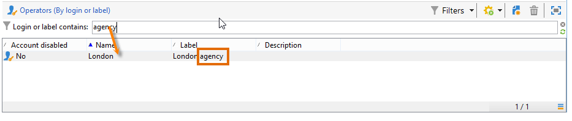

# Creare un filtro {#creating-a-filter}

I filtri disponibili in Adobe Campaign vengono definiti tramite condizioni di filtro create utilizzando la stessa modalità operativa delle query.

>[!NOTE]
>
>Per ulteriori informazioni sulla creazione di filtri, consulta [questa sezione](../../platform/using/filtering-options.md).

Il nodo **[!UICONTROL Administration > Configuration > Predefined filters]** contiene tutti i filtri utilizzati negli elenchi e nelle panoramiche.

Ad esempio, l&#39;elenco degli operatori può essere filtrato per **[!UICONTROL Active accounts]**:

Il filtro corrispondente contiene la query sul valore **[!UICONTROL Account disabled]** dello schema **[!UICONTROL Operators]**:

Per lo stesso elenco, il filtro **[!UICONTROL By login or label]** consente di filtrare i dati nell&#39;elenco in base al valore immesso nel campo del filtro:

Viene creato come segue:

Per soddisfare le condizioni di filtro, l’account operatore deve controllare una delle seguenti condizioni:

* L’etichetta contiene i caratteri immessi nel campo di immissione,
* Il nome dell’operatore contiene i caratteri immessi nel campo di immissione,
* Il contenuto dell&#39;area di descrizione contiene i caratteri immessi nel campo di input.

>[!NOTE]
>
>La funzione **[!UICONTROL Upper]** consente di disattivare la funzione con distinzione tra maiuscole e minuscole.

La colonna **[!UICONTROL Taken into account if]** consente di definire i criteri di applicazione per queste condizioni di filtro. Qui i caratteri **$(/tmp/@text)** rappresentano il contenuto del campo di input collegato al filtro:

In questo caso, **$(/tmp/@text)=&#39;agency&#39;**

L&#39;espressione **$(/tmp/@text)!=&#39;** applica ogni condizione quando il campo di input non è vuoto.
