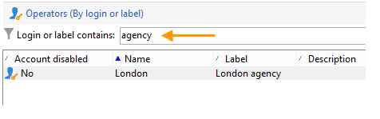

# Creare un filtro {#creating-a-filter}

I filtri disponibili in Adobe Campaign vengono definiti tramite condizioni di filtro create utilizzando la stessa modalità operativa delle query.

>[!NOTE]
>
>Per ulteriori informazioni sulla creazione di filtri, consulta [questa sezione](../../platform/using/filtering-options.md).

Il **[!UICONTROL Administration > Configuration > Predefined filters]** Questo nodo contiene tutti i filtri utilizzati negli elenchi e nelle panoramiche.

Ad esempio, l’elenco degli operatori può essere filtrato per **[!UICONTROL Active accounts]**:

Il filtro corrispondente contiene la query sul **[!UICONTROL Account disabled]** valore del **[!UICONTROL Operators]** schema:

Per lo stesso elenco, il **[!UICONTROL By login or label]** filtro consente di filtrare i dati nell’elenco in base al valore immesso nel campo del filtro:

Viene creato come segue:

Per soddisfare le condizioni di filtro, l’account operatore deve controllare una delle seguenti condizioni:

* L’etichetta contiene i caratteri immessi nel campo di immissione,
* Il nome dell’operatore contiene i caratteri immessi nel campo di immissione,
* Il contenuto dell&#39;area di descrizione contiene i caratteri immessi nel campo di input.

>[!NOTE]
>
>Il **[!UICONTROL Upper]** consente di disattivare la funzione con distinzione tra maiuscole e minuscole.

Il **[!UICONTROL Taken into account if]** consente di definire i criteri di applicazione per queste condizioni di filtro. Ecco, il **$(/tmp/@text)** i caratteri rappresentano il contenuto del campo di input collegato al filtro:

Qui, **$(/tmp/@text)=&#39;agenzia&#39;**

Il **$(/tmp/@text)!=&#39;&#39;** l’espressione applica ogni condizione quando il campo di input non è vuoto.
