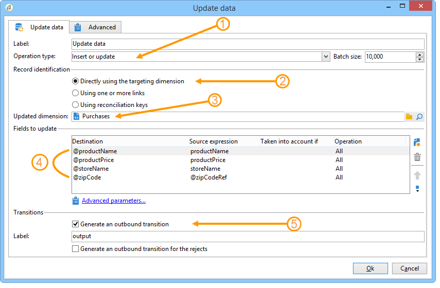
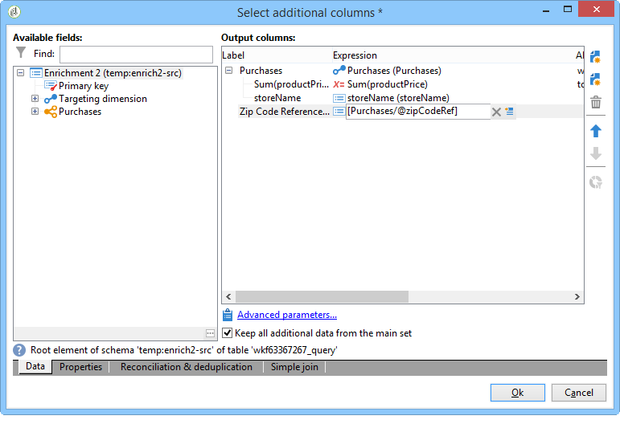

# Creazione di un elenco di riepilogo{#creating-a-summary-list}

Questo caso d’uso descrive in dettaglio la creazione di un flusso di lavoro che, dopo la raccolta dei file e dopo diversi arricchimenti, consente di creare un elenco di riepilogo. L&#39;esempio si basa su un elenco di contatti che hanno effettuato acquisti in uno store.


Viene utilizzata la seguente struttura dati:


Il suo scopo è:

* Per utilizzare le varie opzioni dell&#39;attività di arricchimento
* Per aggiornare i dati nel database dopo una riconciliazione
* Per creare una &quot;vista&quot; globale dei dati arricchiti

Per creare un elenco di riepilogo, effettuate le seguenti operazioni:

1. Raccolta e caricamento di un file &quot;Acquisti&quot; nella tabella di lavoro del flusso di lavoro
1. Arricchimento dei dati importati mediante la creazione di un collegamento a una tabella di riferimento
1. Aggiornamento della tabella &quot;Acquisti&quot; con i dati arricchiti
1. Arricchimento dei dati &quot;Contatti&quot; con un calcolo aggregato dalla tabella &quot;Acquisti&quot;
1. Creazione di un elenco di riepilogo

## Passaggio 1: Caricamento del file e riconciliazione dei dati importati {#step-1--loading-the-file-and-reconciling-the-imported-data}

I dati da caricare sono dati relativi all&#39;acquisto con il seguente formato:

```
Product Name;Product price;Store
Computer;2000;London 3
Tablet;600;Cambridge
Computer;2000;London 5
Comptuer;2000;London 8
Tablet;600;Cambridge
Phone;500;London 5
```

Questi dati sono contenuti in un file di testo &quot;Purchases.txt&quot;.

1. Aggiungete le attività **Raccolta file** e **Caricamento dei dati (file)** al flusso di lavoro.

   L&#39;attività **Raccolta file** consente di raccogliere e inviare file da e verso il server Adobe Campaign .

   L&#39;attività **Caricamento dati(file)** consente di arricchire la tabella di lavoro del flusso di lavoro con i dati raccolti.

   Per ulteriori informazioni su questa attività, vedere [Caricamento di dati da un file](../../workflow/using/importing-data.md#loading-data-from-a-file).

1. Configurate l&#39;attività **Raccolta file** per raccogliere file di testo (*.txt) dalla directory selezionata.

   

   L&#39;attività **Raccolta file** consente di gestire l&#39;assenza di un file nella directory di origine. A questo scopo, selezionare l&#39;opzione **[!UICONTROL Process file nonexistence]**. In questo flusso di lavoro, è stata aggiunta un&#39;attività **Wait** per provare un&#39;altra raccolta di file se manca dalla directory al momento della raccolta.

1. Configurare l&#39;attività **Caricamento dati (file)** utilizzando un file di esempio con lo stesso formato dei dati da importare.

   

   Fare clic sul collegamento **[!UICONTROL Click here to change the file format...]** per rinominare le colonne utilizzando i nomi e le etichette interni della tabella &quot;Acquisti&quot;.

   

Una volta importati i dati, l&#39;arricchimento viene effettuato creando un collegamento a una tabella di riferimento che corrisponde allo schema &quot;Memores&quot;.

Aggiungete l&#39;attività di arricchimento e configuratela come segue:

1. Selezionare il set principale composto dai dati dell&#39;attività **Caricamento dati(file)**.

   

1. Fare clic su **[!UICONTROL Add data]**, quindi selezionare l&#39;opzione **[!UICONTROL A link]**.

   

1. Selezionare l&#39;opzione **[!UICONTROL Define a collection]**.
1. Selezionare lo schema &quot;Memorizza&quot; come destinazione.

   

Per ulteriori informazioni sui vari tipi di collegamenti, fare riferimento a [Arricchimento e modifica dei dati](../../workflow/using/targeting-data.md#enriching-and-modifying-data).

Nella finestra seguente, è necessario creare una condizione di unione selezionando il campo di origine (nel set principale) e il campo di destinazione (appartenente allo schema &quot;Memorizza&quot;) per configurare la riconciliazione dei dati.


Ora che il collegamento è stato creato, verrà aggiunta una colonna alla tabella di lavoro del flusso di lavoro dallo schema &quot;Stores&quot;: il campo &quot;Riferimento ZipCode&quot;.

1. Aprire l&#39;attività di arricchimento.
1. Fai clic su **[!UICONTROL Edit additional data]**.
1. Aggiungete il campo &quot;ZipCode Reference&quot; alla cartella **[!UICONTROL Output columns]**.


I dati nella tabella di lavoro del flusso di lavoro dopo l’arricchimento saranno i seguenti:


## Passaggio 2: Scrittura di dati arricchiti nella tabella &quot;Acquisti&quot; {#step-2--writing-enriched-data-to-the--purchases--table}

Questo passaggio descrive come scrivere i dati importati e arricchiti nella tabella &quot;Acquisti&quot;. A tal fine, è necessario utilizzare un&#39;attività **Aggiorna dati**.

Prima di aggiornare i dati nella tabella **Acquisti**, è necessario eseguire una riconciliazione tra i dati nella tabella di lavoro del flusso di lavoro e la dimensione di targeting **Acquisti**.

1. Fare clic sulla scheda **[!UICONTROL Reconciliation]** dell&#39;attività di arricchimento.
1. Selezionare la dimensione di targeting, in questo caso lo schema &quot;Acquisti&quot;.
1. Selezionare un&#39;espressione &quot;Source&quot; per i dati nella tabella del flusso di lavoro (in questo caso il campo &quot;storeName&quot;).
1. Selezionare una &quot;espressione di destinazione&quot; per i dati nella tabella &quot;Acquisti&quot; (in questo caso il campo &quot;storename&quot;).
1. Seleziona l’opzione **[!UICONTROL Keep unreconciled data coming from the work table]**.


Nell&#39;attività **Aggiorna dati** è necessaria la seguente configurazione:

1. Selezionare l&#39;opzione **[!UICONTROL Insert or update]** nel campo **[!UICONTROL Operation type]** per evitare di creare nuovi record ogni volta che il file viene raccolto.
1. Selezionare il valore **[!UICONTROL By directly using the targeting dimension]** per l&#39;opzione **[!UICONTROL Record identification]**.
1. Selezionare lo schema &quot;Acquisti&quot; come **[!UICONTROL Document type]**.
1. Specificate l&#39;elenco dei campi da aggiornare. La colonna **[!UICONTROL Destination]** consente di definire i campi dello schema &quot;Acquisti&quot;. La colonna **[!UICONTROL Expression]** consente di selezionare i campi nella tabella di lavoro per eseguire una mappatura.
1. Fare clic sull&#39;opzione **[!UICONTROL Generate an outbound transition]**.



## Passaggio 3: Arricchimento dei dati &#39;Contact&#39; {#step-3--enriching--contact--data-}

Lo schema &quot;Contatti&quot; è fisicamente collegato allo schema &quot;Acquisti&quot;. Ciò significa che potete utilizzare un&#39;altra opzione dell&#39;opzione &quot;Arricchimento&quot;: aggiunta di dati collegati alla dimensione filtro.

Lo scopo di questo secondo arricchimento è quello di creare un aggregato sullo schema di acquisto per calcolare l&#39;importo totale degli acquisti per ogni contatto identificato.

1. Aggiungere un&#39;attività di tipo **query** che consente di recuperare tutti i **Contatti** memorizzati.
1. Aggiungete un&#39;attività **Enrichment**, quindi selezionate il set principale risultante dalla query precedente.
1. Fare clic su Aggiungi **[!UICONTROL Data]**.
1. Fare clic sull&#39;opzione **[!UICONTROL Data linked to the targeting dimension]**.
1. Fare clic sull&#39;opzione **[!UICONTROL Data linked to the filtering dimension]** nella finestra **[!UICONTROL Select fields to add]**.
1. Selezionare il nodo **[!UICONTROL Purchases]**, quindi fare clic su **[!UICONTROL Next]**.

   

1. Modificare il campo **[!UICONTROL Collected data]** selezionando l&#39;opzione **[!UICONTROL Aggregates]**.

   

1. Fai clic su **[!UICONTROL Next]**.
1. Aggiungi la seguente espressione per calcolare il totale degli acquisti per ogni contatto: &quot;Sum(@prodprice)&quot;.

   

Per preparare l&#39;elenco di riepilogo, è necessario aggiungere campi dai campi &quot;Acquisti&quot; e dal primo arricchimento: il campo &quot;Riferimento ZipCode&quot;.

1. Fare clic sul collegamento **[!UICONTROL Edit additional data...]** nell&#39;attività di arricchimento.
1. Aggiungete i campi &quot;Nome store&quot; e &quot;Informazioni di riferimento per acquisti/CAP&quot;.

   

1. Fare clic sulla scheda **[!UICONTROL Properties]**.
1. Cambia il secondo collegamento per creare una sola riga.

   

## Passaggio 4: Creazione e aggiunta a un elenco di riepilogo {#step-4--creating-and-adding-to-a-summary-list}

L&#39;ultimo passaggio prevede la scrittura di tutti i dati arricchiti in un elenco.

1. Aggiungete un&#39;attività **Aggiornamento elenco** al flusso di lavoro. Questa attività deve essere collegata alla transizione in uscita della seconda attività di arricchimento.
1. Selezionare l&#39;opzione **[!UICONTROL Create the list if necessary (Calculated name)]**.
1. Selezionare un valore per il nome calcolato. L&#39;etichetta scelta per l&#39;elenco corrisponde alla data corrente: &lt;%= formatDate(new Date(), &quot;%2D/%2M/%2Y&quot;) %>.

Una volta eseguito il flusso di lavoro, l&#39;elenco includerà:

* un elenco dei contatti,
* una colonna &quot;Acquisti totali&quot;,
* una colonna &quot;Nome store&quot;,
* una colonna &quot;Riferimento codice postale&quot; inserita per tutti gli store contenuti nello schema di riferimento dello store.


