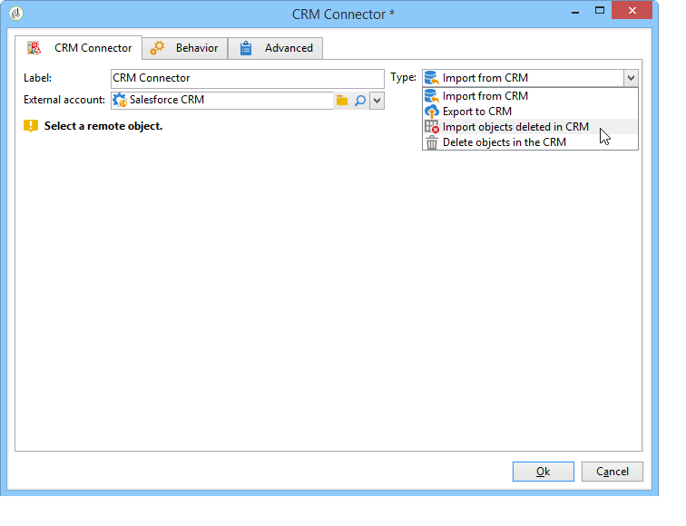
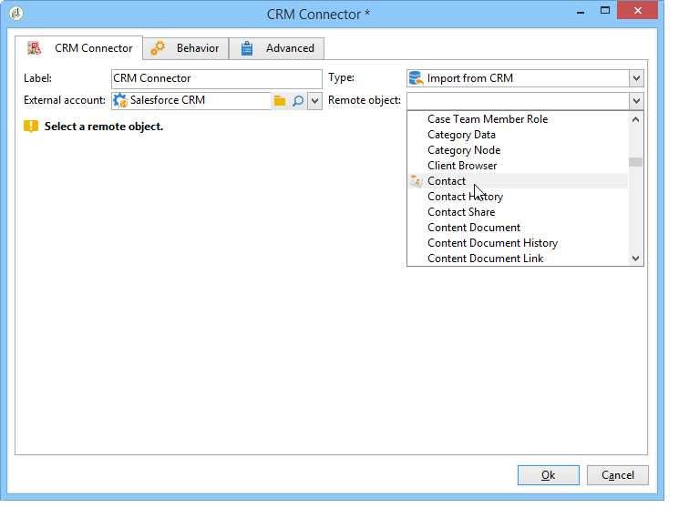

# Connettore per sistema CRM{#crm-connector}

Il **Connettore CRM** L’attività ti consente di configurare la sincronizzazione dei dati tra Adobe Campaign e un sistema di gestione delle relazioni con i clienti.

Per ulteriori informazioni sui connettori CRM in Adobe Campaign, consulta questa [sezione](../../platform/using/crm-connectors.md).

Con questa attività, puoi:

* Importa dal CRM
* Esporta in CRM
* Importa oggetti eliminati nel CRM
* Elimina oggetti nel CRM

Seleziona l’account esterno che corrisponde al CRM con cui desideri configurare la sincronizzazione, quindi seleziona l’oggetto da sincronizzare (account, opportunità, contatti, ecc.).

La configurazione di questa attività dipende dal processo da eseguire. Varie configurazioni sono dettagliate [in questa pagina](../../platform/using/crm-data-sync.md).
