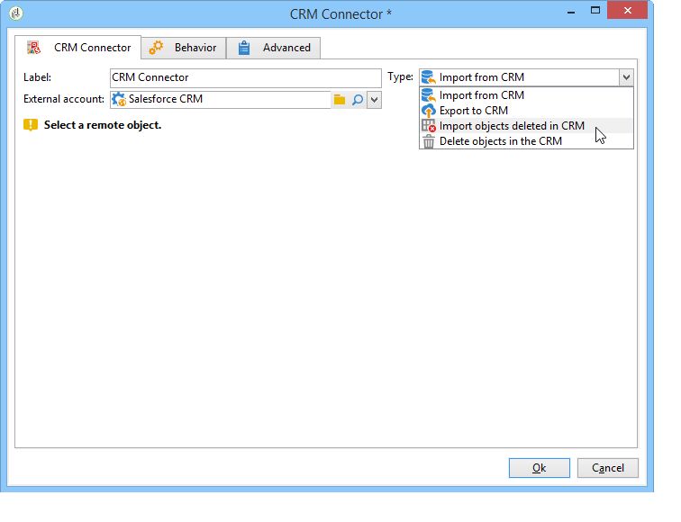

# Connettore per sistema CRM{#crm-connector}

L&#39;attività del connettore **CRM** consente di configurare la sincronizzazione dei dati tra Adobe Campaign e un sistema CRM.

Per ulteriori informazioni sui connettori CRM in Adobe Campaign, consulta questa [sezione](../../platform/using/crm-connectors.md).

Con questa attività, puoi:

* Importa dal CRM
* Esporta in CRM
* Importa oggetti eliminati nel CRM
* Elimina oggetti nel CRM

Seleziona l’account esterno che corrisponde al CRM con cui desideri configurare la sincronizzazione, quindi seleziona l’oggetto da sincronizzare (account, opportunità, contatti, ecc.).

La configurazione di questa attività dipende dal processo da eseguire. In questa pagina sono descritte in dettaglio [diverse configurazioni](../../platform/using/crm-data-sync.md).
