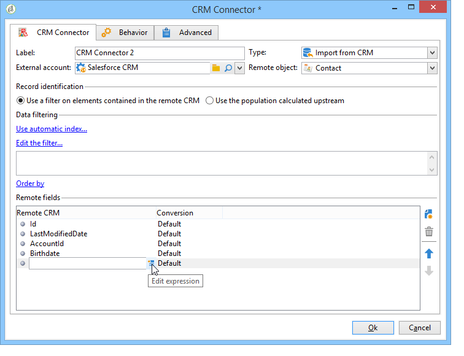
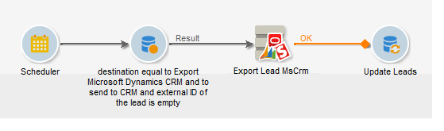

# Connettore di gestione delle relazioni con i clienti{#crm-connector}

Il **connettore CRM** consente di configurare la sincronizzazione dei dati tra  Adobe Campaign e un CRM.

Per ulteriori informazioni sui connettori CRM in  Adobe Campaign, consultare la sezione [](../../platform/using/crm-connectors.md).

Questo consente di:

* Importa da CRM (fare riferimento a [Importazione da CRM](#importing-from-the-crm)),
* Esportazione in CRM (fare riferimento a [Esportazione in CRM](#exporting-to-the-crm)),
* Importa oggetti eliminati nel CRM (fare riferimento a [Importazione di oggetti eliminati in CRM](#importing-objects-deleted-in-the-crm)),
* Eliminare gli oggetti in CRM (fare riferimento a [Eliminazione degli oggetti in CRM](#deleting-objects-in-the-crm)).


Selezionare l&#39;account esterno che corrisponde al CRM con cui si desidera configurare la sincronizzazione, quindi selezionare l&#39;oggetto da sincronizzare (account, opportunità, contatti, ecc.).


La configurazione di questa attività dipende dal processo da eseguire. Diverse configurazioni sono descritte di seguito.

## Importazione da CRM {#importing-from-the-crm}

Per importare dati tramite CRM in  Adobe Campaign, è necessario creare il seguente tipo di flusso di lavoro:


Per un&#39;attività di importazione, i passaggi di configurazione dell&#39;attività **Connettore CRM** sono:

1. Selezionare un&#39;operazione **[!UICONTROL Import from the CRM]**.
1. Fare clic sull&#39;elenco a discesa **[!UICONTROL Remote object]** e selezionare l&#39;oggetto interessato dal processo. Questo oggetto coincide con una delle tabelle create in  Adobe Campaign durante la configurazione del connettore.
1. Andate alla sezione **[!UICONTROL Remote fields]** e immettete i campi da importare.

   Per aggiungere un campo, fare clic sul pulsante **[!UICONTROL Add]** nella barra degli strumenti, quindi fare clic sull&#39;icona **[!UICONTROL Edit expression]**.

   

   Se necessario, modificare il formato dei dati tramite l&#39;elenco a discesa delle colonne **[!UICONTROL Conversion]**. I possibili tipi di conversione sono descritti in questa [pagina](../../platform/using/crm-connectors.md#data-format).

   >[!CAUTION]
   >
   >L&#39;identificatore del record in CRM è obbligatorio per il collegamento di oggetti in CRM e in  Adobe Campaign. Viene aggiunto automaticamente quando l&#39;attività viene approvata.
   > 
   >Anche l&#39;ultima data di modifica sul lato CRM è obbligatoria per le importazioni di dati incrementali.

1. Puoi anche filtrare i dati da importare in base alle tue esigenze. A tale scopo, fare clic sul collegamento **[!UICONTROL Edit the filter...]**.

   Nell&#39;esempio seguente,  Adobe Campaign importa solo i contatti per i quali è stata registrata una certa attività dal 31 luglio 2012.

   

   Le limitazioni collegate alle modalità di filtraggio dei dati sono descritte dettagliatamente nella sezione [Filtro su dati](#filter-on-data).

1. L&#39;opzione **[!UICONTROL Use automatic index]** consente di gestire automaticamente la sincronizzazione incrementale degli oggetti tra CRM e  Adobe Campaign, a seconda della data e dell&#39;ultima modifica.

   Per ulteriori informazioni, consultare [Gestione delle variabili](#variable-management).

## Gestione delle variabili {#variable-management}

L&#39;attivazione dell&#39;opzione **[!UICONTROL Automatic index]** consente di raccogliere solo gli oggetti modificati dall&#39;ultima importazione.


Per impostazione predefinita, la data dell&#39;ultima sincronizzazione è memorizzata nell&#39;opzione specificata nella finestra di configurazione:

```
LASTIMPORT_<%=instance.internalName%>_<%=activityName%>
```

Puoi specificare il campo CRM remoto da prendere in considerazione per identificare le modifiche più recenti.

Per impostazione predefinita, vengono utilizzati i campi seguenti (nell&#39;ordine specificato):

* Per Microsoft Dynamics: **modificato su**,
* Per  Oracle On Demand: **LastUpdated**, **ModifiedDate**, **LastLoggedIn**,
* Per Salesforce.com: **LastModifiedDate**, **SystemModestamp**.

Attivando l&#39;opzione **[!UICONTROL Automatic index]** vengono generate tre variabili che possono essere utilizzate nel flusso di lavoro di sincronizzazione tramite un&#39;attività di tipo **[!UICONTROL JavaScript code]**. Tali attività sono:

* **varscriptOptionName**: rappresenta il nome dell&#39;opzione che contiene l&#39;ultima data di importazione.
* **vars.crmStartImport**: rappresenta la data di inizio (inclusa) dell&#39;ultimo recupero di dati.
* **vars.crmEndDate**: rappresenta la data di fine (esclusa) dell&#39;ultimo recupero di dati.

   Queste date sono visualizzate nel seguente formato: **yyyy/MM/dd hh:mm:ss**.

## Filtrare i dati {#filter-on-data}

Per garantire un funzionamento efficiente con i diversi CRM, è necessario creare i filtri utilizzando le seguenti regole:

* Ogni livello di filtro può utilizzare un solo tipo di operatore logico.
* L&#39;operatore EXCEPT (AND NOT) non è supportato.
* I confronti possono riguardare solo valori null (tipo &#39;is empty&#39;/&#39;non empty&#39;) o numeri. Ciò significa che una volta valutata la colonna **[!UICONTROL Value]** (colonna a destra), il risultato di questa valutazione deve essere un numero.
* I dati nella colonna **[!UICONTROL Value]** vengono valutati in JavaScript.
* I confronti JOIN non sono supportati.
* L&#39;espressione nella colonna a sinistra deve essere un campo. Non può essere una combinazione di più espressioni, un numero, ecc.

Ad esempio, la condizione di filtro illustrata di seguito NON sarà valida per un&#39;importazione CRM, perché:

* L&#39;operatore OR è collocato sullo stesso livello degli operatori AND.
* I confronti vengono eseguiti sulle stringhe di testo.


## Ordina per {#order-by}

In Microsoft Dynamics e Salesforce.com, puoi ordinare i campi remoti da importare in ordine crescente o decrescente.

A questo scopo, fare clic sul collegamento **[!UICONTROL Order by]** e aggiungere le colonne all&#39;elenco.

L&#39;ordine delle colonne nell&#39;elenco corrisponde all&#39;ordine di ordinamento:


## Identificazione del record {#record-identification}

Invece di importare gli elementi inclusi (e possibilmente filtrati) in CRM, puoi utilizzare una popolazione calcolata in precedenza nel flusso di lavoro.

A questo scopo, selezionare l&#39;opzione **[!UICONTROL Use the population calculated upstream]** e specificare il campo che contiene l&#39;identificatore remoto.

Selezionate quindi i campi della popolazione in entrata che desiderate importare, come illustrato di seguito:


## Esportazione in CRM {#exporting-to-the-crm}

L&#39;esportazione  dati Adobe Campaign in CRM consente di copiare l&#39;intero contenuto in un database CRM.

Per esportare i dati in CRM, devi creare il seguente tipo di flusso di lavoro:



Per un&#39;esportazione, applicare la seguente configurazione all&#39;attività **Connettore CRM**:

1. Selezionare un&#39;operazione **[!UICONTROL Export to CRM]**.
1. Fare clic sull&#39;elenco a discesa **[!UICONTROL Remote object]** e selezionare l&#39;oggetto interessato dal processo. Questo oggetto coincide con una delle tabelle create in  Adobe Campaign durante la configurazione del connettore.

   >[!CAUTION]
   >
   >La funzione di esportazione dell&#39;attività **Connettori CRM** può inserire o aggiornare campi sul lato CRM. Per abilitare gli aggiornamenti di campo in CRM, devi specificare la chiave primaria della tabella remota. Se la chiave non è presente, i dati verranno inseriti (anziché essere aggiornati).

1. Nella sezione **[!UICONTROL Mapping]**, specificate i campi da esportare e la relativa mappatura nel CRM.

   

   Per aggiungere un campo, fare clic sul pulsante **[!UICONTROL Add]** nella barra degli strumenti, quindi fare clic sull&#39;icona **[!UICONTROL Edit expression]**.

   Per un dato campo, se non è definita alcuna corrispondenza sul lato CRM, i valori non possono essere aggiornati: sono inseriti direttamente nel CRM.

   Se necessario, modificare il formato dei dati tramite l&#39;elenco a discesa delle colonne **[!UICONTROL Conversion]**. I possibili tipi di conversione sono descritti in questa sezione [](../../platform/using/crm-connectors.md#data-format).

   L&#39;elenco dei record da esportare e il risultato dell&#39;esportazione vengono salvati in un file temporaneo che rimane accessibile finché il flusso di lavoro non viene completato o riavviato. Questo consente di riavviare il processo in caso di errori senza correre il rischio di esportare più volte lo stesso record o di perdere dati.

## Formato dati ed elaborazione degli errori {#data-format-and-error-processing}

È possibile convertire il formato dei dati al momento dell&#39;importazione in o da CRM.

A questo scopo, selezionare la conversione da applicare nella colonna corrispondente.


La modalità **[!UICONTROL Default]** applica la conversione automatica dei dati, che nella maggior parte dei casi corrisponde a una copia/incolla dei dati. Tuttavia, viene applicata la gestione del fuso orario.

Altre possibili conversioni sono:

* **[!UICONTROL Date only]**: in questa modalità vengono eliminati i campi Data + Ora.
* **[!UICONTROL Without time offset]**: questa modalità annulla la gestione del fuso orario applicata nella modalità predefinita.
* **[!UICONTROL Copy/Paste]**: questa modalità utilizza dati non elaborati come le stringhe (nessuna conversione).


Nel quadro delle importazioni o delle esportazioni di dati, è possibile applicare un processo specifico a errori e rifiuti. A tal fine, selezionare le opzioni **[!UICONTROL Process rejects]** e **[!UICONTROL Process errors]** nella scheda **[!UICONTROL Behavior]**.

Queste opzioni consentono di posizionare le corrispondenti transizioni in uscita.


Quindi, inserite le attività pertinenti ai processi che desiderate applicare.

Per elaborare gli errori, ad esempio, potete aggiungere un&#39;attività di attesa e pianificare i tentativi di flusso di lavoro.

I rifiuti vengono raccolti con il relativo codice di errore e il relativo messaggio, il che significa che è possibile impostare il tracciamento dei rifiuti per ottimizzare il processo di sincronizzazione.

Anche quando l&#39;opzione **[!UICONTROL Process rejects]** non è abilitata, viene generato un avviso per ogni colonna rifiutata con un codice di errore e un messaggio.

La transizione in uscita **[!UICONTROL Reject]** consente di accedere allo schema di output che contiene le colonne specifiche relative ai messaggi di errore e ai codici. Queste colonne sono:

* Per  Oracle On Demand: **errorLogFilename** (nome del file di registro sul lato Oracle ), **errorCode** (codice di errore), **errorSymbol** (simbolo di errore, diverso dal codice di errore), **errorMessage** (descrizione del contesto di errore).
* Per Salesforce.com: **errorSymbol** (simbolo di errore, diverso dal codice di errore), **errorMessage** (descrizione del contesto di errore).

## Importazione di oggetti eliminati in CRM {#importing-objects-deleted-in-the-crm}

Per abilitare l&#39;impostazione di un ampio processo di sincronizzazione dei dati, puoi importare gli oggetti eliminati in CRM in  Adobe Campaign.

A questo scopo, eseguire i seguenti passaggi:

1. Selezionare un&#39;operazione **[!UICONTROL Import objects deleted in the CRM]**.
1. Fare clic sull&#39;elenco a discesa **[!UICONTROL Remote object]** e selezionare l&#39;oggetto interessato dal processo. Questo oggetto coincide con una delle tabelle create in  Adobe Campaign durante la configurazione del connettore.
1. Specificare il periodo di eliminazione da prendere in considerazione nei campi **[!UICONTROL Start date]** e **[!UICONTROL End date]**. Queste date verranno incluse nel periodo.

   

   >[!CAUTION]
   >
   >Il periodo di eliminazione degli elementi deve coincidere con le limitazioni specifiche del CRM. Ciò significa che per Salesforce.com, ad esempio, gli elementi eliminati oltre 30 giorni fa non possono essere recuperati.

## Eliminazione di oggetti in CRM {#deleting-objects-in-the-crm}

Per eliminare gli oggetti dal lato CRM, è necessario specificare la chiave primaria degli elementi remoti da eliminare.


La scheda **[!UICONTROL Behavior]** consente di abilitare l&#39;elaborazione dei rifiuti. Questa opzione genera una seconda transizione di output per l&#39;attività **[!UICONTROL CRM connector]**. Per ulteriori informazioni, consulta questa [sezione](../../platform/using/crm-connectors.md#error-processing).

Anche quando l&#39;opzione **[!UICONTROL Process rejects]** è disabilitata, viene generato un avviso per ogni colonna rifiutata.

## Esempio di configurazione di un&#39;importazione di contatti {#example-of-how-to-configure-a-contact-import}

Nell&#39;esempio seguente, l&#39;attività è configurata per importare contatti da un Oracle On Demand CRM . Prima di essere importati, i campi CRM vengono selezionati in modo che coincidano con quelli già esistenti nel database Adobe Campaign .


