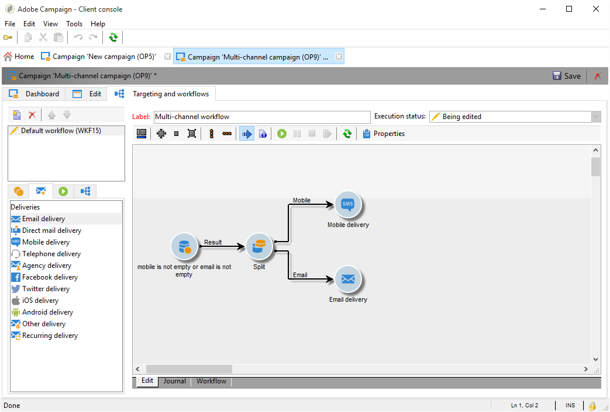

# Consegne cross-channel{#cross-channel-deliveries}

Le consegne cross-channel sono disponibili nella scheda **[!UICONTROL Deliveries]** delle attività del flusso di lavoro della campagna.

I vari canali disponibili sono:

* [E-mail](../../delivery/using/about-email-channel.md)
* [Direct mailing](../../delivery/using/about-direct-mail-channel.md)
* [Mobile](../../delivery/using/sms-channel.md)
* [X (precedentemente noto come Twitter)](../../social/using/about-social-marketing.md)
* [iOS](../../delivery/using/create-notifications-ios.md)
* [Android](../../delivery/using/create-notifications-android.md)

Seleziona il modello su cui desideri basare la consegna e definirne il contenuto.

Puoi specificare un target per la consegna a monte del flusso di lavoro utilizzando le diverse attività di targeting.

Nell’esempio seguente, creeremo un flusso di lavoro per inviare un’e-mail o un SMS per gli abbonati a notifiche push e quindi una notifica push una settimana dopo. Per eseguire questa operazione:

1. Creare una campagna.
1. Nella scheda **[!UICONTROL Targeting and workflows]** della campagna, aggiungi **[!UICONTROL Query]** al flusso di lavoro.
1. Configura la query. Ad esempio, in questo caso come dimensione di destinazione vengono selezionati i destinatari abbonati alle notifiche push.

   >[!NOTE]
   >
   >Per le notifiche push, utilizza la dimensione di destinazione **applicazioni in abbonamento**.

   

1. Aggiungi le condizioni del filtro alla query. In questo caso, selezioneremo i destinatari che hanno un numero di cellulare o un indirizzo e-mail.

   

1. Aggiungi un&#39;attività **[!UICONTROL Split]** al flusso di lavoro per dividere i destinatari con un numero di cellulare e quelli con un indirizzo e-mail.
1. Nella scheda **[!UICONTROL Delivery]**, seleziona una consegna per ciascuno degli oggetti.

   Crea la consegna nello stesso modo in cui crei una consegna con un assistente di consegna classico facendo doppio clic sull’attività di consegna nel flusso di lavoro. Per ulteriori informazioni, consulta questa [pagina](../../delivery/using/about-email-channel.md).

   

1. Aggiungere e configurare un&#39;attività **[!UICONTROL Wait]** in modo che i destinatari non ricevano troppe consegne contemporaneamente.
1. Aggiungi un&#39;attività **[!UICONTROL Split]** per dividere gli abbonati di un&#39;app mobile iOS o Android.

   Selezionare un servizio per ciascun sistema operativo. Per ulteriori informazioni sulla creazione del servizio, consulta questa [pagina](../../delivery/using/configuring-the-mobile-application.md).

   

1. Seleziona e configura la consegna di un’app mobile per ciascuno dei sistemi operativi.

   
