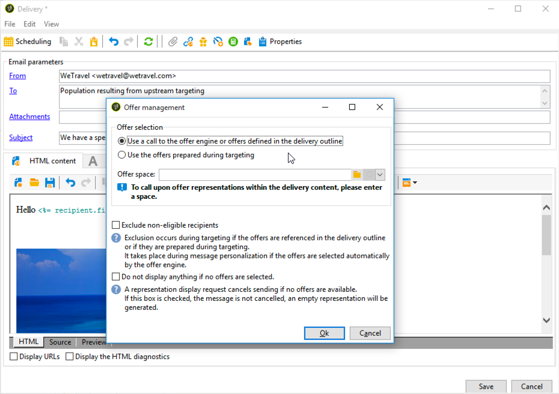

# Flusso di lavoro di consegna cross-channel{#cross-channel-delivery-workflow}

Questo caso d’uso presenta un esempio che coinvolge un flusso di lavoro per la distribuzione tra canali. Il concetto generale di consegne tra canali è presentato in [questa sezione](../../workflow/using/cross-channel-deliveries.md).

L&#39;obiettivo è quello di segmentare un&#39;audience dai destinatari del database in diversi gruppi allo scopo di inviare un&#39;e-mail a un gruppo e un messaggio SMS a un altro gruppo.

Le fasi di implementazione principali per questo caso di utilizzo sono le seguenti:

1. Creazione di un&#39; **[!UICONTROL Query]** attività da destinare al pubblico.
1. Creazione di un&#39; **[!UICONTROL Email delivery]** attività contenente un collegamento a un&#39;offerta.
1. Utilizzo di un&#39; **[!UICONTROL Split]** attività per:

   * Inviare un altro messaggio e-mail ai destinatari che non hanno aperto il primo messaggio e-mail.
   * Inviate un SMS ai destinatari che hanno aperto l’e-mail ma non hanno fatto clic sul collegamento all’offerta.
   * Aggiungete al database i destinatari che hanno aperto l’e-mail e hanno fatto clic sul collegamento.

## Passaggio 1: Targeting dell&#39;audience {#step-1--targeting-the-audience}

Per definire la destinazione, create una query per identificare i destinatari.

1. Creare una campagna. Per ulteriori informazioni al riguardo, consulta [questa sezione](../../campaign/using/setting-up-marketing-campaigns.md#creating-a-campaign).
1. Nella **[!UICONTROL Targeting and workflows]** scheda della campagna, aggiungete un&#39;attività **Query** al flusso di lavoro. For more on using this activity, refer to [this section](../../workflow/using/query.md).
1. Definite i destinatari che riceveranno le vostre consegne. Ad esempio, selezionare i membri &quot;Gold&quot; come dimensione di destinazione.
1. Aggiungere condizioni di filtraggio alla query. In questo esempio, selezionate i destinatari che dispongono di un indirizzo e-mail e di un numero mobile.

   

1. Salva le modifiche.

## Passaggio 2: Creazione di un’e-mail con un’offerta {#step-2--creating-an-email-including-an-offer}

1. Create un&#39; **[!UICONTROL Email delivery]** attività e fate doppio clic su di essa nel flusso di lavoro per modificarla. Per ulteriori informazioni sulla creazione di un&#39;e-mail, consultate [questa sezione](../../delivery/using/about-email-channel.md).
1. Progettate il messaggio e inserite un collegamento che includa un&#39;offerta nel contenuto.

   

   Per ulteriori informazioni sull&#39;integrazione di un&#39;offerta nel corpo di un messaggio, consulta [questa sezione](../../interaction/using/integrating-an-offer-via-the-wizard.md#delivering-with-a-call-to-the-offer-engine).

1. Salva le modifiche.
1. Fate clic con il pulsante destro del mouse sull&#39; **[!UICONTROL Email delivery]** attività per aprirla.
1. Selezionare l&#39; **[!UICONTROL Generate an outbound transition]** opzione per recuperare la popolazione e i registri di tracciamento.

   

   In questo modo potrete utilizzare queste informazioni per inviare un&#39;altra consegna a seconda del comportamento dei destinatari che ricevono la prima e-mail.

1. Aggiungete un&#39; **[!UICONTROL Wait]** attività per consentire ai destinatari di aprire l&#39;e-mail entro alcuni giorni.

   

## Passaggio 3: Segmentazione dell&#39;audience risultante {#step-3--segmenting-the-resulting-audience}

Una volta identificato il target e creata la prima consegna, è necessario segmentare il target in popolazioni diverse utilizzando le condizioni di filtro.

1. Aggiungete un&#39;attività **Split** al flusso di lavoro e apritela. For more on using this activity, refer to [this section](../../workflow/using/split.md).
1. Crea tre segmenti dalla popolazione calcolata a monte nella query.

   

1. Per il primo sottoinsieme, selezionate l’ **[!UICONTROL Add a filtering condition on the inbound population]** opzione e fate clic su **[!UICONTROL Edit]**.

   

1. Selezionate **[!UICONTROL Recipients of a delivery]** come filtro di restrizione e fate clic su **[!UICONTROL Next]**.

   

1. Nelle impostazioni del filtro, selezionate **[!UICONTROL Recipients who have not opened or clicked (email)]** dall’elenco a **[!UICONTROL Behavior]** discesa e selezionate l’e-mail con l’offerta da inviare dall’elenco di distribuzione. Fai clic su **[!UICONTROL Finish]**.

   

1. Procedere in modo simile per il secondo sottoinsieme e selezionare **[!UICONTROL Recipients who have not clicked (email)]** dall&#39;elenco a **[!UICONTROL Behavior]** discesa.

   

1. Per il terzo sottoinsieme, dopo aver selezionato **[!UICONTROL Add a filtering condition on the inbound population]** e fatto clic su di esso **[!UICONTROL Edit]**, selezionate l’ **[!UICONTROL Use a specific filtering dimension]** opzione.
1. Selezionate **[!UICONTROL Recipient tracking log]** dall’elenco a **[!UICONTROL Filtering dimension]** discesa, evidenziate **[!UICONTROL Filtering conditions]** dall’elenco **[!UICONTROL List of restriction filters]** e fate clic su **[!UICONTROL Next]**.

   

1. Selezionate le condizioni del filtro come segue:

   

1. Click **[!UICONTROL Finish]** to save your changes.

## Passaggio 4: Finalizzazione del flusso di lavoro {#step-4--finalizing-the-workflow}

1. Aggiungete le attività pertinenti al flusso di lavoro dopo i tre sottoinsiemi risultanti dall&#39; **[!UICONTROL Split]** attività:

   * Aggiungete un&#39; **[!UICONTROL Email delivery]** attività per inviare un promemoria e-mail al primo sottoinsieme.
   * Aggiungete un&#39; **[!UICONTROL Mobile delivery]** attività per inviare un messaggio SMS al secondo sottoinsieme.
   * Aggiungete un&#39; **[!UICONTROL List update]** attività per aggiungere i destinatari corrispondenti al database.

1. Fate doppio clic sulle attività di consegna nel flusso di lavoro per modificarle. Per ulteriori informazioni sulla creazione di un&#39;e-mail e di un SMS, fare riferimento a Canale [e-mail e canale](../../delivery/using/about-email-channel.md) SMS.
1. Fate doppio clic sull&#39; **[!UICONTROL List update]** attività e selezionate l&#39; **[!UICONTROL Generate an outbound transition]** opzione.

   Potete quindi esportare i destinatari risultanti da  Adobe Campaign nell’Adobe Experience Cloud. Ad esempio, potete utilizzare l&#39;audience in  Adobe Target aggiungendo un&#39; **[!UICONTROL Update shared audience]** attività al flusso di lavoro. Per ulteriori informazioni, consulta [Esportazione di un&#39;audience](../../integrations/using/importing-and-exporting-audiences.md#exporting-an-audience).

1. Fate clic sul pulsante **Avvia** nella barra delle azioni per eseguire il flusso di lavoro.

La popolazione di destinazione dell&#39;attività **Query** verrà segmentata per ricevere un&#39;e-mail o un SMS in base ai comportamenti dei destinatari. La popolazione rimanente verrà aggiunta al database utilizzando l&#39; **[!UICONTROL List update]** attività.
