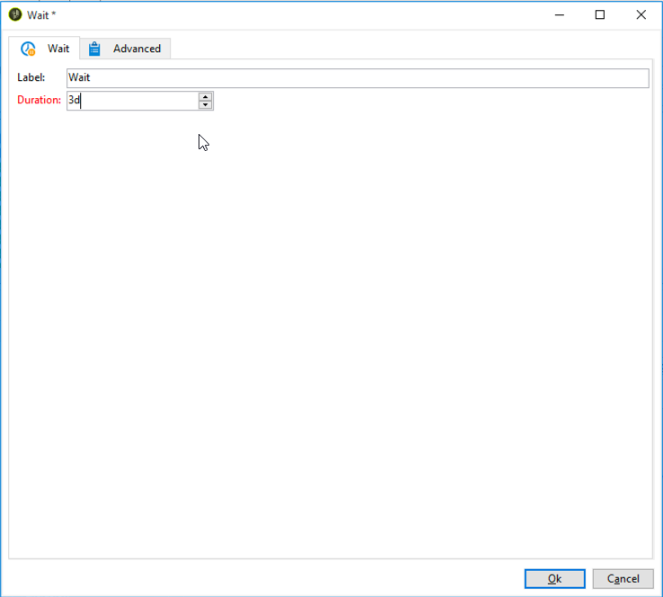

# Flusso di lavoro di consegna cross-channel{#cross-channel-delivery-workflow}

Questo caso d’uso presenta un esempio che coinvolge un flusso di lavoro di consegna cross-channel. Il concetto generale di consegne cross-channel è presentato in [questa sezione](cross-channel-deliveries.md).

L’obiettivo è segmentare un pubblico dai destinatari del database in gruppi diversi, allo scopo di inviare un’e-mail a un gruppo e un messaggio SMS a un altro gruppo.

I passaggi principali di implementazione per questo caso d’uso sono i seguenti:

1. Creazione di un **[!UICONTROL Query]** attività per indirizzare il pubblico.
1. Creazione di un **[!UICONTROL Email delivery]** attività contenente un collegamento a un’offerta.
1. Utilizzo di un **[!UICONTROL Split]** attività a:

   * Invia un’altra e-mail ai destinatari che non hanno aperto la prima e-mail.
   * Invia un SMS ai destinatari che hanno aperto l’e-mail ma non hanno fatto clic sul collegamento all’offerta.
   * Aggiungi al database i destinatari che hanno aperto l’e-mail e fatto clic sul collegamento.

## Passaggio 1: targeting del pubblico {#step-1--targeting-the-audience}

Per definire il target, crea una query per identificare i destinatari.

1. Creare una campagna. Per ulteriori informazioni al riguardo, consulta [questa sezione](../../campaign/using/setting-up-marketing-campaigns.md#creating-a-campaign).
1. In **[!UICONTROL Targeting and workflows]** della campagna, aggiungi un **Query** al flusso di lavoro. Per ulteriori informazioni sull&#39;utilizzo di questa attività, consulta [questa sezione](query.md).
1. Definisci i destinatari che riceveranno le consegne. Ad esempio, selezionare membri &quot;Gold&quot; come dimensione di destinazione.
1. Aggiungi condizioni di filtro alla query. In questo esempio, seleziona i destinatari che dispongono di un indirizzo e-mail e di un numero di cellulare.

   

1. Salva le modifiche.

## Passaggio 2: Creazione di un’e-mail che include un’offerta {#step-2--creating-an-email-including-an-offer}

1. Creare un **[!UICONTROL Email delivery]** e fai doppio clic su di essa nel flusso di lavoro per modificarla. Per ulteriori informazioni sulla creazione di un’e-mail, consulta [questa sezione](../../delivery/using/about-email-channel.md).
1. Progetta il messaggio e inserisci un collegamento che includa un’offerta nel contenuto.

   

   Per ulteriori informazioni sull’integrazione di un’offerta nel corpo di un messaggio, consulta [questa sezione](../../interaction/using/integrating-an-offer-via-the-wizard.md#delivering-with-a-call-to-the-offer-engine).

1. Salva le modifiche.
1. Fare clic con il pulsante destro del mouse **[!UICONTROL Email delivery]** per aprirlo.
1. Seleziona la **[!UICONTROL Generate an outbound transition]** per recuperare la popolazione e i registri di tracciamento.

   

   Questo ti consentirà di utilizzare queste informazioni per inviare un’altra consegna a seconda del comportamento dei destinatari al momento della ricezione della prima e-mail.

1. Aggiungi un **[!UICONTROL Wait]** per consentire ai destinatari di aprire l’e-mail in pochi giorni.

   

## Passaggio 3: segmentazione del pubblico risultante {#step-3--segmenting-the-resulting-audience}

Una volta identificata la destinazione e creata la prima consegna, devi segmentarla in popolazioni diverse utilizzando condizioni di filtro.

1. Aggiungi un **Dividi** al flusso di lavoro e aprirlo. Per ulteriori informazioni sull&#39;utilizzo di questa attività, consulta [questa sezione](split.md).
1. Crea tre segmenti dalla popolazione calcolata a monte nella query.

   

1. Per il primo sottoinsieme, selezionate **[!UICONTROL Add a filtering condition on the inbound population]** e fai clic su **[!UICONTROL Edit]**.

   

1. Seleziona **[!UICONTROL Recipients of a delivery]** come filtro di restrizione e fai clic su **[!UICONTROL Next]**.

   

1. Nelle impostazioni del filtro, seleziona **[!UICONTROL Recipients who have not opened or clicked (email)]** dal **[!UICONTROL Behavior]** e seleziona dall’elenco di consegna l’e-mail contenente l’offerta da inviare. Fai clic su **[!UICONTROL Finish]**.

   

1. Procedi in modo simile per il secondo sottoinsieme e seleziona **[!UICONTROL Recipients who have not clicked (email)]** dal **[!UICONTROL Behavior]** elenco a discesa.

   

1. Per il terzo sottoinsieme, dopo aver selezionato **[!UICONTROL Add a filtering condition on the inbound population]** e clic **[!UICONTROL Edit]**, seleziona la **[!UICONTROL Use a specific filtering dimension]** opzione.
1. Seleziona **[!UICONTROL Recipient tracking log]** dal **[!UICONTROL Filtering dimension]** elenco a discesa, evidenziare **[!UICONTROL Filtering conditions]** dal **[!UICONTROL List of restriction filters]** e fai clic su **[!UICONTROL Next]**.

   

1. Seleziona le condizioni del filtro come segue:

   

1. Clic **[!UICONTROL Finish]** per salvare le modifiche.

## Passaggio 4: finalizzazione del flusso di lavoro {#step-4--finalizing-the-workflow}

1. Aggiungi le attività rilevanti al flusso di lavoro dopo i tre sottoinsiemi risultanti da **[!UICONTROL Split]** attività:

   * Aggiungi un **[!UICONTROL Email delivery]** per inviare un messaggio e-mail di promemoria al primo sottoinsieme.
   * Aggiungi un **[!UICONTROL Mobile delivery]** per inviare un messaggio SMS al secondo sottoinsieme.
   * Aggiungi un **[!UICONTROL List update]** attività per aggiungere i destinatari corrispondenti al database.

1. Fai doppio clic sulle attività di consegna nel flusso di lavoro per modificarle. Per ulteriori informazioni sulla creazione di un’e-mail e di un SMS, consulta [Canale e-mail](../../delivery/using/about-email-channel.md) e [Canale SMS](../../delivery/using/sms-channel.md).
1. Fai doppio clic su **[!UICONTROL List update]** attività e seleziona la **[!UICONTROL Generate an outbound transition]** opzione.

   Puoi quindi esportare i destinatari risultanti da Adobe Campaign in Adobe Experience Cloud. Ad esempio, puoi utilizzare il pubblico in Adobe Target aggiungendo un’ **[!UICONTROL Update shared audience]** al flusso di lavoro. Per ulteriori informazioni, consulta [Esportazione di un pubblico](../../integrations/using/importing-and-exporting-audiences.md#exporting-an-audience).

1. Fai clic su **Inizio** nella barra delle azioni per eseguire il flusso di lavoro.

La popolazione destinataria **Query** L’attività verrà segmentata per ricevere un’e-mail o un SMS in base al comportamento dei destinatari. La popolazione rimanente verrà aggiunta al database utilizzando **[!UICONTROL List update]** attività.
