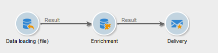
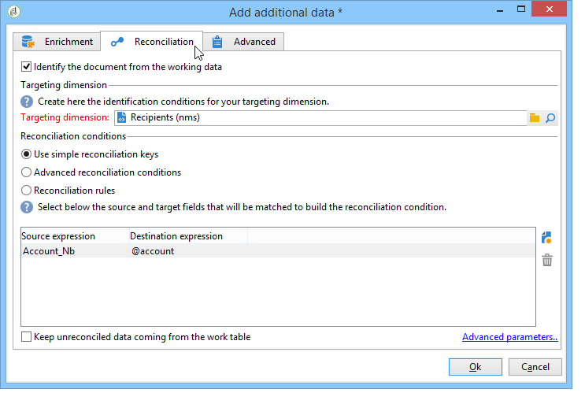
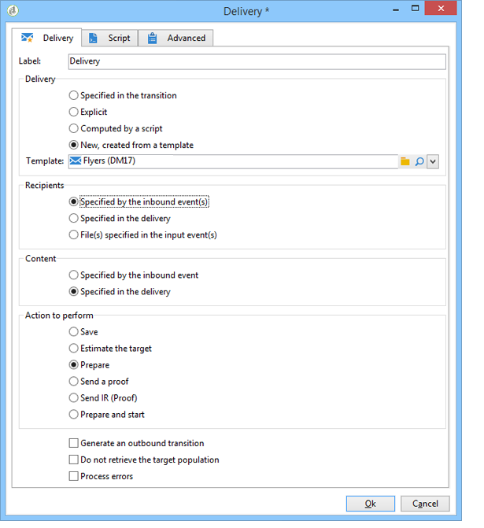

# Ciclo di vita dei dati {#data-life-cycle}


## Tabella di lavoro {#work-table}

Nei flussi di lavoro, i dati trasportati da un’attività all’altra vengono memorizzati in una tabella di lavoro temporanea.

Questi dati possono essere visualizzati e analizzati facendo clic con il pulsante destro del mouse sulla transizione appropriata.


A questo scopo, seleziona il menu pertinente:

* Visualizzazione del target

  Questo menu visualizza i dati disponibili sulla popolazione target e la struttura della tabella di lavoro (**[!UICONTROL Schema]** ).

  

  Per ulteriori informazioni, consulta [Tabelle di lavoro e schema flusso di lavoro](monitoring-workflow-execution.md#worktables-and-workflow-schema).

* Analisi del target

  Questo menu consente di accedere alla procedura guidata di analisi descrittiva che consente di produrre statistiche e rapporti sui dati di transizione.

  Per ulteriori informazioni, consulta questa [sezione](../../reporting/using/using-the-descriptive-analysis-wizard.md).

I dati di destinazione vengono eliminati durante l’esecuzione del flusso di lavoro. È accessibile solo l&#39;ultima tabella di lavoro. È possibile configurare il flusso di lavoro in modo che tutte le tabelle di lavoro rimangano accessibili: selezionare **[!UICONTROL Keep the result of interim populations between two executions]** nelle proprietà del flusso di lavoro.

Tuttavia, si consiglia di evitare di attivare questa opzione in caso di quantità significative di dati.


## Targeting dei dati {#target-data}

I dati memorizzati nella tabella di lavoro del flusso di lavoro sono accessibili nei campi di personalizzazione.

Questo consente di utilizzare i dati raccolti tramite un elenco o in base alle risposte a un sondaggio in una consegna. A tale scopo, utilizza la sintassi seguente:

```
%= targetData.FIELD %
```

**[!UICONTROL Target extension]** (targetData) Gli elementi di personalizzazione del tipo non sono disponibili per i flussi di lavoro di targeting. Il target della consegna deve essere integrato nel flusso di lavoro e specificato nella transizione in entrata della consegna.

Se desideri creare bozze di consegna, la destinazione della bozza deve essere creata in base al **[!UICONTROL Address substitution]** in modo da poter immettere i dati di personalizzazione. Per ulteriori informazioni, consulta questa [sezione](../../delivery/using/steps-defining-the-target-population.md#using-address-substitution-in-proof).

Nell’esempio seguente, raccoglieremo un elenco di informazioni sui clienti, da utilizzare in un’e-mail personalizzata.

Applica i seguenti passaggi:

1. Crea un flusso di lavoro per raccogliere informazioni, riconciliarle con i dati già presenti nel database, quindi avvia una consegna.

   

   Nel nostro esempio, il contenuto del file è il seguente:

   ```
   Music,First name,Last name,Account,CD/DVD,Card
   Pop,David,BLAIR,4323,CD,0
   Rock,Daniel,ARCARI,3222,DVD,1
   Disco,Uma,ALTON,0488,DVD,0
   Jazz,Paul,BOLES,6475,CD,1
   Jazz,David,BOUKHARI,0841,DVD,1
   [...]
   ```

   Per caricare il file, attieniti alla seguente procedura:

   

1. Configurare **[!UICONTROL Enrichment]** digitare attività per riconciliare i dati raccolti con quelli già presenti nel database di Adobe Campaign.

   In questo caso, la chiave di riconciliazione è il numero di account:

   

1. Quindi configura il **[!UICONTROL Delivery]**: viene creato in base a un modello e i destinatari sono specificati dalla transizione in entrata.

   

   >[!CAUTION]
   >
   >Per personalizzare la consegna è possibile utilizzare solo i dati contenuti nella transizione. **targetData** i campi di personalizzazione del tipo sono disponibili solo per la popolazione in entrata del **[!UICONTROL Delivery]** attività.

1. Nel modello di consegna, utilizza i campi raccolti nel flusso di lavoro.

   A tale scopo, inserire **[!UICONTROL Target extension]** digita i campi di personalizzazione.

   

   In questo caso, si desidera inserire il genere musicale e il tipo di file multimediale (CD o DVD) preferiti dal cliente, come indicato nel file raccolto dal flusso di lavoro.

   In più, aggiungeremo un coupon per i titolari di carta fedeltà, ovvero i destinatari per i quali il valore &quot;Carta&quot; è uguale a 1.

   

   **[!UICONTROL Target extension]** I dati di tipo (targetData) vengono inseriti nelle consegne utilizzando le stesse caratteristiche di tutti i campi di personalizzazione. Possono essere utilizzati anche nell’oggetto, nelle etichette di collegamento o nei collegamenti stessi.

   I messaggi indirizzati ai destinatari raccolti conterranno i seguenti dati:

   
