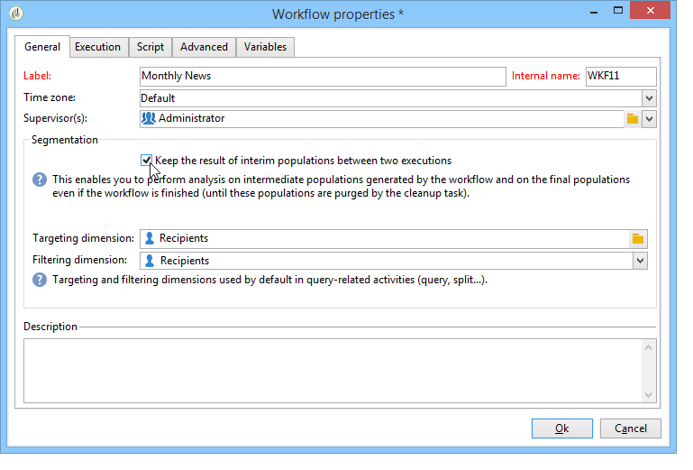

# Ciclo di vita dei dati {#data-life-cycle}

## Tabella di lavoro {#work-table}

Nei flussi di lavoro, i dati trasportati da un&#39;attività all&#39;altra vengono memorizzati in una tabella di lavoro temporanea.

Questi dati possono essere visualizzati e analizzati facendo clic con il pulsante destro del mouse sulla transizione appropriata.


A questo scopo, selezionate il menu appropriato:

* Visualizzazione della destinazione

   Questo menu visualizza i dati disponibili sulla popolazione di destinazione e la struttura della tabella di lavoro (**[!UICONTROL Schema]** scheda).

   

   Per ulteriori informazioni, vedere [Tabelle di lavoro e schema](../../workflow/using/monitoring-workflow-execution.md#worktables-and-workflow-schema)del flusso di lavoro.

* Analisi della destinazione

   Questo menu consente di accedere alla procedura guidata di analisi descrittiva che consente di generare statistiche e rapporti sui dati della transizione.

   For more on this, refer to this [section](../../reporting/using/using-the-descriptive-analysis-wizard.md).

I dati di destinazione vengono eliminati durante l&#39;esecuzione del flusso di lavoro. È accessibile solo l&#39;ultima tabella di lavoro. È possibile configurare il flusso di lavoro in modo che tutte le tabelle di lavoro rimangano accessibili: selezionate l&#39; **[!UICONTROL Keep the result of interim populations between two executions]** opzione nelle proprietà del flusso di lavoro.

Tuttavia, si consiglia di evitare di attivare questa opzione in caso di quantità significative di dati.



## Dati di destinazione {#target-data}

I dati memorizzati nella tabella di lavoro del flusso di lavoro sono accessibili nei campi di personalizzazione.

Questo consente di utilizzare i dati raccolti tramite un elenco o in base alle risposte a un sondaggio in una consegna. A questo scopo, utilizzare la sintassi seguente:

```
%= targetData.FIELD %
```

**[!UICONTROL Target extension]** Gli elementi di personalizzazione di tipo (targetData) non sono disponibili per i flussi di lavoro di targeting. La destinazione di consegna deve essere integrata nel flusso di lavoro e specificata nella transizione in entrata della consegna.

Se desiderate creare delle prove di consegna, il target di prova deve essere costruito in base alla **[!UICONTROL Address substitution]** modalità in modo da poter inserire i dati di personalizzazione. For more on this, refer to this [section](../../delivery/using/steps-defining-the-target-population.md#using-address-substitution-in-proof).

Nell&#39;esempio seguente, raccoglieremo un elenco di informazioni sui clienti da utilizzare in un&#39;e-mail personalizzata.

Effettuate le seguenti operazioni:

1. Create un flusso di lavoro per raccogliere le informazioni, riconciliatelo con i dati già presenti nel database, quindi avviate una consegna.

   

   Nel nostro esempio, il contenuto del file è il seguente:

   ```
   Music,First name,Last name,Account,CD/DVD,Card
   Pop,David,BLAIR,4323,CD,0
   Rock,Daniel,ARCARI,3222,DVD,1
   Disco,Uma,ALTON,0488,DVD,0
   Jazz,Paul,BOLES,6475,CD,1
   Jazz,David,BOUKHARI,0841,DVD,1
   [...]
   ```

   Per caricare il file, procedere come segue:

   

1. Configura l&#39;attività del **[!UICONTROL Enrichment]** tipo per riconciliare i dati raccolti con quelli già presenti nel database Adobe Campaign.

   Qui, la chiave di riconciliazione è il numero di conto:

   

1. Quindi configurate i **[!UICONTROL Delivery]** seguenti parametri: viene creato in base a un modello e i destinatari sono specificati dalla transizione in entrata.

   

   >[!CAUTION]
   >
   >Per personalizzare la consegna possono essere utilizzati solo i dati contenuti nella transizione. **i campi di personalizzazione del tipo targetData** sono disponibili solo per la popolazione in entrata dell&#39; **[!UICONTROL Delivery]** attività.

1. Nel modello di consegna, utilizzate i campi raccolti nel flusso di lavoro.

   A tal fine, inserire **[!UICONTROL Target extension]** i campi di personalizzazione dei tipi.

   

   Qui, vogliamo inserire il genere musicale e il tipo di supporto preferiti del cliente (CD o DVD) come indicato nel file raccolto dal flusso di lavoro.

   Inoltre, aggiungeremo un coupon per i titolari di carte fedeltà, ossia i destinatari per i quali il valore &quot;Carta&quot; è uguale a 1.

   

   **[!UICONTROL Target extension]** I dati di tipo (targetData) vengono inseriti nelle consegne utilizzando le stesse caratteristiche di tutti i campi di personalizzazione. Possono essere utilizzati anche nell&#39;oggetto, nelle etichette di collegamento o nei link stessi.

   I messaggi indirizzati ai destinatari raccolti conterranno i seguenti dati:

   
