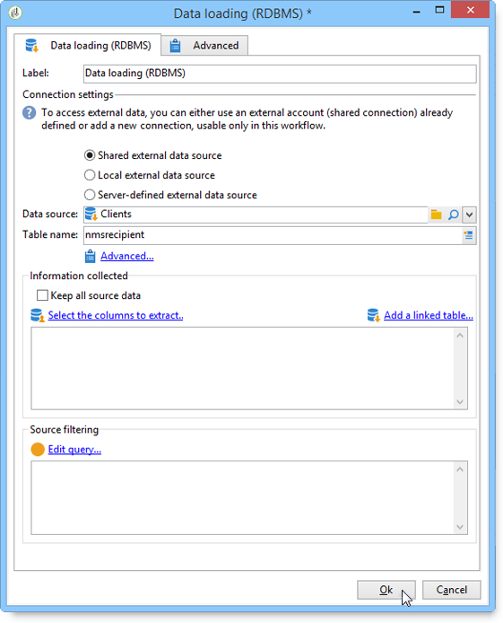

# Caricamento dati (RDBMS){#data-loading-rdbms}

Il **[!UICONTROL Data loading (RDBMS)]** attività consente di accedere direttamente a questo database esterno e di raccogliere solo i dati necessari per il targeting.

Per migliorare le prestazioni, è consigliabile utilizzare l’attività di query, in cui è possibile utilizzare i dati di un database esterno. Per ulteriori informazioni, consulta [Accesso a un database esterno (FDA)](accessing-an-external-database-fda.md).

Il funzionamento è il seguente:

1. Selezionare l&#39;origine dati dall&#39;elenco e immettere il nome della tabella contenente i dati da estrarre.

   

   Il nome della tabella immesso nel campo corrispondente viene utilizzato come modello per la raccolta dei dati nel database esterno. Il nome della tabella elaborata dal flusso di lavoro può essere calcolato o trasmesso dalla transizione in entrata dell’attività di caricamento dei dati. Per selezionare la tabella da utilizzare, fare clic su **[!UICONTROL Advanced..]**. collega e seleziona la **[!UICONTROL Specified in the transition]** o **[!UICONTROL Explicit]** opzione.

   

1. Fai clic su **[!UICONTROL Select the columns to extract...]** per scegliere i dati da raccogliere nel database.

   

1. Puoi definire un filtro per questi dati. A questo scopo, fai clic su **[!UICONTROL Edit query....]** collegamento.

   I dati raccolti in questo modo possono essere utilizzati in tutto il ciclo di vita del flusso di lavoro.
