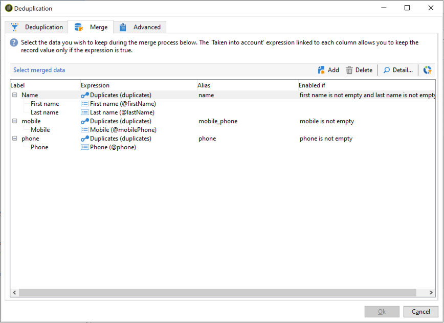

# Utilizzo della funzionalità di unione dell’attività Deduplication {#deduplication-merge}

## Informazioni su questo caso d’uso {#about-this-use-case}

Questo caso d&#39;uso descrive come utilizzare la funzionalità **[!UICONTROL Merge]** nell&#39;attività **[!UICONTROL Deduplication]**.

Per ulteriori informazioni su questa funzionalità, consulta [questa sezione](../../workflow/using/deduplication.md#merging-fields-into-single-record).

L’attività **[!UICONTROL Deduplication]** viene utilizzata per rimuovere righe duplicate da un set di dati. In questo caso d’uso, i dati mostrati di seguito vengono duplicati in base al campo E-mail .

| Data ultima modifica | Nome | Cognome | E-mail | Telefono cellulare | Telefono |
|-----|------------|-----------|-------|--------------|------|
| 19/05/2020 | Robert | Tisner | bob@mycompany.com | 444-444-444 | 777-777-7777 |
| 22/07/2020 | Bobby | Tisner | bob@mycompany.com |  | 777-777-7777 |
| 03/10/2020 | Bob |  | bob@mycompany.com |  | 888-888-8888 |

Con la funzionalità **[!UICONTROL Merge]** dell’attività Deduplication, puoi configurare un set di regole per la deduplicazione per definire un gruppo di campi da unire in un singolo record di dati risultante. Ad esempio, con un set di record duplicati, puoi scegliere di mantenere il numero di telefono più vecchio o il nome più recente.

## Attivazione della funzionalità di unione {#activating-merge}

Per abilitare la funzionalità di unione, devi prima configurare l’attività **[!UICONTROL Deduplication]** . Per farlo, esegui questi passaggi:

1. Apri l&#39;attività, quindi fai clic sul collegamento **[Modifica configurazione]** .

1. Seleziona il campo di riconciliazione da utilizzare per la deduplicazione, quindi fai clic su **[!UICONTROL Next]**. In questo esempio, vogliamo deduplicare in base al campo e-mail.

   

1. Fai clic sul collegamento **[!UICONTROL Advanced parameters]**, quindi attiva le opzioni **[!UICONTROL Merge records]** e **[!UICONTROL Use several record merging criteria]** .

   

1. La scheda **[!UICONTROL Merge]** viene aggiunta alla schermata di configurazione **[!UICONTROL Deduplication]**. Questa scheda consente di specificare i dati da unire durante l’esecuzione della deduplicazione.

## Configurazione dei campi da unire {#configuring-rules}

Di seguito sono riportate le regole che si desidera utilizzare per unire i dati in un singolo record:

* Mantenere il nome più recente (campi nome e cognome),
* Mantenere il cellulare più recente,
* Mantenere il numero di telefono più vecchio,
* Tutti i campi di un gruppo devono essere non-null per essere idonei al record finale.

Per configurare queste regole, effettua le seguenti operazioni:

1. Apri la scheda **[!UICONTROL Merge]** , quindi fai clic sul pulsante **[!UICONTROL Add]** .

   

1. Specifica l’identificatore e l’etichetta del gruppo di campi da unire.

   

1. Indicare le condizioni per la selezione dei record da prendere in considerazione.

   

1. Ordina in base all’ultima data di modifica per selezionare il nome più recente.

   

1. Selezionare i campi da unire. In questo esempio, vogliamo mantenere i campi nome e cognome.

   

1. I campi vengono aggiunti al set di dati da unire e un nuovo elemento viene aggiunto allo schema del flusso di lavoro.

   Ripetere questi passaggi per configurare i campi del telefono cellulare e del telefono.

   

   

## Risultati {#results}

Dopo aver configurato queste regole, alla fine dell&#39;attività **[!UICONTROL Deduplication]** vengono ricevuti i seguenti dati.

| Data di modifica | Nome | Cognome | E-mail | Telefono cellulare | Telefono |
|-----|------------|-----------|-------|--------------|------|
| 19/05/2020 | Robert | Tisner | bob@mycompany.com | 444-444-444 | 777-777-7777 |
| 22/07/2020 | Bobby | Tisner | bob@mycompany.com |  | 777-777-7777 |
| 03/10/2020 | Bob |  | bob@mycompany.com |  | 888-888-8888 |

Il risultato viene unito dai tre record in base alle regole configurate in precedenza. Dopo il confronto, si conclude che sono utilizzati il nome e il telefono cellulare più recenti, insieme al numero di telefono originale.

| Nome | Cognome | E-mail | Telefono cellulare | Telefono |
|------------|-----------|-------|--------------|------|
| Bobby | Tisner | bob@mycompany.com | 444-444-4444 | 888-888-8888 |

>[!NOTE]
>
> Il nome che è stato unito è &quot;Bobby&quot;, perché abbiamo configurato una regola &quot;Nome&quot; composta sia dal nome che dal cognome.
>
>Di conseguenza, non è stato possibile prendere in considerazione &quot;Bob&quot; (il nome più recente) perché il campo del cognome associato era vuoto. La combinazione più recente di nomi e cognomi è stata unita nel record finale.
