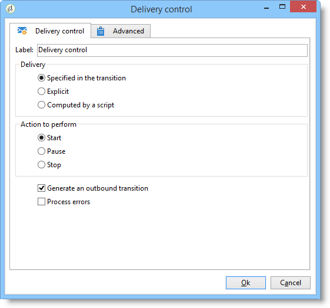

# Controllo della consegna{#delivery-control}

Un&#39;azione di tipo controllo **** Consegna consente di avviare, mettere in pausa o interrompere una consegna.

Può trattarsi della consegna specificata nella transizione, di una consegna selezionata esplicitamente o di una consegna calcolata da uno script. For more on this, refer to [Delivery](../../workflow/using/delivery.md).

Se selezionate **[!UICONTROL Start]**, l&#39;attività eseguirà tutti i passaggi necessari per avviare la consegna (calcolo target, preparazione contenuto, consegna). Se alcuni di questi passaggi sono già stati eseguiti da un&#39;attività di flusso di lavoro precedente, non verranno eseguiti di nuovo. Ad esempio, se la stima di destinazione è già stata eseguita da un&#39;attività di **[!UICONTROL Delivery]** tipo (fare riferimento a [Consegna](../../workflow/using/delivery.md)), l&#39; **[!UICONTROL Act on the delivery]** attività avvierà i passaggi rimanenti (preparazione e distribuzione dei contenuti).

Sono disponibili le seguenti opzioni:

* **[!UICONTROL Generate an outbound transition]**

   Crea una transizione in uscita che verrà attivata al termine dell&#39;esecuzione. Potete scegliere se recuperare o meno la destinazione della consegna in uscita.

* **[!UICONTROL Processing errors]**

   Fare riferimento a Errori [di](../../workflow/using/monitoring-workflow-execution.md#processing-errors)elaborazione.

## Parametri di input {#input-parameters}

* deliveryId

Identificatore di consegna, se l&#39;azione selezionata è **[!UICONTROL Specified in the transition]**.
