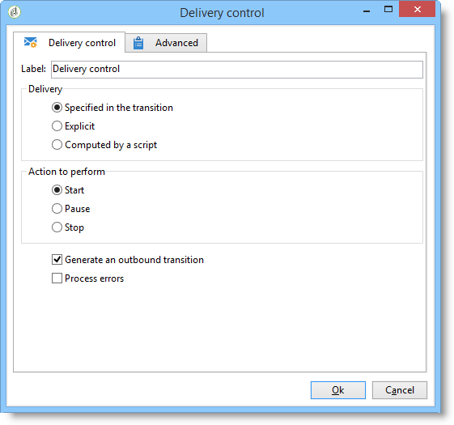

# Controllo della consegna{#delivery-control}

Un&#39;azione di tipo **Controllo di consegna** consente di avviare, mettere in pausa o interrompere una consegna.

Può trattarsi della consegna specificata nella transizione, di una consegna selezionata esplicitamente o di una consegna calcolata da uno script. Per ulteriori informazioni, consulta [Consegna](delivery.md).

Se si seleziona **[!UICONTROL Start]**, l&#39;attività eseguirà tutti i passaggi necessari per avviare la consegna (calcolo del target, preparazione del contenuto, consegna). Se alcuni di questi passaggi sono già stati eseguiti da un’attività del flusso di lavoro precedente, non verranno eseguiti nuovamente. Ad esempio, se la stima di destinazione è già stata eseguita da un&#39;attività di tipo **[!UICONTROL Delivery]** (fare riferimento a [Consegna](delivery.md)), l&#39;attività di tipo **[!UICONTROL Act on the delivery]** avvierà i passaggi rimanenti (preparazione e consegna dei contenuti).

Sono disponibili le seguenti opzioni:

* **[!UICONTROL Generate an outbound transition]**

  Crea una transizione in uscita che verrà attivata alla fine dell’esecuzione. Puoi scegliere se recuperare o meno la destinazione della consegna in uscita.

* **[!UICONTROL Processing errors]**

  Consulta [Errori di elaborazione](monitoring-workflow-execution.md#processing-errors).

## Parametri di input {#input-parameters}

* deliveryId

Identificatore di consegna, se l&#39;azione selezionata è **[!UICONTROL Specified in the transition]**.
