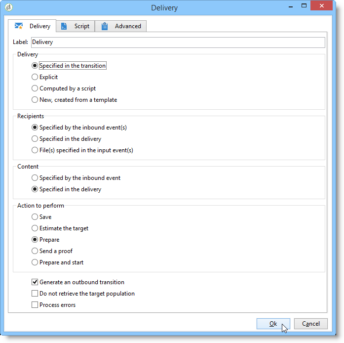
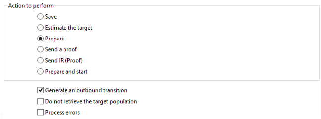

# Consegna{#delivery}

Un&#39;attività di tipo **Consegna** consente di creare un&#39;azione di consegna. Può essere costruito utilizzando elementi di input.

Per configurarlo, modificate l&#39;attività e immettete le opzioni di consegna.



1. **Consegna**

   Puoi:

   * Agisci sulla consegna specificata nella transizione in entrata. A questo scopo, selezionare la prima opzione della **[!UICONTROL Delivery]** sezione della finestra.

      Questa opzione può essere utilizzata quando un&#39;attività di flusso di lavoro precedente ha già creato o specificato la consegna. Questo può essere stato fatto, come nell&#39;esempio seguente, da un&#39;attività dello stesso tipo che ha generato una transizione in uscita.

      Nell&#39;esempio seguente, la consegna viene creata per la prima volta. La popolazione e il contenuto vengono definiti successivamente. Quindi, le informazioni per questi tre elementi vengono reinserite in una nuova attività di consegna utilizzando la transizione in entrata in modo che possa essere inviata.

      

   * Selezionare direttamente la consegna interessata. A questo scopo, selezionate l&#39; **[!UICONTROL Explicit]** opzione e selezionate la consegna dall&#39;elenco a discesa del **[!UICONTROL Delivery]** campo.

      Per impostazione predefinita, l’elenco mostra le consegne non completate contenute nella cartella **Consegne** . Per accedere ad altre campagne, fai clic sull’ **[!UICONTROL Select link]** icona .

      

      Selezionate la campagna dall&#39;elenco a discesa del **[!UICONTROL Folder]** campo oppure fate clic **[!UICONTROL Display sub-levels]** per visualizzare tutte le consegne contenute nelle sottocartelle:

      

      Dopo aver selezionato l’azione di consegna, potete visualizzare il contenuto facendo clic sull’ **[!UICONTROL Edit link]** icona .

   * Creare uno script per calcolare la consegna. A questo scopo, selezionare l&#39; **[!UICONTROL Computed by a script]** opzione e immettere lo script. Per aprire una finestra di input, fate clic sull’ **[!UICONTROL Edit...]** opzione. L&#39;esempio seguente recupera l&#39;identificatore della consegna:

      

   * Crea una nuova consegna. A questo scopo, selezionate l&#39; **[!UICONTROL New, created from a template]** opzione e il modello di consegna su cui verrà basato il recapito.

      

      Fate clic sull&#39; **[!UICONTROL Select link]** icona per sfogliare le cartelle e fate clic sull&#39; **[!UICONTROL Edit link]** icona se desiderate visualizzare il contenuto del modello selezionato.

1. **Destinatari**

   I destinatari possono essere specificati dagli eventi in entrata, ad esempio in seguito all&#39;importazione di un file, o specificati nell&#39;azione di consegna. Possono anche essere memorizzati in uno o più file.

   

1. **Contenuto**

   Il contenuto del messaggio può essere definito nella consegna o nell&#39;evento in entrata.

   

1. **Azione da eseguire**

   Potete creare la consegna, prepararla, avviarla, stimare la destinazione o inviare una prova.

   

   Selezionare il tipo di azione da eseguire:

   * **[!UICONTROL Save]**: questa opzione consente di creare la consegna e salvarla. Non lo analizzerà né lo fornirà.
   * **[!UICONTROL Estimate the target]**: questa opzione consente di calcolare il target di consegna per valutarne il potenziale (prima fase di analisi). Questa azione equivale a selezionare l&#39; **[!UICONTROL Estimate the population to be targeted]** opzione e fare clic su quando si invia un&#39;operazione alla destinazione principale tramite **[!UICONTROL Analyze]** Consegna ****.
   * **[!UICONTROL Prepare]**: questa opzione consente di eseguire l&#39;intero processo di analisi (calcolo di destinazione e preparazione del contenuto). La consegna non viene inviata. Questa azione equivale a selezionare l&#39; **[!UICONTROL Deliver as soon as possible]** opzione e fare clic su quando si invia un&#39;operazione alla destinazione principale con **[!UICONTROL Analyze]** Consegna ****.
   * **[!UICONTROL Send a proof]**: questa opzione consente di inviare una prova della consegna. Questa azione equivale a fare clic sul **[!UICONTROL Send a proof]** pulsante nella barra degli strumenti di una consegna con **consegna**
   * **[!UICONTROL Prepare and start]**: questa opzione avvia l’intero processo di analisi (calcolo target e preparazione dei contenuti) e invia la distribuzione. Questa azione equivale a fare clic **[!UICONTROL Deliver as soon as possible]**, **[!UICONTROL Analyze]** e **[!UICONTROL Confirm delivery]** scegliere quando si invia una consegna alla destinazione principale con **Consegna**.

   L&#39; **[!UICONTROL Act on a delivery]** attività ulteriormente utilizzata nel flusso di lavoro consente di avviare tutti i passaggi rimanenti necessari per avviare la distribuzione (calcolo della destinazione, preparazione dei contenuti, distribuzione). For more on this, refer to [Delivery control](../../workflow/using/delivery-control.md).

   Sono inoltre disponibili le seguenti opzioni:

   * **[!UICONTROL Generate an outbound transition]**

      Crea una transizione in uscita che verrà attivata al termine dell&#39;esecuzione. Potete scegliere se recuperare o meno la destinazione della consegna in uscita.

   * **[!UICONTROL Do not recover target]**

      Non recupera la destinazione dell&#39;azione di consegna in uscita.

   * **[!UICONTROL Processing errors]**

      Fare riferimento al controllo [](../../workflow/using/delivery-control.md)Consegna.
   La scheda **Script** consente di modificare i parametri di consegna.

   

## Esempio: flusso di lavoro di distribuzione {#example--delivery-workflow}

Crea un nuovo flusso di lavoro e aggiungi attività come mostrato nell’immagine seguente:


Aprite l&#39;attività **Consegna** e definite le proprietà come segue:

* Nella **[!UICONTROL Delivery]** sezione, selezionate **[!UICONTROL New, created from a template]** e selezionate un modello di consegna.
* In the **[!UICONTROL Recipients]** section, select **[!UICONTROL Specified in the delivery]**.
* In the **[!UICONTROL Action to execute]** section, keep the **[!UICONTROL Prepare]** option.


Fare clic **[!UICONTROL OK]** per chiudere la finestra delle proprietà. Hai appena configurato un&#39;attività che consiste nella creazione e preparazione di una nuova consegna basata su un modello di consegna il cui target verrà specificato al suo interno.

Aprite l&#39;attività **Approvazione** e definite le proprietà come segue:

1. Nel **[!UICONTROL Assignment type]** campo, selezionate un gruppo in cui siete registrati. Se siete connessi utilizzando l&#39;account &#39;admin&#39;, selezionate il gruppo Amministrazione.
1. Quindi, immettete un titolo e inserite il testo seguente nel corpo del messaggio:

   ```
   Do you wish to approve delivery (<%= vars.recCount %> recipient(s))?
   ```

   Questo è un messaggio che include un&#39;espressione scritta in JavaScript: **[!UICONTROL vars.recCount]** rappresenta il numero di destinatari interessati dalla consegna dell&#39;attività precedente. Per ulteriori informazioni sulle espressioni JavaScript, fare riferimento a script e modelli [](../../workflow/using/javascript-scripts-and-templates.md)JavaScript.

   

   L&#39;attività Approvazione è dettagliata in [Approvazione](../../workflow/using/approval.md).

## Parametri di input {#input-parameters}

Identificatore di consegna, se l&#39; **[!UICONTROL Specified in the transition]** opzione è selezionata nella **[!UICONTROL Delivery]** sezione.

* deliveryId
* tableName
* schema

Ogni evento in ingresso deve specificare una destinazione definita da questi parametri.

>[!NOTE]
>
>Questo parametro viene visualizzato solo se l&#39; **[!UICONTROL Specified by inbound event(s)]** opzione è selezionata nella **[!UICONTROL Recipients]** sezione.

* nomefile

   Nome completo del file generato se l&#39; **[!UICONTROL File(s) specified by inbound event(s)]** opzione è selezionata nella **[!UICONTROL Recipients]** sezione.

* contentId

   Identificatore del contenuto se l&#39; **[!UICONTROL Specified by inbound events]** opzione è selezionata nella **[!UICONTROL Content]** sezione.

## Parametri di output {#output-parameters}

* tableName
* schema
* recCount

Questo insieme di tre valori identifica il target risultante dalla consegna. **[!UICONTROL tableName]** è il nome della tabella che memorizza gli identificatori della destinazione, **[!UICONTROL schema]** è lo schema della popolazione (in genere nms:destinatario) ed **[!UICONTROL recCount]** è il numero di elementi nella tabella.

La transizione associata al complemento ha gli stessi parametri.

>[!NOTE]
>
>Non sono presenti parametri di output quando l&#39; **[!UICONTROL Do not recover target]** opzione è selezionata.

