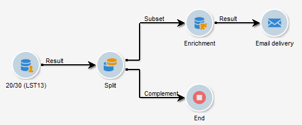

# Arricchimento delle e-mail con campi data personalizzati{#email-enrichment-with-custom-date-fields}

In questo esempio, desideriamo inviare un&#39;e-mail con campi di dati personalizzati ai destinatari che festeggeranno i compleanni di questo mese. L&#39;e-mail includerà un coupon valido una settimana prima e dopo i compleanni.

Dobbiamo indirizzare i destinatari da una lista che festeggerà i loro compleanni questo mese con un&#39; **[!UICONTROL Split]** attività. Quindi, utilizzando l&#39; **[!UICONTROL Enrichment]** attività, il campo dati personalizzato fungerà da date di validità nel messaggio e-mail per l&#39;offerta speciale del cliente.



Per creare questo esempio, procedere come segue:

1. Nella **[!UICONTROL Targeting and workflows]** scheda della campagna, trascina e rilascia un&#39; **[!UICONTROL Read list]** attività per eseguire il targeting dell&#39;elenco dei destinatari.
1. L&#39;elenco da elaborare può essere specificato esplicitamente, calcolato da uno script o localizzato dinamicamente, in base alle opzioni selezionate e ai parametri definiti qui.

   

1. Aggiungi un&#39; **[!UICONTROL Split]** attività per distinguere i destinatari che festeggeranno i loro compleanni questo mese dagli altri destinatari.
1. Per dividere l&#39;elenco, nella **[!UICONTROL Filtering of selected records]** categoria selezionare **[!UICONTROL Add a filtering condition on the inbound population]**. Then, click **[!UICONTROL Edit]**.

   

1. Seleziona **[!UICONTROL Filtering conditions]** quindi fai clic sul **[!UICONTROL Edit expression]** pulsante per filtrare il mese di compleanno del destinatario.

   

1. Fate clic **[!UICONTROL Advanced Selection]** quindi **[!UICONTROL Edit the formula using an expression]** e aggiungete la seguente espressione: Mese(@nascitaDate).
1. Nella **[!UICONTROL Operator]** colonna, selezionate la **[!UICONTROL equal to]**.
1. Filtra ulteriormente la tua condizione, aggiungendo il **[!UICONTROL Value]** mese della data corrente: Month(GetDate()).

   Questo consente di eseguire una query sui destinatari il cui mese di compleanno corrisponde al mese corrente.

   

1. Fai clic su **[!UICONTROL Finish]**. Quindi, nella **[!UICONTROL General]** scheda dell&#39; **[!UICONTROL Split]** attività, fate clic **[!UICONTROL Generate complement]** nella **[!UICONTROL Results]** categoria.

   Con il **[!UICONTROL Complement]** risultato, potete aggiungere un&#39;attività di consegna o aggiornare un elenco. Qui abbiamo aggiunto un&#39; **[!UICONTROL End]** attività.

   

È ora necessario configurare l&#39; **[!UICONTROL Enrichment]** attività:

1. Aggiungete un&#39; **[!UICONTROL Enrichment]** attività dopo il sottoinsieme per aggiungere i campi data personalizzati.

   

1. Aprite l&#39; **[!UICONTROL Enrichment]** attività. In the **[!UICONTROL Complementary information]** category, click **[!UICONTROL Add data]**.

   

1. Selezionare **[!UICONTROL Data linked to the filtering dimension]** quindi **[!UICONTROL Data of the filtering dimension]**.
1. Fai clic sul pulsante **[!UICONTROL Add]**.

   

1. Aggiungi un **[!UICONTROL Label]**. Quindi, nella **[!UICONTROL Expression]** colonna, fate clic su **[!UICONTROL Edit expression]**.

   

1. In primo luogo, è necessario eseguire il targeting della settimana prima della data di nascita come data **di inizio** validità con le **[!UICONTROL Expression]**: `SubDays([target/@birthDate], 7)`.

   

1. Quindi, per creare la data **di fine validità del campo data personalizzato per la settimana successiva alla data di nascita, è necessario aggiungere** **[!UICONTROL Expression]**: `AddDays([target/@birthDate], 7)`.

   È possibile aggiungere un&#39;etichetta all&#39;espressione.

   

1. Fai clic su **[!UICONTROL Ok]**. Il vostro arricchimento è pronto.

Dopo l&#39; **[!UICONTROL Enrichment]** attività, potete aggiungere una consegna. In questo caso, abbiamo aggiunto un&#39;e-mail di consegna per inviare ai destinatari un&#39;offerta speciale con date di validità ai clienti che festeggiano i compleanni di questo mese.

1. Trascinate e rilasciate un&#39; **[!UICONTROL Email delivery]** attività dopo l&#39; **[!UICONTROL Enrichment]** attività.

   

1. Fate doppio clic sull&#39; **[!UICONTROL Email delivery]** attività per iniziare a personalizzare la distribuzione.
1. Aggiungi un **[!UICONTROL Label]** elemento alla consegna e fai clic su **[!UICONTROL Continue]**.
1. Fate clic **[!UICONTROL Save]** per creare la consegna e-mail.
1. Controllate nella **[!UICONTROL Approval]** scheda della consegna dell’e-mail **[!UICONTROL Properties]** che l’ **[!UICONTROL Confirm delivery before sending option]** utente sia selezionato.

   Quindi avviate il flusso di lavoro per arricchire la transizione in uscita con le informazioni di destinazione.

   

È ora possibile iniziare a progettare la distribuzione delle e-mail con i campi data personalizzati creati nell&#39; **[!UICONTROL Enrichment]** attività.

1. Fate doppio clic sull&#39; **[!UICONTROL Email delivery]** attività.
1. Aggiungete le estensioni di destinazione al messaggio e-mail. Deve trovarsi all&#39;interno della seguente espressione per configurare il formato delle date di validità:

   ```
   <%=
           formatDate(targetData.alias of your expression,"%2D.%2M")  %>
   ```

1. Fai clic su  . Selezionare **[!UICONTROL Target extension]** quindi le date di validità personalizzate create in precedenza con l&#39; **[!UICONTROL Enrichment]** attività per aggiungere l&#39;estensione all&#39;espressione formatDate.

   

1. Configura il contenuto dell’e-mail in base alle esigenze.

   

1. Visualizzare l&#39;anteprima del messaggio e-mail per verificare se i campi data personalizzati sono stati configurati correttamente

   

La tua e-mail è ora pronta. Potete iniziare a inviare le prove e confermare la consegna per inviare le e-mail di compleanno.
