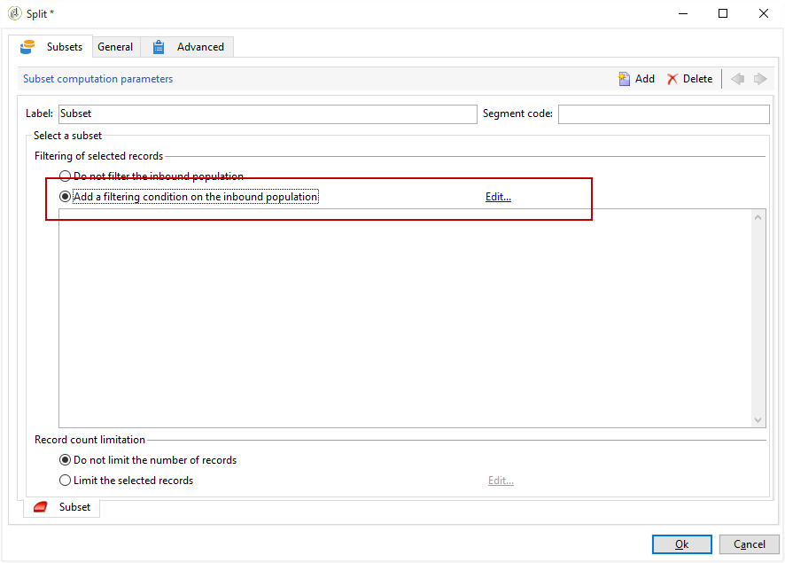
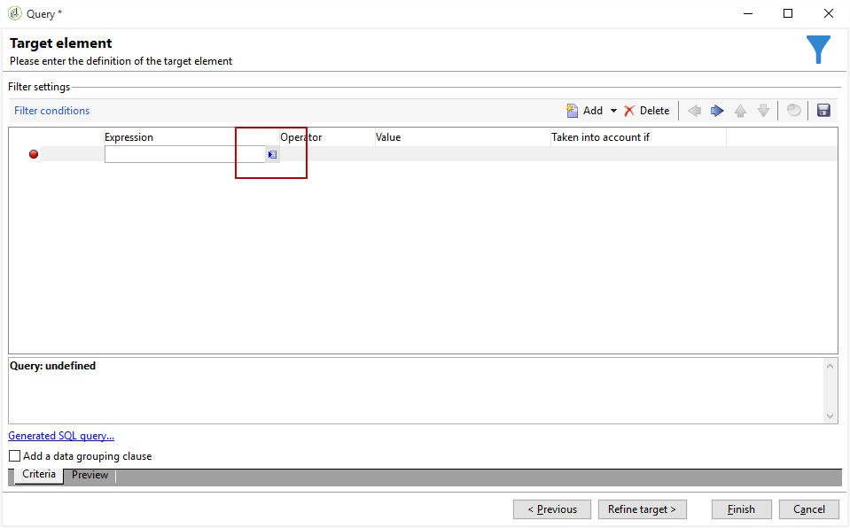
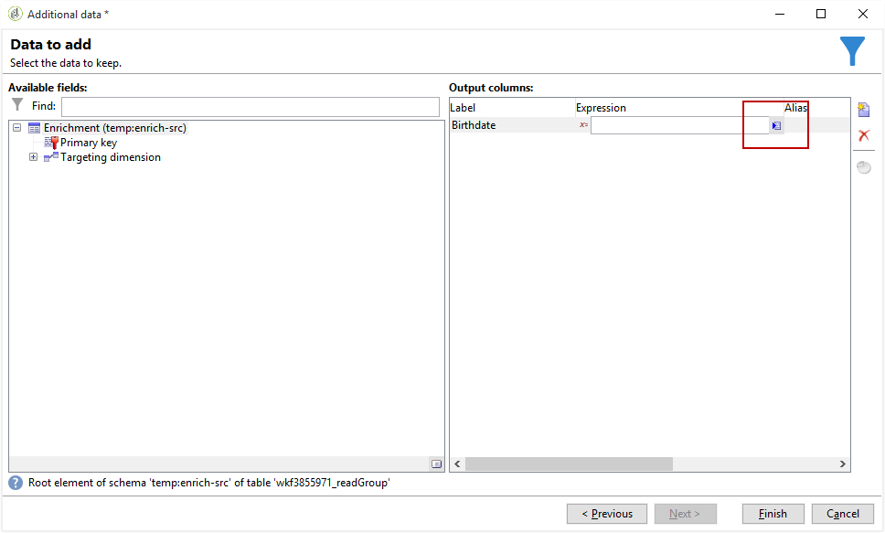

# Arricchimento delle e-mail con campi data personalizzati{#email-enrichment-with-custom-date-fields}

In questo esempio, vogliamo inviare un’e-mail con campi di dati personalizzati ai destinatari che questo mese festeggiano i loro compleanni. L&#39;e-mail includerà un coupon valido una settimana prima e dopo i loro compleanni.

Dobbiamo eseguire il targeting dei destinatari da una lista che questo mese festeggeranno i loro compleanni con un&#39;attività **[!UICONTROL Split]**. Quindi, utilizzando l’attività **[!UICONTROL Enrichment]**, il campo dati personalizzato agirà come date di validità nell’e-mail per l’offerta speciale del cliente.


Per creare questo esempio, esegui i seguenti passaggi:

1. Nella scheda **[!UICONTROL Targeting and workflows]** della campagna, trascina e rilascia un’attività **[!UICONTROL Read list]** per eseguire il targeting dell’elenco di destinatari.
1. L’elenco da elaborare può essere specificato esplicitamente, calcolato da uno script o localizzato dinamicamente, in base alle opzioni selezionate e ai parametri qui definiti.

   

1. Aggiungi un’attività **[!UICONTROL Split]** per differenziare i destinatari che festeggeranno i loro compleanni questo mese dagli altri destinatari.
1. Per dividere l’elenco, nella categoria **[!UICONTROL Filtering of selected records]** selezionare **[!UICONTROL Add a filtering condition on the inbound population]**. Quindi, fai clic su **[!UICONTROL Edit]**.

   

1. Seleziona **[!UICONTROL Filtering conditions]** , quindi fai clic sul pulsante **[!UICONTROL Edit expression]** per filtrare il mese di compleanno del destinatario.

   

1. Fai clic su **[!UICONTROL Advanced Selection]**, quindi **[!UICONTROL Edit the formula using an expression]** e aggiungi la seguente espressione: Month(@datadinascita).
1. Nella colonna **[!UICONTROL Operator]** , seleziona il valore **[!UICONTROL equal to]**.
1. Per filtrare ulteriormente la condizione, aggiungi il mese **[!UICONTROL Value]** della data corrente: Month(GetDate()).

   Verranno eseguiti query sui destinatari il cui mese di compleanno corrisponde al mese corrente.

   

1. Fai clic su **[!UICONTROL Finish]**. Quindi, nella scheda **[!UICONTROL General]** della tua attività **[!UICONTROL Split]**, fai clic su **[!UICONTROL Generate complement]** nella categoria **[!UICONTROL Results]**.

   Con il risultato **[!UICONTROL Complement]**, puoi aggiungere un’attività di consegna o aggiornare un elenco. In questo caso, è stata aggiunta un’attività **[!UICONTROL End]** .

   

È ora necessario configurare l&#39;attività **[!UICONTROL Enrichment]**:

1. Aggiungi un’attività **[!UICONTROL Enrichment]** dopo il sottoinsieme per aggiungere campi data personalizzati.

   

1. Apri l’attività **[!UICONTROL Enrichment]** . Nella categoria **[!UICONTROL Complementary information]**, fai clic su **[!UICONTROL Add data]**.

   

1. Selezionare **[!UICONTROL Data linked to the filtering dimension]**, quindi **[!UICONTROL Data of the filtering dimension]**.
1. Fai clic sul pulsante **[!UICONTROL Add]**.

   

1. Aggiungi un **[!UICONTROL Label]**. Quindi, nella colonna **[!UICONTROL Expression]**, fai clic su **[!UICONTROL Edit expression]**.

   

1. Innanzitutto, dobbiamo eseguire il targeting della settimana prima della data di nascita come data di inizio della validità **con** con il seguente **[!UICONTROL Expression]**: `SubDays([target/@birthDate], 7)`.

   

1. Quindi, per creare il campo data personalizzato **Data fine validità** che eseguirà il targeting della settimana dopo la data di nascita, devi aggiungere il valore **[!UICONTROL Expression]**: `AddDays([target/@birthDate], 7)`.

   Puoi aggiungere un’etichetta all’espressione.

   

1. Fai clic su **[!UICONTROL Ok]**. L&#39;arricchimento è ora pronto.

Dopo l’attività **[!UICONTROL Enrichment]**, puoi aggiungere una consegna. In questo caso, abbiamo aggiunto una consegna e-mail per inviare ai destinatari un’offerta speciale con date di validità ai clienti che festeggiano il compleanno questo mese.

1. Trascina e rilascia un’attività **[!UICONTROL Email delivery]** dopo l’attività **[!UICONTROL Enrichment]** .

   

1. Fai doppio clic sull’attività **[!UICONTROL Email delivery]** per iniziare a personalizzare la consegna.
1. Aggiungi un **[!UICONTROL Label]** alla consegna e fai clic su **[!UICONTROL Continue]**.
1. Fai clic su **[!UICONTROL Save]** per creare la consegna e-mail.
1. Controlla nella scheda **[!UICONTROL Approval]** della consegna e-mail **[!UICONTROL Properties]** che sia selezionato **[!UICONTROL Confirm delivery before sending option]**.

   Quindi, avvia il flusso di lavoro per arricchire la transizione in uscita con le informazioni mirate.

   

Ora puoi iniziare a progettare la consegna e-mail con i campi data personalizzati creati nell’attività **[!UICONTROL Enrichment]** .

1. Fai doppio clic sull’attività **[!UICONTROL Email delivery]** .
1. Aggiungi le estensioni di destinazione all’e-mail. Deve trovarsi all’interno della seguente espressione per configurare il formato delle date di validità:

   ```
   <%=
           formatDate(targetData.alias of your expression,"%2D.%2M")  %>
   ```

1. Fai clic su  . Seleziona **[!UICONTROL Target extension]** quindi le date di validità personalizzate create in precedenza con l&#39;attività **[!UICONTROL Enrichment]** per aggiungere l&#39;estensione all&#39;espressione formatDate.

   

1. Configura il contenuto dell’e-mail in base alle esigenze.

   

1. Visualizza l’anteprima del messaggio e-mail per verificare se i campi data personalizzati sono stati configurati correttamente

   

L’e-mail è ora pronta. Puoi iniziare a inviare le bozze e confermare la consegna per inviare le e-mail di compleanno.
