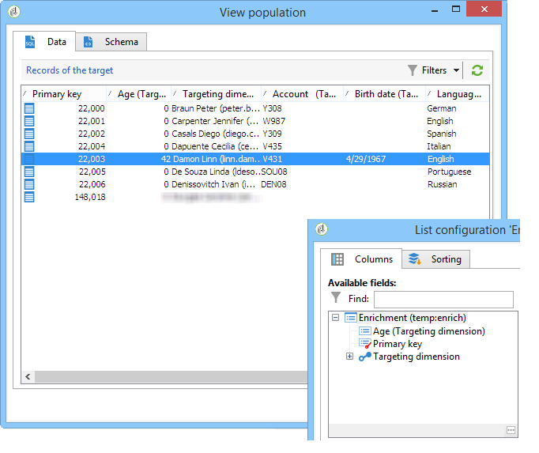
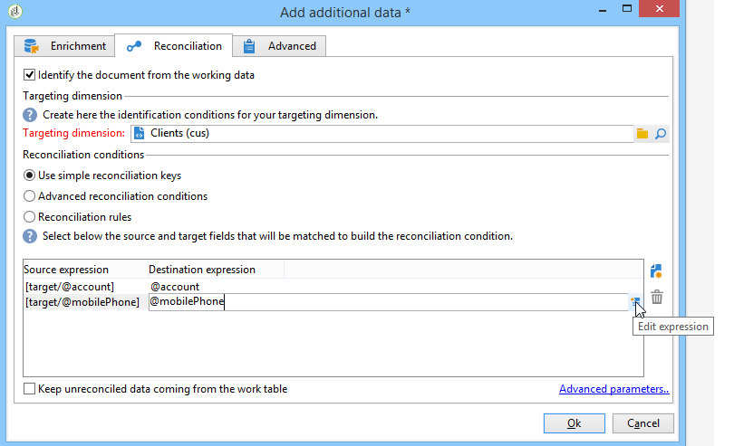

# Enrichment{#enrichment}

L&#39;attività **[!UICONTROL Enrichment]** consente di aggiungere informazioni a un elenco di profili e collegamenti a una tabella esistente (create un nuovo join). È inoltre possibile definire criteri di riconciliazione con i profili presenti nel database.


## Definizioni {#definitions}

Per utilizzare l&#39;attività di arricchimento, è necessario avere familiarità con le varie opzioni disponibili quando si aggiungono dati.


L&#39;opzione **[!UICONTROL Data linked to the filtering dimension]** consente di accedere a:

* Dati della dimensione filtro: accesso ai dati della tabella di lavoro
* Dati collegati alla dimensione filtro: accesso ai dati collegati alla tabella di lavoro


L&#39;opzione **[!UICONTROL A link]** consente di creare un join su qualsiasi tabella del database.


Esistono quattro tipi di collegamenti:

* **[!UICONTROL Define a collection]**: consente di definire un collegamento con una cardinalità 1-N tra le tabelle.
* **[!UICONTROL Define a link whose target is still available]**: consente di definire un collegamento con una cardinalità 1-1 tra le tabelle. Le condizioni di join devono essere definite da un singolo record nella tabella di destinazione.
* **[!UICONTROL Define a link whose target does not necessarily exist in the base]**: consente di definire un collegamento con una cardinalità 0-1 tra le tabelle. La condizione di join deve essere definita da 0 o 1 (max.) record nella tabella di destinazione.

   Questa opzione è configurata nella scheda **[!UICONTROL Simple Join]** a cui è possibile accedere tramite il collegamento **[!UICONTROL Edit additional data]** dell&#39;attività **[!UICONTROL Enrichment]**.

* **[!UICONTROL Define a link by searching for a reference among several options]**: questo tipo di collegamento definisce una riconciliazione con un record univoco.  Adobe Campaign crea un collegamento a una tabella di destinazione aggiungendo una chiave esterna nella tabella di destinazione per memorizzare un riferimento al record univoco.

   Questa opzione è configurata nella scheda **[!UICONTROL Reconciliation and deduplication]** a cui è possibile accedere tramite il collegamento **[!UICONTROL Edit additional data]** dell&#39;attività **[!UICONTROL Enrichment]**.

I casi d’uso che descrivono dettagliatamente il funzionamento delle attività di arricchimento nel loro contesto sono disponibili anche nelle seguenti sezioni:

* [Arricchimento delle e-mail con campi data personalizzati](../../workflow/using/email-enrichment-with-custom-date-fields.md).
* [Arricchimento dei dati](../../workflow/using/enriching-data.md)
* [Creazione di un elenco di riepilogo](../../workflow/using/creating-a-summary-list.md)

## Aggiunta di informazioni {#adding-information}

Utilizzare l&#39;attività **[!UICONTROL Enrichment]** per aggiungere colonne a una tabella di lavoro: questa attività può essere utilizzata come complemento a un&#39;attività di query.

La configurazione di ulteriori colonne è dettagliata in [Aggiunta di dati](../../workflow/using/query.md#adding-data).

Il campo **[!UICONTROL Primary set]** consente di selezionare la transizione in entrata: i dati della tabella di lavoro di questa attività saranno arricchiti.

Fare clic sul collegamento **[!UICONTROL Add data]** e selezionare il tipo di dati da aggiungere. L&#39;elenco dei tipi di dati offerti dipende dai moduli e dalle opzioni installati sulla piattaforma. In una configurazione minima, puoi sempre aggiungere dati collegati alla dimensione di filtraggio e a un collegamento.


Nell&#39;esempio seguente, la transizione in uscita sarà arricchita di informazioni sull&#39;età dei profili di destinazione.


Fare clic con il pulsante destro del mouse sulla transizione in entrata dell&#39;attività di arricchimento per visualizzare i dati prima della fase di arricchimento.


La tabella di lavoro contiene i dati seguenti e lo schema associato:


Ripetere questa operazione nell&#39;output della fase di arricchimento.


È possibile notare che i dati relativi alle pagine di profilo sono stati aggiunti:



Anche lo schema corrispondente è stato arricchito.

## Gestione di dati aggiuntivi {#managing-additional-data}

Deselezionate l&#39;opzione **[!UICONTROL Keep all additional data from the main set]** se non desiderate conservare i dati aggiuntivi definiti in precedenza. In questo caso, solo le colonne aggiuntive selezionate nell&#39;attività di arricchimento verranno aggiunte alla tabella di lavoro in uscita. Le informazioni aggiuntive aggiunte alle attività a monte non verranno salvate.


I dati e lo schema nella fase di arricchimento dell&#39;output saranno i seguenti:


## Creazione di un collegamento {#creating-a-link}

È possibile utilizzare l&#39;attività di arricchimento per creare un collegamento tra i dati di lavoro e il database Adobe Campaign : si tratta di un collegamento locale al flusso di lavoro tra i dati in entrata.

Ad esempio, se carichi i dati di un file che contiene il numero di account, il paese e l’e-mail dei destinatari, dovrai creare un collegamento alla tabella del paese per aggiornare tali informazioni nei loro profili.

A questo scopo, eseguire i seguenti passaggi:

1. Raccogli e carica il seguente tipo di file:

   ```
   Account number;Country;Email
   18D65;FRANCE;agnes@gmail.com
   243PP;RUSSIA;paul@gmail.com
   55H87;CROATIA;dave@gmail.com
   56U81;USA;susan@gmail.com
   853PI;ITALY;anna@gmail.com
   890LP;FRANCE;robert@gmail.com
   83TY2;SWITZERLAND;mike@gmail.com
   ```

1. Modificate l&#39;attività di arricchimento e fate clic su **Aggiungi dati...Collegamento** per creare un join con la tabella Paese.

   

1. Selezionare l&#39;opzione **[!UICONTROL Link definition]** e fare clic sul pulsante **[!UICONTROL Next]**. Specifica il tipo di collegamento da creare. In questo esempio, vogliamo riconciliare il paese del destinatario del file con un paese nell&#39;elenco dei paesi disponibili nella tabella dedicata del database. Scegli l’opzione **[!UICONTROL Define a link by searching for a reference among several options]**. Selezionare la tabella del paese nel campo **[!UICONTROL Target schema]**.

   

1. Infine, selezionare i campi che consentiranno di collegare i valori del file di origine a quelli del database.

   

All&#39;output di questa attività di arricchimento, lo schema temporaneo conterrà il collegamento alla tabella del paese:


## Riconciliazione dati {#data-reconciliation}

L&#39;attività di arricchimento può essere utilizzata per configurare la riconciliazione dei dati, inclusa una volta che i dati sono stati caricati nel database. In questo caso, la scheda **[!UICONTROL Reconciliation]** consente di definire il collegamento tra i dati nel database Adobe Campaign  e i dati nella tabella di lavoro.

Selezionate l&#39;opzione **[!UICONTROL Identify the targeting document based on work data]**, specificate lo schema a cui desiderate creare un collegamento e definite le condizioni di unione: a tal fine, selezionate i campi da riconciliare nei dati di lavoro (**[!UICONTROL Source expression]**) e nella dimensione di targeting (**[!UICONTROL Destination expression]**).

È possibile utilizzare uno o più criteri di riconciliazione.



Se sono specificate più condizioni di join, devono essere verificate tutte in modo che i dati possano essere collegati tra loro.

## Inserimento di una proposta di offerta {#inserting-an-offer-proposition}

L&#39;attività di arricchimento consente di aggiungere offerte o collegamenti alle offerte per i destinatari della distribuzione.

Per ulteriori informazioni sull&#39;attività di arricchimento, fare riferimento a questa sezione [sezione](../../workflow/using/enrichment.md).

Ad esempio, è possibile arricchire i dati per una query del destinatario prima della consegna.


Dopo aver configurato la query (consultare la sezione [sezione](../../workflow/using/query.md)):

1. Aggiungere e aprire un&#39;attività di arricchimento.
1. Nella scheda **[!UICONTROL Enrichment]**, seleziona **[!UICONTROL Add data]**.
1. Selezionare **[!UICONTROL An offer proposition]** nei tipi di dati da aggiungere.

   

1. Specificate un identificatore e un&#39;etichetta per la proposta che verrà aggiunta.
1. Specificate la selezione dell&#39;offerta. Sono disponibili due opzioni:

   * **[!UICONTROL Search for the best offer in a category]**: selezionate questa opzione e specificate i parametri di chiamata del motore di offerte (spazio di offerta, categoria o tema/i, data di contatto, numero di offerte da mantenere). Il motore calcolerà automaticamente le offerte da aggiungere in base a questi parametri. È consigliabile completare il campo **[!UICONTROL Category]** o **[!UICONTROL Theme]**, anziché entrambi allo stesso tempo.

      

   * **[!UICONTROL A predefined offer]**: selezionate questa opzione e specificate uno spazio di offerta, un&#39;offerta specifica e una data di contatto per configurare direttamente l&#39;offerta che desiderate aggiungere, senza chiamare il motore delle offerte.

      

1. Quindi configurate un&#39;attività di consegna che corrisponda al canale scelto. Fare riferimento a [Consegne tra canali](../../workflow/using/cross-channel-deliveries.md).

   Il numero di proposte disponibili per l&#39;anteprima dipende dalla configurazione effettuata nell&#39;attività di arricchimento, piuttosto che da qualsiasi possibile configurazione effettuata direttamente nella consegna.

Per specificare le proposte di offerta, potete anche scegliere di fare riferimento a un collegamento a un&#39;offerta. Per ulteriori informazioni, consultare la sezione seguente [Riferimento a un collegamento a un&#39;offerta](#referencing-a-link-to-an-offer).

## Riferimento a un collegamento a un&#39;offerta {#referencing-a-link-to-an-offer}

Potete anche fare riferimento a un collegamento a un&#39;offerta in un&#39;attività di arricchimento.

Per eseguire questa operazione:

1. Selezionare **[!UICONTROL Add data]** nella scheda **[!UICONTROL Enrichment]** dell&#39;attività.
1. Nella finestra in cui si sceglie il tipo di dati da aggiungere, selezionare **[!UICONTROL A link]**.
1. Seleziona il tipo di collegamento che desideri stabilire e la destinazione. In questo caso, la destinazione è lo schema dell&#39;offerta.

   

1. Specificate il join tra i dati della tabella in entrata nell&#39;attività di arricchimento (qui la tabella dei destinatari) e la tabella delle offerte. Ad esempio, potete collegare un codice di offerta a un destinatario.

   

1. Quindi configurate un&#39;attività di consegna che corrisponda al canale scelto. Fare riferimento a [Consegne tra canali](../../workflow/using/cross-channel-deliveries.md).

   >[!NOTE]
   >
   >Il numero di proposte disponibili per l&#39;anteprima dipende dalla configurazione eseguita nella distribuzione.

## Memorizzazione delle classificazioni e dei pesi delle offerte {#storing-offer-rankings-and-weights}

Per impostazione predefinita, quando si utilizza un&#39;attività **arricchimento** per distribuire le offerte, le loro classificazioni e i loro pesi non vengono memorizzati nella tabella delle proposte.

Per impostazione predefinita, l&#39;attività **[!UICONTROL Offer engine]** memorizza tali informazioni.

Tuttavia, potete memorizzare queste informazioni nel modo seguente:

1. Crea una chiamata al motore delle offerte in un&#39;attività di arricchimento inserita dopo una query e prima di un&#39;attività di consegna. Fare riferimento a questa sezione [](../../interaction/using/integrating-an-offer-via-a-workflow.md#specifying-an-offer-or-a-call-to-the-offer-engine).
1. Nella finestra principale dell&#39;attività, selezionare **[!UICONTROL Edit additional data...]**.

   

1. Aggiungete le colonne **[!UICONTROL @rank]** per la classificazione e **[!UICONTROL @weight]** per lo spessore dell&#39;offerta.

   

1. Conferma l’aggiunta e salva il flusso di lavoro.

La consegna memorizza automaticamente la classifica e il peso delle offerte. Queste informazioni sono visibili nella scheda **[!UICONTROL Offers]** della consegna.
