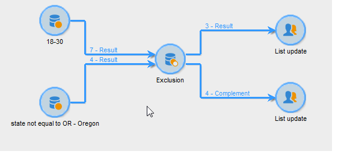

# Exclusion{#exclusion}

Un&#39;attività di tipo **Exclusion** crea un target basato su un target principale da cui vengono estratti uno o più altri target.

Per configurare questa attività, immettete la relativa etichetta e selezionate il set di destinatari principale: la popolazione dalla serie principale permette di costruire il risultato. Saranno esclusi i profili condivisi dal set principale e almeno una delle attività di immissione.

>[!NOTE]
>
>Per ulteriori informazioni sulla configurazione e l&#39;utilizzo dell&#39;attività di esclusione, vedere [Esclusione di una popolazione (Esclusione)](../../workflow/using/targeting-data.md#excluding-a-population--exclusion-).

Selezionare l&#39;opzione **[!UICONTROL Generate complement]** se si desidera sfruttare la popolazione rimanente. Il complemento conterrà la popolazione entrante principale meno la popolazione in uscita. All&#39;attività verrà quindi aggiunta una transizione di output aggiuntiva, come segue:

## Esempi di esclusione {#exclusion-examples}

L&#39;esempio seguente cerca di compilare un elenco dei destinatari di età compresa tra i 18 e i 30 anni, escludendo i residenti di Parigi.

1. Inserire e aprire un&#39;attività di tipo **[!UICONTROL Exclusion]** dopo due query. La prima query riguarda i destinatari residenti a Parigi. La seconda query ha come obiettivo quelli di età compresa tra i 18 e i 30 anni.
1. Inserite il set principale. Qui il set principale è la **query di 18-30 anni**. Gli elementi relativi al secondo set saranno esclusi dal risultato finale.
1. Selezionare l&#39;opzione **[!UICONTROL Generate complement]** se si desidera sfruttare i dati che rimangono dopo l&#39;esclusione. In questo caso, il complemento è costituito da beneficiari di età compresa tra i 18 e i 30 anni che vivono a Parigi.
1. Approvare la configurazione di esclusione, quindi inserire un&#39;attività dell&#39;elenco di aggiornamento nel risultato. Se necessario, è inoltre possibile inserire un aggiornamento dell&#39;elenco aggiuntivo.
1. Eseguire il flusso di lavoro. In questo esempio, il risultato è composto da beneficiari di età compresa tra i 18 e i 30 anni, ma quelli che vivono a Parigi sono esclusi e inviati al complemento.

   

## Parametri di input {#input-parameters}

* tableName
* schema

Ogni evento in ingresso deve specificare una destinazione definita da questi parametri.

## Parametri di output {#output-parameters}

* tableName
* schema
* recCount

Questo insieme di tre valori identifica il target risultante dall&#39;esclusione. **[!UICONTROL tableName]** è il nome della tabella che registra gli identificatori di destinazione,  **[!UICONTROL schema]** è lo schema della popolazione (in genere nms:destinatario) ed  **[!UICONTROL recCount]** è il numero di elementi nella tabella.

La transizione associata al complemento ha gli stessi parametri.
