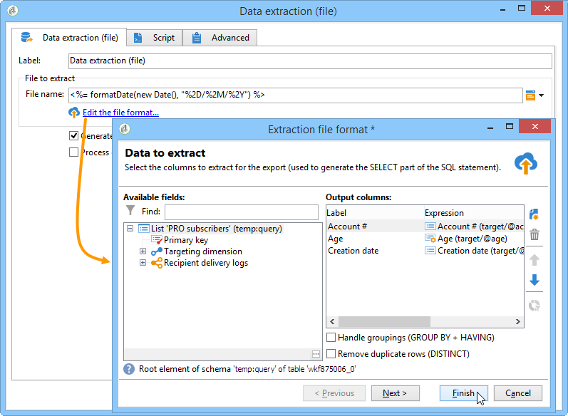

# Estrazione dati (file){#extraction-file}

Potete estrarre i dati da una tabella di un flusso di lavoro in un file esterno utilizzando l&#39; **[!UICONTROL Data extraction (file)]** attività.

>[!CAUTION]
>
>Questa attività deve sempre avere una transizione in entrata che contenga i dati da estrarre.

Per configurare l&#39;estrazione dei dati, effettua i seguenti passaggi:

1. Specificate il nome del file di output: questo nome può contenere variabili, inserite tramite il pulsante di personalizzazione a destra del campo.
1. Fare clic **[!UICONTROL Edit the file format...]** per selezionare i dati da estrarre.

   

   L&#39; **[!UICONTROL Handle groupings (GROUP BY + HAVING)]** opzione aggiunge un passaggio aggiuntivo per filtrare il risultato finale dell&#39;aggregazione, ad esempio per un determinato tipo di ordine di acquisto, per i clienti che hanno ordinato più di 10 volte e così via.

1. Se necessario, è possibile aggiungere nuove colonne al file di output, ad esempio calcoli o risultati di elaborazione. A tale scopo, fare clic sull&#39; **[!UICONTROL Add]** icona.

   

   Nella riga aggiuntiva, fate clic sull’ **[!UICONTROL Edit expression]** icona per definire il contenuto della nuova colonna.

   

   Potrete quindi accedere alla finestra di selezione. Fare clic **[!UICONTROL Advanced selection]** per scegliere il processo da applicare ai dati.

   

   Scegliere la formula desiderata dall&#39;elenco.

   

È possibile definire un post-processo da eseguire durante l&#39;estrazione dei dati, consentendo di comprimere o cifrare i file. A questo scopo, il comando desiderato deve essere aggiunto nella **[!UICONTROL Script]** scheda dell&#39;attività.

Per ulteriori informazioni, consulta questa sezione: [Estrazione o cifratura di un file](../../workflow/using/how-to-use-workflow-data.md#zipping-or-encrypting-a-file).

## List of aggregate functions {#list-of-aggregate-functions}

Di seguito è riportato un elenco delle funzioni di aggregazione disponibili:

* **[!UICONTROL Count]** per contare tutti i valori non-null del campo da aggregare, compresi i valori duplicati (del campo aggregato),

   **[!UICONTROL Distinct]** per calcolare il numero totale di valori diversi e non-null del campo da aggregare (i valori duplicati sono esclusi prima del calcolo),

* **[!UICONTROL Sum]** per calcolare la somma dei valori di un campo numerico,
* **[!UICONTROL Minimum value]** per calcolare i valori minimi di un campo (numerici o di altro tipo),
* **[!UICONTROL Maximum value]** per calcolare i valori massimi di un campo (numerici o di altro tipo),
* **[!UICONTROL Average]** per calcolare la media dei valori di un campo numerico.

