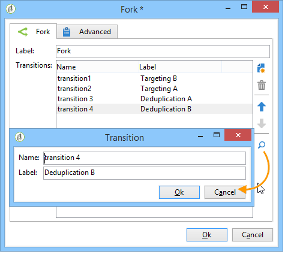

# Fork{#fork}

L&#39;attività **[!UICONTROL Fork]** consente di creare più transizioni in uscita, al fine di eseguire diverse attività in modo indipendente all&#39;interno dello stesso flusso di lavoro.

Ad esempio, potete utilizzare l&#39;attività dopo una query per eseguire due azioni in parallelo:

* Salvate il risultato della query in un&#39;audience,
* Eseguire una segmentazione sul risultato per inviare più consegne.

Potete inoltre utilizzare l&#39;attività nel contesto della creazione di contenuto e dell&#39;automazione dell&#39;invio dei contenuti, per avviare in parallelo il calcolo di destinazione e la creazione di contenuto. Un caso d&#39;uso dedicato è disponibile in [questa sezione](../../delivery/using/automating-via-workflows.md#creating-the-delivery-and-its-content).

>[!IMPORTANT]
>
>Tenete presente che le transizioni in uscita aggiunte dopo un&#39;attività Fork non verranno eseguite contemporaneamente.
>
>L&#39;attività non deve pertanto essere utilizzata per migliorare le prestazioni del flusso di lavoro, ma per eseguire più attività in modo indipendente, e infine unirle prima di eseguire il resto del flusso di lavoro.

Per configurare l&#39;attività, apritela e definite il numero e l&#39;etichetta delle transizioni in uscita desiderate.

Potete quindi configurare ciascuna transizione in uscita, quindi unirli utilizzando un&#39;attività [AND-join](../../workflow/using/and-join.md), se necessario. In questo modo, il resto del flusso di lavoro verrà eseguito solo una volta completate le transizioni in uscita dell&#39;attività **[!UICONTROL Fork]**.
