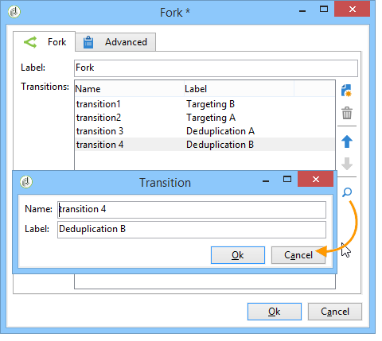
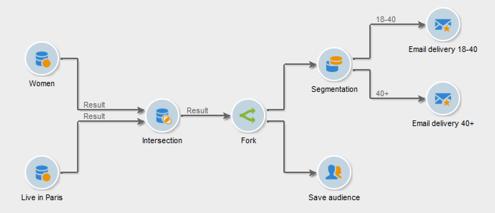
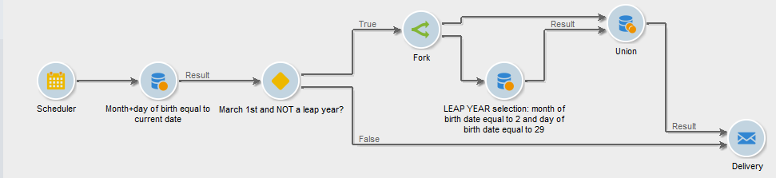

# Fork{#fork}

È possibile utilizzare l&#39;attività **[!UICONTROL Fork]** per creare più transizioni in uscita ed eseguire più attività in modo indipendente all&#39;interno dello stesso flusso di lavoro.

>[!IMPORTANT]
>
>Le transizioni in uscita aggiunte dopo un&#39;attività **[!UICONTROL Fork]** non vengono eseguite contemporaneamente. Questo comportamento può influire sulle prestazioni del flusso di lavoro. Utilizzare l&#39;attività **[!UICONTROL Fork]** se è necessario eseguire più attività in modo indipendente. Facoltativamente, puoi unire le attività in uscita prima della parte successiva del flusso di lavoro.

Per configurare un&#39;attività **[!UICONTROL Fork]** e le attività correlate, eseguire la procedura seguente:

1. Apri l&#39;attività **[!UICONTROL Fork]** e definisci il nome e l&#39;etichetta delle transizioni in uscita.

   

1. Apri ogni transizione in uscita e configurala.
1. Facoltativamente, per unire le transizioni in uscita, aggiungi un’attività AND-join. [Ulteriori informazioni](and-join.md).

   La parte successiva del flusso di lavoro viene eseguita solo al completamento delle transizioni in uscita unite.

## Esempio: segmentazione

In questo esempio, e-mail diverse vengono inviate a gruppi di popolazione diversi. Un&#39;attività **[!UICONTROL Fork]** viene utilizzata dopo una query per eseguire due azioni in parallelo:

* Salvare il risultato della query
* Segmentare il risultato per inviare più consegne

  

Il flusso di lavoro comprende le seguenti attività:

1. Attività **[!UICONTROL Query]**

   Due gruppi di popolazione sono selezionati: le donne e i parigini.

1. Attività **[!UICONTROL Intersection]**

   Viene selezionata l’intersezione dei risultati della query, ovvero donne parigine.

1. Attività **[!UICONTROL Fork]**

   La popolazione calcolata viene salvata e, in parallelo, segmentata in due gruppi:

   1. Donne parigine di età compresa tra 18 e 40 anni
   1. Parigine over 40

1. Attività **[!UICONTROL Delivery]**

   A ciascun gruppo di popolazione viene inviata un’e-mail diversa.

## Caso d’uso: inviare un’e-mail di compleanno

Un’e-mail ricorrente viene inviata a un elenco di destinatari per il compleanno. Un&#39;attività **[!UICONTROL Fork]** viene utilizzata per includere i destinatari nati il 29 febbraio in un anno bisestile. [Ulteriori informazioni](sending-a-birthday-email.md) su questo caso d&#39;uso.

## Caso di utilizzo: automatizzare i contenuti con un flusso di lavoro

La creazione e la distribuzione di un blocco di contenuto sono automatizzate. Un&#39;attività **[!UICONTROL Fork]** viene utilizzata per calcolare la destinazione e, in parallelo, per creare il contenuto. [Ulteriori informazioni](../../delivery/using/automating-via-workflows.md#creating-the-delivery-and-its-content) su questo caso d&#39;uso.

Puoi quindi configurare ogni transizione in uscita e unirla utilizzando un&#39;attività [AND-join](and-join.md), se necessario. In questo modo, il resto del flusso di lavoro verrà eseguito solo una volta completate le transizioni in uscita dell&#39;attività **[!UICONTROL Fork]**.

## Argomenti correlati

* [Attività AND-join](and-join.md)
* [Caso d’uso: e-mail di compleanno](sending-a-birthday-email.md)
* [Caso di utilizzo: creazione e distribuzione di contenuti](../../delivery/using/automating-via-workflows.md#creating-the-delivery-and-its-content)