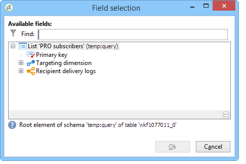

# Come utilizzare i dati dei flussi di lavoro{#how-to-use-workflow-data}

## Aggiornamento del database {#updating-the-database}

Tutti i dati raccolti possono essere utilizzati per aggiornare il database o nelle consegne. Ad esempio, puoi arricchire le possibilità di personalizzazione dei contenuti dei messaggi (includere il numero di contratti nel messaggio, specificare il carrello medio degli acquisti nell&#39;ultimo anno, ecc.) o targeting dettagliato della popolazione (inviare un messaggio ai co-possessori del contratto, indirizzare i 1000 migliori abbonati ai servizi online, ecc.). Questi dati possono essere esportati o archiviati in un elenco.

### Elenchi e aggiornamenti diretti {#lists-and-direct-updates}

I dati del database Adobe Campaign  e gli elenchi esistenti possono essere aggiornati utilizzando due attività dedicate:

* L&#39;attività **[!UICONTROL List update]** consente di memorizzare le tabelle di lavoro in un datalist.

   Potete selezionare un elenco esistente o crearlo. In questo caso, vengono calcolati il nome e, eventualmente, la cartella del record.

   

   Fare riferimento a [Aggiornamento elenco](../../workflow/using/list-update.md).

* L&#39;attività **[!UICONTROL Update data]** esegue un aggiornamento di massa dei campi nel database.

   Per ulteriori informazioni, fare riferimento a [Aggiorna dati](../../workflow/using/update-data.md).

### Gestione iscrizione/annullamento sottoscrizione {#subscription-unsubscription-management}

Per informazioni su come iscriversi e annullare l&#39;iscrizione a un servizio di informazioni tramite un flusso di lavoro, consultare [Subscription Services](../../workflow/using/subscription-services.md).

## Invio tramite un flusso di lavoro {#sending-via-a-workflow}

### Attività di consegna {#delivery-activity}

L&#39;attività di consegna è dettagliata in [Consegna](../../workflow/using/delivery.md).

### Arricchimento e targeting delle consegne {#enriching-and-targeting-deliveries}

Le consegne possono elaborare i dati dai flussi di lavoro per personalizzare i contenuti o nel quadro della selezione della popolazione di destinazione.

Ad esempio, nell’ambito di una consegna diretta per posta, potete includere nel file di estrazione i dati aggiuntivi, tratti dalla manipolazione dei dati eseguita nel flusso di lavoro:

Oltre ai campi di personalizzazione standard, puoi aggiungere campi di personalizzazione dalle fasi del flusso di lavoro ai contenuti per la distribuzione. I dati aggiuntivi definiti nelle attività del flusso di lavoro possono essere conservati e resi accessibili nella procedura guidata di consegna, come illustrato nell&#39;esempio seguente, per definire il nome del file di output nel quadro della consegna diretta:

I dati contenuti nella tabella del flusso di lavoro sono identificati dal relativo nome: è sempre composto dal collegamento **targetData**. Per ulteriori informazioni, fare riferimento a [Dati di destinazione](../../workflow/using/data-life-cycle.md#target-data).

Nel quadro della distribuzione delle e-mail, i campi di personalizzazione possono anche utilizzare i dati provenienti dall&#39;estensione di destinazione eseguita nelle fasi del flusso di lavoro di targeting, come illustrato nell&#39;esempio seguente:

Se un codice del segmento viene specificato in un&#39;attività di targeting, viene aggiunto a una colonna specifica della tabella del flusso di lavoro e viene offerto insieme ai campi di personalizzazione. Per visualizzare tutti i campi di personalizzazione, fai clic sul collegamento **[!UICONTROL Target extension > Other...]** accessibile tramite il pulsante di personalizzazione.

