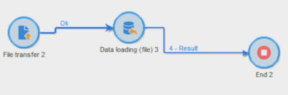

# Importazione di dati{#importing-data}

>[!CAUTION]
>
>Ricorda i limiti di archiviazione SFTP, archiviazione DB e profilo attivo in base al contratto AdobeCampaign quando utilizzi questa funzionalità.

## Modalità di raccolta dei dati {#how-to-collect-data}

### Utilizzo dei dati di un elenco: Leggi l&#39;elenco {#using-data-from-a-list--read-list}

I dati inviati in un flusso di lavoro possono provenire da elenchi in cui i dati sono stati preparati e strutturati in anticipo.

Questo elenco potrebbe essere stato creato direttamente in  Adobe Campaign o importato dall’ **[!UICONTROL Import a list]** opzione. Per ulteriori informazioni su questa opzione, fare riferimento a questa [pagina](../../platform/using/generic-imports-and-exports.md).

Per ulteriori informazioni sull&#39;utilizzo dell&#39;attività di lettura dell&#39;elenco in un flusso di lavoro, vedere [Elenco](../../workflow/using/read-list.md)di lettura.

### Caricamento di dati da un file {#loading-data-from-a-file}

I dati elaborati in un flusso di lavoro possono essere estratti da un file strutturato in modo che possano essere importati in  Adobe Campaign.

Una descrizione dell&#39;attività di caricamento dei dati è disponibile nella sezione Caricamento [dati (file)](../../workflow/using/data-loading--file-.md) .

Esempio di file strutturato da importare:

```
lastname;firstname;birthdate;email;crmID
Smith;Hayden;23/05/1989;hayden.smith@example.com;124365
Mars;Daniel;17/11/1987;dannymars@example.com;123545
Smith;Clara;08/02/1989;hayden.smith@example.com;124567
Durance;Allison;15/12/1978;allison.durance@example.com;120987
```

## Estrazione o decrittografia di un file prima dell&#39;elaborazione {#unzipping-or-decrypting-a-file-before-processing}

### Informazioni sulle fasi di pre-elaborazione {#about-pre-processing-stages}

 Adobe Campaign consente di importare file compressi o crittografati. Prima di poter essere letti in un&#39;attività di caricamento dei [dati (file)](../../workflow/using/data-loading--file-.md) , è possibile definire una pre-elaborazione per decomprimere o decrittografare il file.

Per essere in grado di effettuare le seguenti operazioni:

1. Utilizzate l&#39; [Pannello di controllo Campaign](https://docs.adobe.com/content/help/en/control-panel/using/instances-settings/gpg-keys-management.html#decrypting-data) per generare una coppia di chiavi pubblica/privata.

   >[!NOTE]
   >
   >Il Pannello di controllo Campaign è disponibile per tutti i clienti ospitati su AWS (ad eccezione dei clienti che ospitano le proprie istanze di marketing in sede).

1. Se l&#39;installazione di  Adobe Campaign è ospitata da  Adobe, contattate  Assistenza clienti Adobe per avere sul server le utility necessarie.
1. Se l&#39;installazione di  Adobe Campaign è in sede, installate l&#39;utility da utilizzare (ad esempio: GPG, GZIP) e le chiavi necessarie (chiave di crittografia) sul server dell&#39;applicazione.

Potete quindi usare i comandi di pre-elaborazione desiderati nei flussi di lavoro:

1. Aggiungete e configurate un&#39; **[!UICONTROL File transfer]** attività nel flusso di lavoro.
1. Aggiungete un&#39; **[!UICONTROL Data loading (file)]** attività e definite il formato del file.
1. Selezionare l&#39; **[!UICONTROL Pre-process the file]** opzione.
1. Specificate il comando di pre-elaborazione da applicare.
1. Aggiungere altre attività per gestire i dati provenienti dal file.
1. Salvate ed eseguite il flusso di lavoro.

Un esempio è illustrato nel caso di utilizzo riportato di seguito.

**Argomenti correlati:**

* [Attività](../../workflow/using/data-loading--file-.md)di caricamento dei dati (file).
* [Estrazione o cifratura di un file](../../workflow/using/how-to-use-workflow-data.md#zipping-or-encrypting-a-file).

### Caso di utilizzo: Importazione di dati crittografati con una chiave generata dal Pannello di controllo Campaign {#use-case-gpg-decrypt}

In questo caso, verrà creato un flusso di lavoro per importare i dati crittografati in un sistema esterno, utilizzando una chiave generata nel Pannello di controllo Campaign.

In [questa sezione](https://docs.adobe.com/content/help/en/campaign-classic-learn/tutorials/administrating/control-panel-acc/gpg-key-management/decrypting-data.html)è disponibile anche un video di esercitazione che mostra come usare una chiave GPG per decifrare i dati.

Le operazioni da eseguire per questo caso di utilizzo sono le seguenti:

1. Utilizzate il Pannello di controllo Campaign per generare una coppia di chiavi (pubblica/privata). I passaggi dettagliati sono disponibili nella documentazione [dell&#39;](https://docs.adobe.com/content/help/en/control-panel/using/instances-settings/gpg-keys-management.html#decrypting-data)Pannello di controllo Campaign.

   * La chiave pubblica verrà condivisa con il sistema esterno, che la utilizzerà per crittografare i dati da inviare a Campaign.
   * La chiave privata verrà utilizzata dal Campaign Classic per decrittografare i dati crittografati in arrivo.

   

1. Nel sistema esterno, utilizzare la chiave pubblica scaricata dal Pannello di controllo Campaign per cifrare i dati da importare in Campaign Classic.

   

1. In Campaign Classic, creare un flusso di lavoro per importare i dati crittografati e decifrarlo utilizzando la chiave privata installata tramite il Pannello di controllo Campaign. A tal fine, verrà creato un flusso di lavoro come segue:

   

   * **[!UICONTROL File transfer]** activity: Trasferisce il file da un&#39;origine esterna a un Campaign Classic. In questo esempio, vogliamo trasferire il file da un server SFTP.
   * **[!UICONTROL Data loading (file)]** activity: Carica i dati dal file nel database e decrittografalo utilizzando la chiave privata generata nel Pannello di controllo Campaign.

1. Aprite l&#39; **[!UICONTROL File transfer]** attività, quindi specificate l&#39;account esterno da cui desiderate importare il file .gpg crittografato.

   

   Concetti globali su come configurare l&#39;attività sono disponibili in [questa sezione](../../workflow/using/file-transfer.md).

1. Aprite l&#39; **[!UICONTROL Data loading (file)]** attività, quindi configuratela in base alle vostre esigenze. Concetti globali su come configurare l&#39;attività sono disponibili in [questa sezione](../../workflow/using/data-loading--file-.md).

   Aggiungete una fase di pre-elaborazione all&#39;attività, per decifrare i dati in arrivo. A questo scopo, selezionare l&#39; **[!UICONTROL Pre-process the file]** opzione, quindi copiare e incollare il comando di decrittazione nel **[!UICONTROL Command]** campo :

   `gpg --batch --passphrase passphrase --decrypt <%=vars.filename%>`

   

   >[!CAUTION]
   >
   >In questo esempio, utilizziamo la passphrase utilizzata per impostazione predefinita dal Pannello di controllo Campaign, che è &quot;passphrase&quot;.
   >
   >Se in passato avete già installato chiavi GPG nell&#39;istanza tramite una richiesta dell&#39;Assistenza clienti, la passphrase potrebbe essere stata modificata e per impostazione predefinita è diversa da quella.

1. Fate clic **[!UICONTROL OK]** per confermare la configurazione dell&#39;attività.

1. Ora puoi eseguire il flusso di lavoro. Una volta eseguita, potete controllare nei registri del flusso di lavoro che la decrittazione è stata eseguita e che i dati del file sono stati importati.

   

## Procedure ottimali per l&#39;importazione dei dati {#best-practices-when-importing-data}

Essere cauti e seguire le poche semplici regole descritte di seguito aiuterà molto a garantire la coerenza dei dati all&#39;interno del database e ad evitare errori comuni durante l&#39;aggiornamento del database o le esportazioni di dati.

### Utilizzo dei modelli di importazione {#using-import-templates}

La maggior parte dei flussi di lavoro di importazione deve contenere le seguenti attività: **[!UICONTROL Data loading (file)]**, **[!UICONTROL Enrichment]**, **[!UICONTROL Split]**, **[!UICONTROL Deduplication]**, **[!UICONTROL Update data]**.

Utilizzando i modelli di importazione è molto comodo preparare importazioni simili e garantire la coerenza dei dati all&#39;interno del database. Scopri come creare modelli di workflow nella sezione Modelli [di](../../workflow/using/building-a-workflow.md#workflow-templates) workflow.

In molti progetti, le importazioni vengono create senza **[!UICONTROL Deduplication]** attività perché i file utilizzati nel progetto non hanno duplicati. Talvolta i duplicati vengono visualizzati durante l’importazione di file diversi. La deduplicazione è quindi difficile. Pertanto, un passaggio di deduplicazione è una buona precauzione in tutti i flussi di lavoro di importazione.

Non basarsi sul presupposto che i dati in arrivo siano coerenti e corretti o che il reparto IT o il supervisore  Adobe Campaign se ne occuperanno. Durante il progetto, tenere presente la pulizia dei dati. Deduplicare, riconciliare e mantenere la coerenza quando si importano i dati.

Un esempio di modello di importazione è disponibile nella sezione [Impostazione di una sezione di importazione](#setting-up-a-recurring-import) ricorrente.

### Uso dei formati di file semplici {#using-flat-file-formats}

Il formato più efficiente per le importazioni è rappresentato dai file semplici. I file flat possono essere importati in modalità collettiva a livello di database.

Ad esempio:

* Separatore: tabulazione o punto e virgola
* Prima riga con intestazioni
* Nessun delimitatore di stringa
* Formato data: AAAA/MM/GG HH:mm:SS

 Adobe Campaign non può importare file XML utilizzando le attività di importazione file standard. È possibile importare file XML utilizzando JavaScript ma solo con volumi ridotti: meno di 10.000 record per file.

### Utilizzo di compressione e crittografia {#using-compression-and-encryption}

Quando possibile, usate file ZIP per le importazioni e le esportazioni.

In Linux è possibile decomprimere un file e importarlo contemporaneamente utilizzando una riga di comando. Ad esempio:

```
zcat nl6/var/vp/import/filename.gz
```

È inoltre buona norma crittografare i file inviati in rete se non sono protetti. GPG può essere utilizzato per questo.

### Caricamento dei dati in batch dai file {#loading-data-in-batch-from-files}

Il caricamento di dati in batch da un file è più efficace rispetto al caricamento di una riga alla volta e in tempo reale (ad esempio tramite un servizio Web).

Le importazioni che utilizzano i servizi Web non sono efficienti. È consigliabile utilizzare i file quando possibile.

È inoltre noto che la chiamata di servizi Web esterni per arricchire i profili in tempo reale causa problemi di prestazioni e perdite di memoria, in quanto funziona a livello di linea.

Se è necessario importare i dati, è meglio farlo in batch, utilizzando un flusso di lavoro, che in tempo reale, utilizzando un&#39;applicazione Web o un servizio Web.

### Utilizzo della gestione dei dati {#using-data-management}

Il caricamento in modalità iterativa (riga per riga) tramite JavaScript deve essere limitato a volumi di piccole dimensioni.

Per una migliore efficienza, utilizza sempre l&#39; **[!UICONTROL Data Loading (File)]** attività nei flussi di lavoro di gestione dei dati.

### Importazione in modalità Delta {#importing-in-delta-mode}

Le importazioni regolari devono essere effettuate in modalità delta. Ciò significa che solo i dati modificati o nuovi vengono inviati al Adobe Campaign , invece che all&#39;intera tabella ogni volta.

Le importazioni complete devono essere utilizzate solo per il carico iniziale.

Importa i dati utilizzando la gestione dei dati anziché JavaScript.

### Mantenimento della coerenza {#maintaining-consistency}

Per mantenere la coerenza dei dati nel database del Adobe Campaign , attenersi ai principi seguenti:

* Se i dati importati corrispondono a una tabella di riferimento  Adobe Campaign, è necessario riconciliarla con tale tabella nel flusso di lavoro. I record che non corrispondono devono essere rifiutati.
* Assicurarsi che i dati importati siano sempre **&quot;normalizzati&quot;** (e-mail, numero di telefono, indirizzo e-mail diretto) e che la normalizzazione sia affidabile e non cambi nel corso degli anni. In caso contrario, è probabile che nel database vengano visualizzati dei duplicati, e dato che  Adobe Campaign non fornisce strumenti per effettuare la corrispondenza &quot;fuzzy&quot;, sarà molto difficile gestirli e rimuoverli.
* I dati transazionali devono avere una chiave di riconciliazione e devono essere riconciliati con i dati esistenti al fine di evitare la creazione di duplicati.
* **Importa i file correlati in ordine**.

   Se l’importazione è composta da più file che dipendono l’uno dall’altro, il flusso di lavoro deve verificare che i file vengano importati nell’ordine corretto. Quando un file ha esito negativo, gli altri file non vengono importati.

* **Deduplicare**, riconciliare e mantenere la coerenza quando si importano i dati.

## Impostazione di un&#39;importazione ricorrente {#setting-up-a-recurring-import}

L’utilizzo di un modello di importazione è una procedura consigliata se è necessario importare regolarmente file con la stessa struttura.

In questo esempio viene illustrato come preimpostare un flusso di lavoro che può essere riutilizzato per importare profili provenienti da un CRM nel database del Adobe Campaign . Per ulteriori informazioni su tutte le impostazioni possibili per ogni attività, consultate questa [sezione](../../workflow/using/about-activities.md).

1. Crea un nuovo modello di workflow da **[!UICONTROL Resources > Templates > Workflow templates]**.
1. Aggiungete le seguenti attività:

   * **[!UICONTROL Data loading (file)]**: Definire la struttura prevista del file contenente i dati da importare.
   * **[!UICONTROL Enrichment]**: Riconciliare i dati importati con i dati del database.
   * **[!UICONTROL Split]**: Creare filtri per elaborare i record in modo diverso a seconda che possano essere riconciliati o meno.
   * **[!UICONTROL Deduplication]**: Deduplicare i dati dal file in entrata prima di essere inseriti nel database.
   * **[!UICONTROL Update data]**: Aggiornate il database con i profili importati.

   

1. Configurare l&#39; **[!UICONTROL Data Loading (file)]** attività:

   * Definite la struttura prevista caricando un file di esempio. Il file di esempio deve contenere solo poche righe, ma tutte le colonne necessarie per l&#39;importazione. Controllare e modificare il formato del file per essere certi che il tipo di ogni colonna sia impostato correttamente: testo, data, numero intero, ecc. Ad esempio:

      ```
      lastname;firstname;birthdate;email;crmID
      Smith;Hayden;23/05/1989;hayden.smith@mailtest.com;123456
      ```

   * Nella **[!UICONTROL Name of the file to load]** sezione, selezionare **[!UICONTROL Upload a file from the local machine]** e lasciare il campo vuoto. Ogni volta che viene creato un nuovo flusso di lavoro da questo modello, potete specificare qui il file desiderato, purché corrisponda alla struttura definita.

      Potete utilizzare una qualsiasi delle opzioni, ma dovete modificare di conseguenza il modello. Ad esempio, se selezionate **[!UICONTROL Specified in the transition]**, potete aggiungere un&#39; **[!UICONTROL File Transfer]** attività prima di recuperare il file da importare da un server FTP/SFTP. Con la connessione S3 o SFTP, puoi anche importare dati di segmento in  Adobe Campaign con  piattaforma dati cliente in tempo reale del Adobe. For more on this, refer to this [documentation](https://docs.adobe.com/content/help/en/experience-platform/rtcdp/destinations/destinations-cat/adobe-destinations/adobe-campaign-destination.html).

      

1. Configurare l&#39; **[!UICONTROL Enrichment]** attività. Lo scopo di questa attività in questo contesto è identificare i dati in arrivo.

   * Nella **[!UICONTROL Enrichment]** scheda, selezionare **[!UICONTROL Add data]** e definire un collegamento tra i dati importati e la dimensione di targeting dei destinatari. In questo esempio, il campo personalizzato ID **** CRM viene utilizzato per creare la condizione di partecipazione. Utilizzare il campo o la combinazione di campi necessari, purché sia possibile identificare record univoci.
   * Nella **[!UICONTROL Reconciliation]** scheda, lasciate l&#39; **[!UICONTROL Identify the document from the working data]** opzione deselezionata.

   

1. Configurare l&#39; **[!UICONTROL Split]** attività per recuperare i destinatari riconciliati in una transizione e i destinatari che non possono essere riconciliati ma che dispongono di dati sufficienti in una seconda transizione.

   La transizione con destinatari riconciliati può quindi essere utilizzata per aggiornare il database. La transizione con destinatari sconosciuti può quindi essere utilizzata per creare nuove voci di destinatari nel database se nel file è disponibile un insieme minimo di informazioni.

   I destinatari che non possono essere riconciliati e che non dispongono di dati sufficienti vengono selezionati in una transizione in uscita complementare e possono essere esportati in un file separato o semplicemente ignorati.

   * Nella **[!UICONTROL General]** scheda dell&#39;attività, selezionate **[!UICONTROL Use the additional data only]** come impostazione di filtro e accertatevi che l&#39; **[!UICONTROL Targeting dimension]** impostazione sia automatica su **[!UICONTROL Enrichment]**.

      Selezionare l&#39; **[!UICONTROL Generate complement]** opzione per verificare se non è possibile inserire alcun record nel database. Se necessario, è possibile applicare ulteriore elaborazione ai dati complementari: esportazione di file, aggiornamento di elenchi, ecc.

   * Nel primo sottoinsieme della **[!UICONTROL Subsets]** scheda, aggiungi una condizione di filtro nella popolazione in entrata per selezionare solo i record per i quali la chiave primaria del destinatario non è uguale a 0. In questo modo, i dati del file riconciliati con i destinatari del database vengono selezionati in tale sottoinsieme.

      

   * Aggiungere un secondo sottoinsieme che selezioni record non riconciliati con dati sufficienti per essere inseriti nel database. Ad esempio: indirizzo e-mail, nome e cognome.

      I sottoinsiemi vengono elaborati nell&#39;ordine di creazione, il che significa che quando viene elaborato questo secondo sottoinsieme, tutti i record già presenti nel database sono già selezionati nel primo sottoinsieme.

      

   * Tutti i record non selezionati nei primi due sottoinsiemi sono selezionati nella **[!UICONTROL Complement]**.

1. Configurate l&#39; **[!UICONTROL Update data]** attività che si trova dopo la prima transizione in uscita dell&#39; **[!UICONTROL Split]** attività configurata in precedenza.

   * Selezionate **[!UICONTROL Update]** come **[!UICONTROL Operation type]** perché la transizione in entrata contiene solo i destinatari già presenti nel database.
   * Nella **[!UICONTROL Record identification]** sezione, selezionate **[!UICONTROL Using reconciliation keys]** e definite una chiave tra la dimensione di targeting e il collegamento creato nella **[!UICONTROL Enrichment]**. In questo esempio, viene utilizzato il campo personalizzato ID **** CRM.
   * Nella **[!UICONTROL Fields to update]** sezione, indicare i campi dalla dimensione destinatari da aggiornare con il valore della colonna corrispondente dal file. Se i nomi delle colonne del file sono identici o quasi identici ai nomi dei campi dimensione destinatari, è possibile utilizzare il pulsante bacchetta magica per far corrispondere automaticamente i diversi campi.

      

1. Configurate l&#39; **[!UICONTROL Deduplication]** attività che si trova dopo la transizione che contiene i destinatari non riconciliati:

   * Selezionate **[!UICONTROL Edit configuration]** e impostate la dimensione di targeting sullo schema temporaneo generato dall&#39; **[!UICONTROL Enrichment]** attività del flusso di lavoro.

      

   * In questo esempio, il campo e-mail viene utilizzato per trovare profili univoci. Potete utilizzare qualsiasi campo sicuramente compilato e parte di una combinazione univoca.
   * Nella **[!UICONTROL Deduplication method]** schermata, selezionate **[!UICONTROL Advanced parameters]** e selezionate l&#39; **[!UICONTROL Disable automatic filtering of 0 ID records]** opzione per fare in modo che i record con una chiave primaria uguale a 0 (che dovrebbe essere tutti i record di questa transizione) non siano esclusi.

   

1. Configurate l&#39; **[!UICONTROL Update data]** attività che si trova dopo che l&#39; **[!UICONTROL Deduplication]** attività è stata configurata in precedenza.

   * Selezionate **[!UICONTROL Insert]** come **[!UICONTROL Operation type]** perché la transizione in entrata contiene solo i destinatari non presenti nel database.
   * Nella **[!UICONTROL Record identification]** sezione, selezionate **[!UICONTROL Directly using the targeting dimension]** e scegliete la **[!UICONTROL Recipients]** quota.
   * Nella **[!UICONTROL Fields to update]** sezione, indicare i campi dalla dimensione destinatari da aggiornare con il valore della colonna corrispondente dal file. Se i nomi delle colonne del file sono identici o quasi identici ai nomi dei campi dimensione destinatari, è possibile utilizzare il pulsante bacchetta magica per far corrispondere automaticamente i diversi campi.

      

1. Dopo la terza transizione dell&#39; **[!UICONTROL Split]** attività, aggiungete un&#39; **[!UICONTROL Data extraction (file)]** attività e un&#39; **[!UICONTROL File transfer]** attività se desiderate tenere traccia dei dati non inseriti nel database. Configurate queste attività per esportare la colonna desiderata e per trasferire il file su un server FTP o SFTP in cui potete recuperarlo.
1. Aggiungete un&#39; **[!UICONTROL End]** attività e salvate il modello di flusso di lavoro.

Ora è possibile utilizzare il modello ed è disponibile per ogni nuovo flusso di lavoro. È quindi necessario specificare il file contenente i dati da importare nell&#39; **[!UICONTROL Data loading (file)]** attività.


