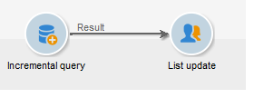

# Query incrementale{#incremental-query}

Una query incrementale consente di selezionare periodicamente una destinazione in base a un criterio, escludendo le persone già interessate per questo criterio.

La popolazione già impostata come destinazione viene memorizzata nella memoria per istanza del flusso di lavoro e per attività, ovvero due flussi di lavoro avviati dallo stesso modello non condividono lo stesso registro. D&#39;altro canto, due attività basate sulla stessa query incrementale per la stessa istanza di flusso di lavoro utilizzeranno lo stesso registro.

La query è definita come per le query standard (fare riferimento a [Creazione di una query](../../workflow/using/query.md#creating-a-query)), ma la sua esecuzione è pianificata.

>[!CAUTION]
>
>Se il risultato di una query incrementale è pari a **0** durante una delle sue esecuzioni, il flusso di lavoro viene messo in pausa fino alla successiva esecuzione programmata della query. Le transizioni e le attività che seguono la query incrementale non vengono pertanto elaborate prima dell&#39;esecuzione seguente.

Per eseguire questa operazione:

1. Nella **[!UICONTROL Scheduling & History]** scheda, selezionare l&#39; **[!UICONTROL Schedule execution]** opzione. L&#39;attività rimane attiva una volta creata e verrà attivata solo nei momenti specificati dalla pianificazione per l&#39;esecuzione della query. Tuttavia, se l&#39;opzione è disabilitata, la query viene eseguita immediatamente **e in una sola volta**.
1. Fate clic sul **[!UICONTROL Change]** pulsante.

   Nella **[!UICONTROL Schedule editing wizard]** finestra potete configurare il tipo di frequenza, ricorrenza evento e periodo di validità dell’evento.

   

1. Fate clic **[!UICONTROL Finish]** per salvare la pianificazione.

   

1. La sezione inferiore della **[!UICONTROL Scheduling & History]** scheda consente di selezionare il numero di giorni di cui tenere conto nella cronologia.

   

   * **[!UICONTROL History in days]**

      I destinatari già assegnati al targeting possono essere registrati per un numero massimo di giorni dal giorno in cui sono stati assegnati al targeting. Se questo valore è zero, i destinatari non vengono mai eliminati dal registro.

   * **[!UICONTROL Keep history when starting]**

      Questa opzione consente di non eliminare il registro quando l&#39;attività è abilitata.

   * **[!UICONTROL SQL table name]**

      Questo parametro consente di sovraccaricare la tabella SQL predefinita contenente i dati della cronologia.

## Esempio di query incrementale: aggiornamento trimestrale {#example-of-an-incremental-query--quarterly-list-update}

Nell&#39;esempio seguente, per aggiornare automaticamente un elenco di destinatari viene utilizzata una query incrementale. Questi destinatari vengono indirizzati come parte di campagne di marketing stagionali.

Poiché queste campagne vengono lanciate all&#39;inizio di ogni stagione per offrire attività sportive rilevanti, queste liste vengono aggiornate ogni trimestre. Tuttavia, un destinatario deve essere selezionato solo una volta ogni 9 mesi da questa campagna. Questo consente di definire la frequenza di ammissibilità del destinatario e di offrire attività per diverse stagioni nel corso degli anni.

1. Aggiungi una query incrementale e un&#39;attività di aggiornamento elenco in un nuovo flusso di lavoro.
1. Configurate la **[!UICONTROL Incremental query]** scheda dell&#39;attività come specificato in [Creazione di una query](../../workflow/using/query.md#creating-a-query).
1. Selezionate la **[!UICONTROL Scheduling & History]** scheda e specificate una cronologia di 270 giorni. Un destinatario che è già stato preso di mira non sarà più destinato per un periodo di 270 giorni, o circa 9 mesi.

   Quindi fate clic sul **[!UICONTROL Change...]** pulsante.

1. Per fare in modo che l&#39;elenco venga aggiornato prima dell&#39;inizio di ogni stagione, selezionare **[!UICONTROL Monthly]**.
1. Nella schermata successiva, selezionate Marzo, Giugno, Settembre e Dicembre. Scegliete il 20 del mese e l’ora di avvio del flusso di lavoro.
1. Selezionare quindi il periodo di validità della query. Ad esempio, se desiderate che l&#39;attività sia attiva in modo permanente, selezionate **[!UICONTROL Permanent validity]**.

   

1. Dopo aver approvato la query incrementale, configurate l&#39;attività di aggiornamento dell&#39;elenco come descritto in Aggiornamento elenco.

Il flusso di lavoro verrà quindi avviato automaticamente subito prima dell&#39;inizio di ogni stagione. L&#39;elenco verrà aggiornato con nuovi destinatari idonei che riceveranno le offerte.

## Parametri di output {#output-parameters}

* tableName
* schema
* recCount

Questo insieme di tre valori identifica la popolazione oggetto della query. **[!UICONTROL tableName]** è il nome della tabella che registra gli identificatori di destinazione, **[!UICONTROL schema]** è lo schema della popolazione (in genere nms:destinatario) ed **[!UICONTROL recCount]** è il numero di elementi nella tabella.
