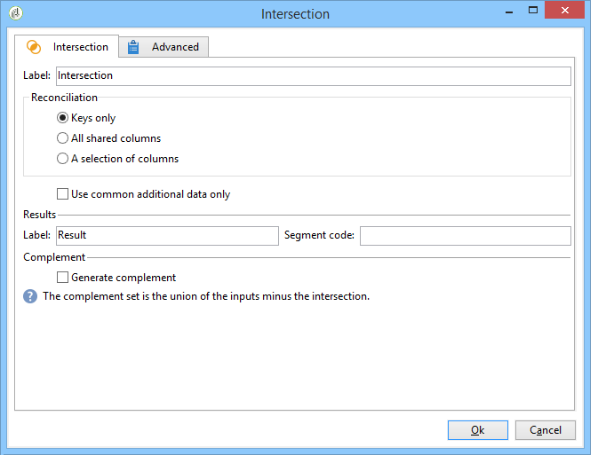

# Intersection{#intersection}

Un&#39;attività di tipo **Intersezione** crea un target dall&#39;intersezione dei target ricevuti.

Un&#39;intersezione consente di estrarre solo la popolazione comune a tutti i risultati dell&#39;attività in entrata. La destinazione viene creata con tutti i risultati ricevuti: tutte le attività precedenti devono pertanto essere completate prima che sia possibile eseguire l&#39;intersezione. Per configurare questa attività, è necessario immettere un&#39;etichetta per essa e le opzioni relative al risultato.

Per ulteriori informazioni sulla configurazione e l&#39;utilizzo dell&#39;attività di intersezione, vedere [Estrazione di dati comuni (Intersezione)](../../workflow/using/targeting-data.md#extracting-joint-data--intersection-).

Check the **[!UICONTROL Generate complement]** option if you wish to process the remaining population. Il complemento conterrà l&#39;unione dei risultati di tutte le attività in entrata meno l&#39;intersezione. All&#39;attività verrà quindi aggiunta un&#39;ulteriore transizione in uscita, come segue:

## Esempio di intersezione {#intersection-example}

Nell&#39;esempio seguente, lo scopo dell&#39;intersezione è di calcolare i destinatari comuni a tre semplici query per creare un elenco.

1. Dopo tre semplici query, inserire un&#39;attività **[!UICONTROL Intersection]** -type.

   In questo esempio; le domande riguardano rispettivamente gli uomini, i beneficiari che vivono a Parigi e i beneficiari di età compresa tra i 18 e i 30 anni.

1. Configurare l&#39;intersezione. A tal fine, selezionare il metodo di **[!UICONTROL Keys only]** riconciliazione, dal momento che le popolazioni risultanti dalle query contengono dati coerenti.
1. Se avete inserito dati aggiuntivi per le query, potete scegliere di mantenere solo quelli condivisi dai destinatari selezionando la casella corrispondente.
1. Se si desidera utilizzare il resto dei dati (per quanto riguarda le query ma non la loro intersezione), selezionare la **[!UICONTROL Generate complement]** casella.
1. Aggiungere un&#39;attività di aggiornamento elenco dopo il risultato dell&#39;intersezione. È inoltre possibile aggiungere un aggiornamento dell&#39;elenco al complemento se si desidera utilizzare anche questo.
1. Eseguire il flusso di lavoro. In questo caso, due destinatari si applicano contemporaneamente a tutte e tre le query inserite. Il complemento è composto da cinque destinatari che si applicano solo a una o due delle tre query.

   Il risultato dell&#39;intersezione viene inviato al primo aggiornamento dell&#39;elenco. Se avete scelto di utilizzare il complemento, questo viene inviato anche al secondo aggiornamento dell&#39;elenco.

   

## Parametri di input {#input-parameters}

* tableName
* schema

Ogni evento in ingresso deve specificare una destinazione definita da questi parametri.

## Parametri di output {#output-parameters}

* tableName
* schema
* recCount

Questo insieme di tre valori identifica il target risultante dall&#39;intersezione. **[!UICONTROL tableName]** è il nome della tabella che registra gli identificatori di destinazione, **[!UICONTROL schema]** è lo schema della popolazione (in genere **[!UICONTROL nms:recipient]**) ed **[!UICONTROL recCount]** è il numero di elementi nella tabella.
