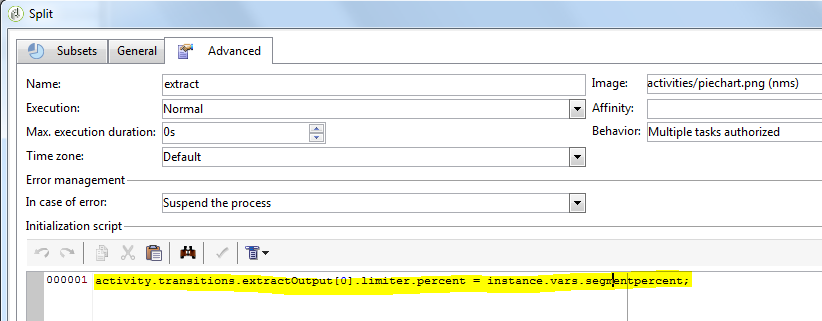

# Script e modelli JavaScript{#javascript-scripts-and-templates}

Gli script consentono di calcolare i valori, scambiare dati tra diverse attività del processo ed eseguire operazioni specifiche utilizzando chiamate SOAP.

Gli script sono onnipresenti in un diagramma di flusso di lavoro:

* Tutte le attività dispongono di script di inizializzazione. Uno script di inizializzazione viene eseguito quando l&#39;attività è attivata e può essere utilizzato per inizializzare le variabili e per modificare le proprietà.
* L&#39;attività &#39;codice JavaScript&#39; viene semplicemente utilizzata per eseguire uno script.
* L&#39;attività &quot;Test&quot; valuta le espressioni JavaScript al fine di attivare la transizione appropriata.
* La maggior parte dei campi di testo sono modelli JavaScript: Le espressioni JavaScript possono essere incluse tra &lt;%= e %>. Questi campi offrono un pulsante che consente di aprire un elenco a discesa per facilitare l’immissione delle espressioni.

   

## Oggetti esposti {#objects-exposed}

Gli script JavaScript eseguiti nel contesto di un flusso di lavoro accedono a una serie di oggetti globali aggiuntivi.

* **instance**: Rappresenta il flusso di lavoro in esecuzione. Lo schema di questo oggetto è **xtk:workflow**.
* **task**: Rappresenta le attività in corso di esecuzione. Lo schema di questo oggetto è **xtk:workflowTask**.
* **event**: Rappresenta gli eventi che hanno attivato l&#39;attività da eseguire. Lo schema di questo oggetto è **xtk:workflowEvent**. Questo oggetto non è inizializzato per le attività di tipo **AND-join** che sono state attivate da più transizioni.
* **eventi**: Rappresenta l&#39;elenco degli eventi che hanno attivato l&#39;attività corrente. Lo schema di questo oggetto è **xtk:workflowEvent**. Questa tabella in genere contiene un elemento ma può contenere diversi elementi per le attività di tipo **AND-join** che sono state attivate in base a diverse transizioni.
* **activity**: Rappresenta il modello dell&#39;attività da eseguire. Lo schema di questo oggetto dipende dal tipo di attività. Questo oggetto può essere modificato dallo script di inizializzazione, in altri script, le modifiche con effetti indeterminabili.

Le proprietà disponibili per questi oggetti possono essere visualizzate in un elenco a discesa facendo clic sul pulsante situato a destra della barra degli strumenti dello script.

>[!CAUTION]
>
>Le proprietà di questi oggetti sono di sola lettura, ad eccezione delle proprietà secondarie della proprietà vars.
>  
>La maggior parte di queste proprietà vengono aggiornate solo dopo l&#39;esecuzione di un&#39;attività elementare o quando l&#39;istanza è passivata. I valori letti non corrispondono necessariamente allo stato corrente ma a quello precedente.

**Esempio**

In questo esempio, e negli esempi seguenti, create un flusso di lavoro che include un&#39;attività codice **** JavaScript e un&#39;attività **End** , come illustrato nel diagramma seguente.


Fate doppio clic sull&#39;attività del codice **** JavaScript e inserite lo script seguente:

```
logInfo("Label: " + instance.label)
logInfo("Start date: " + task.creationDate)
```

La **[!UICONTROL logInfo(message)]** funzione inserisce un messaggio nel registro.

Fate clic **[!UICONTROL OK]** per chiudere la procedura guidata di creazione, quindi avviate il flusso di lavoro utilizzando i pulsanti di azione situati in alto a destra dell’elenco dei flussi di lavoro. Al termine dell&#39;esecuzione, consultare il registro. Vengono visualizzati due messaggi corrispondenti allo script: uno visualizza l&#39;etichetta del flusso di lavoro, l&#39;altro visualizza la data in cui lo script è stato attivato.

## Variabili {#variables}

Le variabili sono le proprietà libere degli **[!UICONTROL instance]**, **[!UICONTROL task]** e **[!UICONTROL event]** degli oggetti. I tipi JavaScript autorizzati per queste variabili sono **[!UICONTROL string]**, **[!UICONTROL number]** e **[!UICONTROL Date]**.

### Variabili di istanza {#instance-variables}

Le variabili di istanza (**[!UICONTROL instance.vars.xxx]**) sono paragonabili alle variabili globali. Sono condivisi da tutte le attività.

### Variabili attività {#task-variables}

Le variabili attività (**[!UICONTROL task.vars.xxx]**) sono paragonabili alle variabili locali. Vengono utilizzati solo dall&#39;attività corrente. Queste variabili vengono utilizzate dalle attività persistenti per conservare i dati e talvolta vengono utilizzate per lo scambio di dati tra i diversi script di una stessa attività.

### Variabili evento {#event-variables}

Le variabili evento (**[!UICONTROL vars.xxx]**) consentono lo scambio di dati tra le attività elementari di un processo di workflow. Queste variabili vengono trasmesse dall’attività che ha attivato l’attività in corso. È possibile modificarle e definirne di nuove. Vengono quindi trasmesse alle seguenti attività.

>[!CAUTION]
>
>Nel caso di attività di tipo [AND-join](../../workflow/using/and-join.md) , le variabili vengono unite ma se una stessa variabile viene definita due volte, si verifica un conflitto e il valore rimane indeterminato.

Gli eventi sono le variabili utilizzate più spesso e dovrebbero essere utilizzati in preferenza per le variabili di istanza.

Alcune variabili di evento vengono modificate o lette dalle varie attività. Sono tutte variabili di tipo stringa. Ad esempio, un’esportazione imposta la **[!UICONTROL vars.filename]** variabile con il nome completo del file appena esportato. Tutte queste variabili lette o modificate sono documentate in [Informazioni sulle attività](../../workflow/using/about-activities.md), nelle sezioni Parametri **di** input e Parametri **di** output delle attività.

### Casi d’uso {#example}

>[!NOTE]
>
>In [questa sezione](../../workflow/using/about-workflow-use-cases.md)sono disponibili ulteriori casi di utilizzo del flusso di lavoro.

**Esempio 1**

In questo esempio, una variabile di istanza viene utilizzata per calcolare dinamicamente la percentuale di divisione da applicare a una popolazione.

1. Create un flusso di lavoro e aggiungete un&#39;attività di avvio.

1. Aggiungete e configurate un&#39;attività codice JavaScript per definire una variabile di istanza.

   Ad esempio: `instance.vars.segmentpercent = 10;`

   

1. Aggiungi un&#39;attività di query e destinatari di destinazione in base alle tue esigenze.

1. Aggiungete un&#39;attività Split e configuratela per eseguire un campionamento casuale della popolazione in arrivo. La percentuale di campionamento può essere qualsiasi cosa desiderata. In questo esempio viene impostato su 50%.

   È questa percentuale che viene aggiornata dinamicamente grazie alla variabile di istanza precedentemente definita.

   

1. All&#39;interno della sezione dello script di inizializzazione della scheda Avanzate dell&#39;attività Dividi, definire una condizione JS. La condizione JS seleziona la percentuale di campionamento casuale della prima transizione proveniente dall&#39;attività Split e la aggiorna a un valore impostato dalla variabile di istanza creata in precedenza.

   ```
   activity.transitions.extractOutput[0].limiter.percent = instance.vars.segmentpercent;
   ```

   

1. Verificate che il complemento sia generato in una transizione separata dell&#39;attività Split e aggiungete le attività End dopo ciascuna transizione in uscita.

1. Salvate ed eseguite il flusso di lavoro. Il campionamento dinamico viene applicato in base alla variabile di istanza.

   

**Esempio 2**

1. Eseguite il flusso di lavoro dall&#39;esempio precedente e sostituite lo script dell&#39;attività Codice **** JavaScript con il seguente script:

   ```
   instance.vars.foo = "bar1"
   vars.foo = "bar2"
   task.vars.foo = "bar3"
   ```

1. Aggiungete lo script seguente allo script di inizializzazione dell&#39;attività **End** :

   ```
   logInfo("instance.vars.foo = " + instance.vars.foo)
   logInfo("vars.foo = " + vars.foo)
   logInfo("task.vars.foo = " + task.vars.foo)
   ```

1. Avviate il flusso di lavoro, quindi controllate il registro.

   ```
   Workflow finished
   task.vars.foo = undefined
   vars.foo = bar2
   instance.vars.foo = bar1
   Starting workflow (operator 'admin')
   ```

Questo esempio mostra che l&#39;attività che segue il codice **** JavaScript accede alle variabili di istanza e di evento, ma le variabili di attività non sono accessibili dall&#39;esterno (&#39;undefined&#39;).

### Chiamata di una variabile di istanza in una query {#calling-an-instance-variable-in-a-query}

Una volta specificata una variabile di istanza in un&#39;attività, potete riutilizzarla in una query del flusso di lavoro.

Pertanto, per chiamare una variabile **instance.vars.xxx = &quot;yyy&quot;** in un filtro, immettete **$(instance/vars/xxx)**.

Ad esempio:

1. Create una variabile di istanza che definisca il nome interno di una consegna tramite **[!UICONTROL JavaScript code]**: **instance.vars.deliveryIN = &quot;DM42&quot;**.

   

1. Create una query le cui dimensioni di targeting e filtro sono i destinatari. Nelle condizioni, specificate che desiderate trovare tutti i destinatari a cui è stato inviato il recapito specificato dalla variabile.

   Come promemoria, queste informazioni vengono memorizzate nei registri di consegna.

   Per fare riferimento alla variabile di istanza nella **[!UICONTROL Value]** colonna, immettete **$(instance/vars/@deliveryIN)**.

   Il flusso di lavoro restituirà i destinatari della distribuzione DM42.

   

## Funzioni avanzate {#advanced-functions}

Oltre alle funzioni JavaScript standard, sono disponibili funzioni speciali per la manipolazione dei file, la lettura o la modifica dei dati nel database o l&#39;aggiunta di messaggi al registro.

### Journal {#journal}

**[!UICONTROL logInfo(message)]** è stato illustrato negli esempi precedenti. Questa funzione aggiunge un messaggio di informazione al giornale di registrazione.

**[!UICONTROL logError(message)]** aggiunge un messaggio di errore al registro. Lo script interrompe l&#39;esecuzione e il flusso di lavoro cambia in stato di errore (per impostazione predefinita, l&#39;istanza viene messa in pausa).

## Script di inizializzazione {#initialization-script}

A determinate condizioni, potete modificare una proprietà di un&#39;attività al momento dell&#39;esecuzione.

La maggior parte delle proprietà delle attività possono essere calcolate in modo dinamico, utilizzando un modello JavaScript o perché le proprietà del flusso di lavoro consentono esplicitamente di calcolare il valore da uno script.

Per altre proprietà, tuttavia, è necessario utilizzare lo script di inizializzazione. Questo script viene valutato prima dell&#39;esecuzione dell&#39;attività. La **[!UICONTROL activity]** variabile fa riferimento all&#39;attività corrispondente all&#39;attività. Le proprietà di questa attività possono essere modificate e interesseranno solo questa attività.
