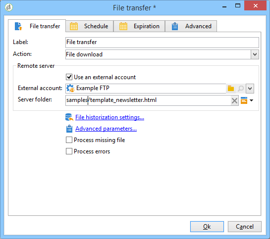

# Caricamento del contenuto di una consegna{#loading-delivery-content}

Se il contenuto di distribuzione è disponibile in un file HTML ubicato  server Amazon S3, FTP o SFTP, potete facilmente caricare tale contenuto  consegne Adobe Campaign.

Per eseguire questa operazione:

1. Se non avete già definito una connessione tra  Adobe Campaign e il server (S)FTP che ospita i file di contenuto, create un nuovo account esterno S3, FTP o SFTP in **[!UICONTROL Administration]** > **[!UICONTROL Platform]** > **[!UICONTROL External Accounts]**. Specificare in questo account esterno l&#39;indirizzo e le credenziali utilizzati per stabilire la connessione al server S3 o (S)FTP.

   Di seguito è riportato un esempio di account esterno S3:

   

1. Create un nuovo flusso di lavoro, ad esempio da **[!UICONTROL Profiles and Targets]** > **[!UICONTROL Jobs]** > **[!UICONTROL Targeting workflows]**.
1. Aggiungete un&#39; **[!UICONTROL File transfer]** attività al flusso di lavoro e configuratela specificando

   * L&#39;account esterno da utilizzare per connettersi al server S3 o (S)FTP.
   * Percorso del file sul server S3 o (S)FTP.

   

1. Aggiungete un&#39; **[!UICONTROL Delivery]** attività e collegatela alla transizione in uscita dell&#39; **[!UICONTROL File transfer]** attività. Configuratelo come segue:

   * Consegna: A seconda delle esigenze, può trattarsi di una consegna specifica già creata nel sistema o di una nuova consegna basata su un modello esistente.
   * Destinatari: In questo esempio, si considera che la destinazione sia specificata nella consegna stessa.
   * Contenuto: Anche se il contenuto viene importato nell&#39;attività precedente, selezionate **[!UICONTROL Specified in the delivery]**. Poiché il contenuto viene importato direttamente da un file ubicato in un server remoto, non dispone di alcun identificatore quando viene elaborato dal flusso di lavoro e non può essere identificato come proveniente dall&#39;evento in ingresso.
   * Azione da eseguire: Selezionate **[!UICONTROL Save]** per salvare la consegna ed essere in grado di accedervi da **[!UICONTROL Campaign management]** > una volta **[!UICONTROL Deliveries]** eseguito il flusso di lavoro.

   

1. Nella **[!UICONTROL Script]** scheda dell&#39; **[!UICONTROL Delivery]** attività, aggiungete il comando seguente per caricare il contenuto del file importato nel recapito:

   ```
   delivery.content.md.source=loadFile(vars.filename)
   ```

   

1. Salvate ed eseguite il flusso di lavoro. Una nuova distribuzione con il contenuto caricato viene creata in **[!UICONTROL Campaign management]** > **[!UICONTROL Deliveries]**.

>[!NOTE]
>
>Le procedure ottimali e la risoluzione dei problemi relativi all&#39;utilizzo del server SFTP sono descritte [in dettaglio in questa pagina](../../platform/using/sftp-server-usage.md).
