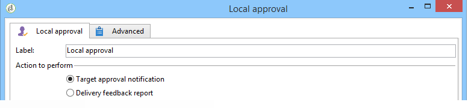

# Approvazione locale{#local-approval}

Se integrata in un flusso di lavoro di targeting, l&#39;attività **[!UICONTROL Local approval]** consente di impostare un processo di approvazione del destinatario prima dell&#39;invio.

>[!CAUTION]
>
>Per utilizzare questa attività, è necessario aver acquistato il modulo Distributed Marketing, che è un&#39;opzione Campaign. Controlla il contratto di licenza.

Per un esempio dell&#39;attività **[!UICONTROL Local approval]** con un modello di distribuzione, fare riferimento a [Utilizzo dell&#39;attività di approvazione locale](../../workflow/using/using-the-local-approval-activity.md).

Per iniziare, immettete un&#39;etichetta per l&#39;attività e il campo **[!UICONTROL Action to execute]**:

* Selezionare l&#39;opzione **[!UICONTROL Target approval notification]** per inviare un messaggio e-mail di notifica ai supervisori locali prima della consegna, chiedendo loro di approvare i destinatari assegnati.

   

* **Query** incrementale: consente di eseguire una query e pianificarne l&#39;esecuzione. Fare riferimento alla sezione [Query incrementale](../../workflow/using/incremental-query.md).

   

## Notifica di approvazione di destinazione {#target-approval-notification}

In questo caso, l&#39;attività **[!UICONTROL Local approval]** viene collocata tra il targeting upstream e la distribuzione:

I campi da inserire nel caso di una notifica per l&#39;approvazione target sono:

* **[!UICONTROL Distribution context]**: selezionate l&#39; **[!UICONTROL Specified in the transition]** opzione se utilizzate un&#39;attività di  **[!UICONTROL Split]** tipo per limitare la popolazione di destinazione. In questo caso, il modello di distribuzione viene immesso nell&#39;attività divisa. Se non si sta limitando la popolazione di destinazione, selezionare l&#39;opzione **[!UICONTROL Explicit]** qui e immettere il modello di distribuzione nel campo **[!UICONTROL Data distribution]**.

   Per ulteriori informazioni sulla creazione di un modello di distribuzione dei dati, fare riferimento a [Limitazione del numero di record di sottoinsiemi per distribuzione dei dati](../../workflow/using/split.md#limiting-the-number-of-subset-records-per-data-distribution).

* **[!UICONTROL Approval management]**

   * Selezionate il modello di consegna e l’oggetto da utilizzare per la notifica e-mail. È disponibile un modello predefinito: **[!UICONTROL Local approval notification]**. Puoi anche aggiungere una descrizione che verrà visualizzata sopra gli elenchi dei destinatari nelle notifiche di approvazione e feedback.
   * Specificare la **[!UICONTROL Approval type]** che corrisponde alla scadenza dell&#39;approvazione (data o scadenza dall&#39;inizio dell&#39;approvazione). A questa data, il flusso di lavoro viene riavviato e i destinatari che non sono stati approvati non vengono presi in considerazione nel targeting. Una volta inviate le notifiche, l&#39;attività viene messa in coda in modo che le autorità di vigilanza locali possano approvare i loro contatti.

      >[!NOTE]
      >
      >Per impostazione predefinita, all&#39;avvio del processo di approvazione, l&#39;attività viene sospesa per tre giorni.

      È inoltre possibile aggiungere uno o più promemoria per informare i supervisori locali che la scadenza si sta avvicinando. A tale scopo, fare clic sul collegamento **[!UICONTROL Add a reminder]**.

* **[!UICONTROL Complementary set]**: l’ **[!UICONTROL Generate complement]** opzione consente di generare un secondo set che include tutte le destinazioni non approvate.

   >[!NOTE]
   >
   >Questa opzione è disabilitata per impostazione predefinita.

## Rapporto di feedback sulla distribuzione {#delivery-feedback-report}

In questo caso, l&#39;attività **[!UICONTROL Local approval]** viene inserita dopo la consegna:

Nel caso di un rapporto di feedback sulla consegna, è necessario inserire i campi seguenti:

* Selezionate l&#39;opzione **[!UICONTROL Specified in the transition]** se la consegna è stata inserita durante un&#39;attività precedente. Selezionare **[!UICONTROL Explicit]** per specificare la consegna nell&#39;attività di approvazione locale.
* Selezionate il modello di consegna e l’oggetto dell’e-mail di notifica. Esiste un modello predefinito: **[!UICONTROL Local approval notification]**.

## Esempio: Approvazione della distribuzione di un flusso di lavoro {#example--approving-a-workflow-delivery}

Questo esempio mostra come impostare un processo di approvazione per la distribuzione di un flusso di lavoro. Per ulteriori informazioni sulla creazione di flussi di lavoro di consegna, fare riferimento all&#39; [Esempio: sezione del flusso di lavoro di distribuzione](../../workflow/using/delivery.md#example--delivery-workflow).

Un operatore può approvare una consegna in uno dei due modi seguenti: utilizzare la pagina Web collegata nel messaggio e-mail o tramite la console.

* Approvazione Web

   L’e-mail inviata agli operatori del gruppo Amministratore consente di approvare la destinazione di consegna. Il messaggio utilizza il testo definito e l&#39;espressione JavaScript viene sostituita dal valore calcolato (in questo caso, &#39;574&#39;)

   Per approvare la consegna, fai clic sul collegamento pertinente e accedi alla console Adobe Campaign .

   

   Scegliere e fare clic sul pulsante **[!UICONTROL Submit]**.

   

* Approvazione tramite console

   Nella struttura ad albero, il nodo **[!UICONTROL Administration > Production > Objects created automatically > Approvals pending]** contiene l&#39;elenco delle attività che devono essere approvate dall&#39;operatore attualmente connesso. Nell&#39;elenco deve essere visualizzata una riga. Fate doppio clic su questa riga per rispondere. Viene visualizzata la finestra seguente:

Selezionare **Yes**, quindi fare clic su **[!UICONTROL Approve]**. Un messaggio vi informa che la risposta è stata registrata.

Torna alla schermata del flusso di lavoro: Dopo circa dieci secondi, il diagramma viene visualizzato come segue:

Il flusso di lavoro ha eseguito l&#39;attività **[!UICONTROL Delivery control]**, che in questo caso significa avviare la consegna precedentemente creata. Il flusso di lavoro è terminato senza errori.
