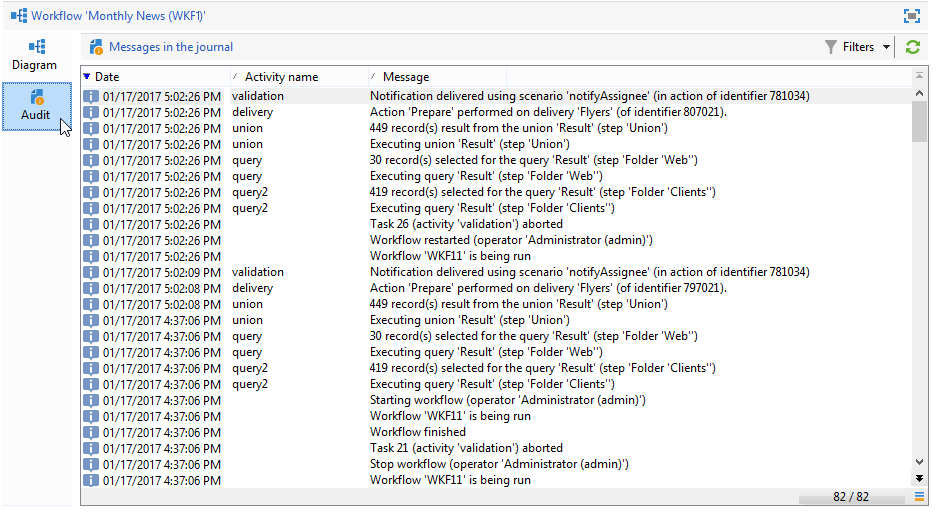

# Monitoraggio dell’esecuzione dei flussi di lavoro {#monitoring-workflow-execution}

In questa sezione vengono fornite informazioni su come monitorare l&#39;esecuzione dei flussi di lavoro.

In [questa sezione](../../workflow/using/supervising-workflows.md#supervising-workflows)è disponibile anche un caso di utilizzo per la creazione di un flusso di lavoro che consente di monitorare lo stato di un set di flussi di lavoro che vengono &quot;messi in pausa&quot;, &quot;interrotti&quot; o &quot;con errori&quot;.

Inoltre, gli amministratori dell’istanza possono utilizzare la traccia di **controllo** per controllare le attività e le ultime modifiche apportate ai flussi di lavoro, lo stato dei flussi di lavoro. For more on this, refer to the [dedicated section](../../production/using/audit-trail.md).

In [questa pagina](../../production/using/monitoring-guidelines.md)sono disponibili altri metodi per monitorare i diversi processi di Campaign.

## Visualizzazione dello stato {#displaying-progress}

È possibile monitorare l&#39;esecuzione visualizzando l&#39;avanzamento utilizzando l&#39;icona appropriata sulla barra degli strumenti.

L&#39; **[!UICONTROL Display progress information]** icona consente di visualizzare lo stato e il risultato dell&#39;attività nella schermata di esecuzione.


Quando questa opzione è selezionata, le attività eseguite sono visualizzate in blu, le attività in sospeso sono in nero, gli avvisi sono visualizzati in arancione ed gli errori in rosso. Questa opzione mostra anche il risultato delle attività nella transizione in uscita, seguita dall&#39;etichetta del risultato come definito nelle proprietà dell&#39;attività e dalla durata del processo se supera un secondo


## Visualizzazione dei registri {#displaying-logs}

Il registro contiene la cronologia o la traccia di controllo del flusso di lavoro. Registra tutte le azioni degli utenti, tutte le operazioni eseguite e gli errori rilevati. Puoi:

* Selezionate la **[!UICONTROL Tracking]** scheda nel dettaglio. Questo elenco contiene tutti i messaggi del flusso di lavoro.

   

* Filtrare i messaggi di registro per attività. A tale scopo, fare clic **[!UICONTROL Display the tasks and the log]** sulla barra degli strumenti sopra il diagramma per visualizzare le schede **[!UICONTROL Log]** e **[!UICONTROL Tasks]** sotto il diagramma. Selezionate un&#39;attività per visualizzare tutti i messaggi correlati. Questo elenco contiene tutti i messaggi quando non è selezionata alcuna attività.

   

   >[!NOTE]
   >
   >Fate clic sullo sfondo del diagramma per deselezionare tutti gli elementi.

* Visualizzare solo i messaggi collegati a una determinata attività. A questo scopo, selezionate la **[!UICONTROL Tasks]** scheda, quindi selezionate un&#39;attività nel diagramma per limitare l&#39;elenco. Fare doppio clic su un&#39;attività per visualizzare le informazioni; l&#39;ultima scheda della finestra contiene il registro.

   

   Il **[!UICONTROL Details...]** pulsante consente di visualizzare tutte le informazioni aggiuntive sull&#39;esecuzione dell&#39;attività. Ad esempio, è possibile visualizzare l&#39;operatore di convalida e, se applicabile, il commento immesso durante l&#39;approvazione, come nell&#39;esempio seguente:

   

>[!NOTE]
>
>Il registro non viene eliminato al riavvio di un flusso di lavoro. Tutti i messaggi sono conservati. Se si desidera eliminare i messaggi da un&#39;esecuzione precedente, è necessario eliminare la cronologia.

Il registro mostra l&#39;elenco cronologico dei messaggi di esecuzione relativi alle attività del flusso di lavoro di targeting.

* Registro di una campagna di targeting

   Una volta eseguita una campagna di targeting, fate clic sulla **[!UICONTROL Tracking]** scheda per visualizzare la traccia di esecuzione.

   

   Vengono visualizzati tutti i messaggi della campagna: campagne eseguite, nonché avvisi o errori.

* Registro di un&#39;attività

   Potete inoltre visualizzare il registro di esecuzione e i dettagli di ciascuna attività. Esistono due modi per farlo:

   1. Selezionate l&#39;attività con targeting e fate clic sull&#39; **[!UICONTROL Display the tasks and the log]** icona.

      

      Nella sezione inferiore del diagramma sono visualizzate due schede: Registro e attività.

      Le attività selezionate all&#39;interno del diagramma fungono da filtri nel registro e nell&#39;elenco delle attività.

      

   1. Fate clic con il pulsante destro del mouse sull&#39;attività con targeting e selezionate **[!UICONTROL Display logs]**.

      

      Il registro viene visualizzato in una finestra separata.

## Rimozione dei registri {#purging-the-logs}

La cronologia del flusso di lavoro non viene eliminata automaticamente: tutti i messaggi vengono conservati per impostazione predefinita. La cronologia può essere rimossa dal **[!UICONTROL File > Actions]** menu o facendo clic sul **[!UICONTROL Actions]** pulsante situato nella barra degli strumenti sopra l&#39;elenco. Seleziona **[!UICONTROL Purge history]**. Le opzioni disponibili nel **[!UICONTROL Actions]** menu sono dettagliate nella sezione della barra degli strumenti [](../../workflow/using/starting-a-workflow.md) Azioni.


## Tabelle di lavoro e schema del flusso di lavoro {#worktables-and-workflow-schema}

Il flusso di lavoro contiene tabelle di lavoro che possono essere modificate tramite determinate attività.  Adobe Campaign consente, tramite le attività di gestione dei dati, di modificare, rinominare e arricchire le colonne delle tabelle di lavoro del flusso di lavoro, ad esempio per allinearle con la nomenclatura in base alle esigenze del cliente, per raccogliere informazioni aggiuntive sul co-beneficiario di un contratto, ecc.

È inoltre possibile creare collegamenti tra diverse dimensioni di lavoro e definire le modifiche di dimensione. Ad esempio, per ogni contratto registrato nella banca dati, rivolgersi al titolare principale e utilizzare i dati del co-titolare nelle informazioni aggiuntive.

Le tabelle di lavoro del flusso di lavoro vengono eliminate automaticamente quando il flusso di lavoro passa. Se si desidera mantenere una tabella di lavoro, salvarla in un elenco tramite l&#39; **[!UICONTROL List update]** attività (fare riferimento a Aggiornamento [](../../workflow/using/list-update.md)elenco).

## Gestione degli errori {#managing-errors}

Quando si verifica un errore, il flusso di lavoro viene messo in pausa e l&#39;attività in esecuzione quando si è verificato l&#39;errore lampeggia in rosso. Nella panoramica del flusso di lavoro (**[!UICONTROL Monitoring]** universo > **[!UICONTROL Workflows]** collegamento) potete visualizzare solo i flussi di lavoro con errori, come mostrato di seguito.


In Adobe Campaign Explorer , l&#39;elenco dei flussi di lavoro visualizza una **[!UICONTROL Failed]** colonna per impostazione predefinita.


Se un flusso di lavoro è in errore, gli operatori appartenenti al gruppo di supervisione del flusso di lavoro ricevono una notifica via e-mail, purché il loro indirizzo e-mail sia elencato nel relativo profilo. Questo gruppo è selezionato nel **[!UICONTROL Supervisor(s)]** campo delle proprietà del flusso di lavoro.


Il contenuto della notifica è configurato nel modello **[!UICONTROL Workflow manager notification]** predefinito: Questo modello è selezionato nella **[!UICONTROL Execution]** scheda delle proprietà del flusso di lavoro. La notifica mostra il nome del flusso di lavoro errori e l’attività interessata.

Esempio di notifica:


Il collegamento consente di accedere alla console  Adobe Campaign in modalità Web e di lavorare sul flusso di lavoro degli errori dopo aver effettuato l’accesso.


È possibile configurare il flusso di lavoro in modo che non interrompa e continui l&#39;esecuzione in caso di errori. A questo scopo, modificate il flusso di lavoro **[!UICONTROL Properties]** e, nella **[!UICONTROL Error management]** sezione, selezionate l&#39; **[!UICONTROL Ignore]** opzione nel **[!UICONTROL In case of error]** campo. È quindi possibile specificare il numero di errori consecutivi che possono essere ignorati prima che il processo venga messo in pausa.

In questo caso, l&#39;attività di errore viene interrotta. Questa modalità è particolarmente adatta ai flussi di lavoro progettati per tentare di ripetere la campagna in un secondo momento (azioni periodiche).


>[!NOTE]
>
>Potete applicare questa configurazione singolarmente per ogni attività. A questo scopo, modificate le proprietà dell&#39;attività e selezionate la modalità di gestione degli errori nella **[!UICONTROL Advanced]** scheda.

Per ulteriori informazioni sulla risoluzione dei problemi di esecuzione dei flussi di lavoro, consulta la sezione [](../../production/using/workflow-execution.md)dedicata.

## Errori di elaborazione {#processing-errors}

Per quanto riguarda le attività, l&#39; **[!UICONTROL Process errors]** opzione visualizza una transizione specifica che sarà abilitata se viene generato un errore. In questo caso, il flusso di lavoro non passa alla modalità di errore e l&#39;esecuzione continua.

Gli errori presi in considerazione sono errori del file system (file non può essere spostato, directory non è stato accessibile, ecc.).

Questa opzione non elabora gli errori relativi alla configurazione dell&#39;attività, ovvero i valori non validi. Gli errori relativi alla configurazione non corretta non consentiranno questa transizione (la directory non esiste, ecc.).

Se un flusso di lavoro viene messo in pausa (manualmente o automaticamente dopo un errore), il **[!UICONTROL Start]** pulsante riavvia l&#39;esecuzione del flusso di lavoro dove è stato interrotto. L&#39;attività errata (o attività in pausa) verrà nuovamente eseguita. Le attività precedenti non vengono eseguite nuovamente.

Per eseguire nuovamente tutte le attività del flusso di lavoro, utilizzate il **[!UICONTROL Restart]** pulsante.

Se modificate le attività già eseguite, le modifiche non vengono prese in considerazione al riavvio dell&#39;esecuzione del flusso di lavoro.

Se modificate le attività non eseguite, queste vengono prese in considerazione al riavvio dell&#39;esecuzione del flusso di lavoro.

Se modificate le attività in pausa, le modifiche non possono essere prese in considerazione correttamente al riavvio del flusso di lavoro.

Se possibile, si consiglia di riavviare completamente il flusso di lavoro dopo aver apportato le modifiche.

## Controllo istanza {#instance-supervision}

La **[!UICONTROL Instance supervision]** pagina consente di visualizzare l&#39;attività  server Adobe Campaign e visualizzare l&#39;elenco dei flussi di lavoro e delle consegne con errori.

Per accedere a questa pagina, vai all&#39; **[!UICONTROL Monitoring]** universo e fai clic sul **[!UICONTROL General view]** collegamento.


Per visualizzare tutti i flussi di lavoro, fai clic sul **[!UICONTROL Workflows]** collegamento. Utilizzate l&#39;elenco a discesa per visualizzare i flussi di lavoro nella piattaforma in base al loro stato.


Fate clic sul collegamento in un flusso di lavoro con errori per aprirlo e visualizzarne il registro.


## Prevenzione simultanea di più esecuzioni {#preventing-simultaneous-multiple-executions}

Un singolo flusso di lavoro può avere più esecuzioni allo stesso tempo. In alcuni casi è necessario evitare che ciò accada.

Ad esempio, è possibile avere un pianificatore che attiva l&#39;esecuzione del flusso di lavoro ogni ora, ma a volte l&#39;esecuzione dell&#39;intero flusso di lavoro richiede più di un&#39;ora. È possibile saltare l&#39;esecuzione se il flusso di lavoro è già in esecuzione.

Se all’inizio del flusso di lavoro è attiva un’attività di segnale, è possibile ignorare il segnale se il flusso di lavoro è in esecuzione.

Il principio generale è il seguente:


La soluzione consiste nell’utilizzare una variabile di istanza. Le variabili di istanza sono condivise da tutte le esecuzioni parallele dei flussi di lavoro.

Di seguito è riportato un semplice flusso di lavoro di prova:


L&#39;evento **[!UICONTROL Scheduler]** viene attivato ogni minuto. La seguente **[!UICONTROL Test]** attività sta per testare la variabile di istanza **isRunning** per decidere se continuare o meno l&#39;esecuzione:


>[!NOTE]
>
>**isRunning** è un nome di variabile scelto per questo esempio. Questa non è una variabile incorporata.

L&#39;attività che segue immediatamente il **[!UICONTROL Test]** ramo **yes** deve impostare la variabile di istanza nel relativo script **di** inizializzazione:

```
instance.vars.isRunning = true
```

L&#39;ultima attività nel ramo **yes** deve ripristinare la variabile su false nello script **di** inizializzazione:

```
instance.vars.isRunning = false
```

Si noti che:

* È possibile controllare il valore corrente della variabile di istanza tramite la scheda **Variabili** , disponibile in **Proprietà** flusso di lavoro.
* Le variabili di istanza vengono reimpostate al riavvio di un flusso di lavoro.
* In JavaScript, un valore non definito è falso in un test, consentendo di verificare la variabile di istanza anche prima di averla inizializzata.
* È possibile monitorare le attività che non vengono elaborate a causa di questo meccanismo aggiungendo un&#39;istruzione di registrazione allo script di inizializzazione della fine &quot;no&quot;.

   ```
   logInfo("Workflow already running, parallel execution not allowed.");
   ```

Un caso di utilizzo è presentato in questa sezione: [Coordinare gli aggiornamenti](../../workflow/using/coordinating-data-updates.md)dei dati.

## Manutenzione del database {#database-maintenance}

I flussi di lavoro utilizzano molte tabelle di lavoro che occupano spazio e finiscono per rallentare l&#39;intera piattaforma se non viene mantenuta. Per ulteriori informazioni sulla manutenzione del database, consultate questa [sezione](../../production/using/tables-to-maintain.md) .

Il flusso di lavoro di pulizia **del** database accessibile tramite il nodo **Amministrazione > Produzione > Flussi** di lavoro tecnici, consente di eliminare i dati obsoleti per evitare la crescita esponenziale del database. Il flusso di lavoro viene attivato automaticamente senza l&#39;intervento dell&#39;utente. Refer to this [section](../../production/using/database-cleanup-workflow.md).

È inoltre possibile creare flussi di lavoro tecnici specifici per eliminare lo spazio necessario per i dati. Fare riferimento a questa [sezione](../../production/using/application-objects.md) e a questa [pagina](#purging-the-logs).

## Gestione dei flussi di lavoro in pausa {#handling-of-paused-workflows}

Per impostazione predefinita, se un flusso di lavoro viene messo in pausa, le relative tabelle di lavoro non vengono mai eliminate. Dalla build 8880, i flussi di lavoro che sono stati messi in pausa per troppo tempo vengono automaticamente interrotti e i relativi tavoli di lavoro vengono eliminati. Questo comportamento viene attivato come segue:

* I flussi di lavoro che sono stati messi in pausa da più di 7 giorni vengono visualizzati come un avviso nel dashboard di monitoraggio (e nell’API di monitoraggio) e una notifica viene inviata al gruppo di supervisori.
* Lo stesso accade ogni settimana, quando viene attivato il flusso di lavoro **[!UICONTROL cleanupPausedWorkflows]** tecnico. Per ulteriori dettagli sul flusso di lavoro, consulta [questa sezione](../../workflow/using/delivery.md).
* Dopo 4 notifiche (ovvero un mese in stato di pausa per impostazione predefinita), il flusso di lavoro viene interrotto senza condizioni. Dopo l’arresto, nel flusso di lavoro viene visualizzato un registro. Le tabelle vengono eliminate nel flusso di lavoro di esecuzione successivo **[!UICONTROL cleanup]**

Questi periodi possono essere configurati tramite l&#39;opzione NmsServer_PausedWorkflowPeriod.

I supervisori del flusso di lavoro ricevono una notifica. Vengono notificati anche l’autore e l’ultimo utente che ha modificato il flusso di lavoro. Gli amministratori non ricevono le notifiche.

## Filtrare i flussi di lavoro in base al loro stato {#filtering-workflows-status}

L&#39;interfaccia Campaign Classic consente di monitorare lo stato di esecuzione di tutti i flussi di lavoro sull&#39;istanza utilizzando **viste** predefinite. Per accedere a queste viste, aprire il nodo **[!UICONTROL Administration]**/**[!UICONTROL Audit]**/**[!UICONTROL Workflows Status]**.

Sono disponibili le seguenti viste:

* **[!UICONTROL Running]**: elenca tutti i flussi di lavoro in esecuzione.
* **[!UICONTROL Paused]**: elenca tutti i flussi di lavoro in pausa.
* **[!UICONTROL Failed]**: elenca tutti i flussi di lavoro con errore.
* **[!UICONTROL Start Pending]**: elenca tutti i flussi di lavoro in attesa di essere avviati dal processo operationMgt. Questa visualizzazione è disponibile solo con il pacchetto **Campagne** marketing (consultate [Installazione di pacchetti](../../installation/using/installing-campaign-standard-packages.md)standard per campagne).


Per impostazione predefinita, queste viste sono accessibili nella **[!UICONTROL Audit]** cartella. Tuttavia, potete ricrearli nella posizione desiderata nella struttura delle cartelle. In questo modo, saranno disponibili per gli utenti standard senza diritto di amministrazione.

Per eseguire questa operazione:

1. Fare clic con il pulsante destro del mouse sulla cartella in cui si desidera aggiungere la visualizzazione.
1. In **[!UICONTROL Add new folder]**/**[!UICONTROL Administration]**, selezionate la visualizzazione da aggiungere.
1. Una volta aggiunta la cartella alla struttura, accertatevi di configurarla come visualizzazione, in modo che visualizzi tutti i flussi di lavoro, indipendentemente dalla cartella di origine.Per ulteriori informazioni sulla configurazione delle viste, consultate [questa sezione](../../platform/using/access-management.md#adding-folders-and-creating-views).

Inoltre, potete impostare delle cartelle di filtri che consentono di filtrare l’elenco dei flussi di lavoro in base al relativo stato di esecuzione. Per eseguire questa operazione:

1. Accedete a una cartella di tipo flusso di lavoro, quindi selezionate il **[!UICONTROL Filters]** / **[!UICONTROL Advanced filter]** menu.
1. Configura il filtro in modo che il **[!UICONTROL @status]** campo del flusso di lavoro sia uguale allo stato desiderato.
1. Salvate e denominate il filtro. Sarà quindi disponibile direttamente dall&#39;elenco dei filtri.


Per ulteriori informazioni, consultare le sezioni seguenti:

* [Creazione di filtri avanzati](../../platform/using/creating-filters.md#creating-an-advanced-filter)
* [Salvataggio dei filtri](../../platform/using/creating-filters.md#saving-a-filter)
