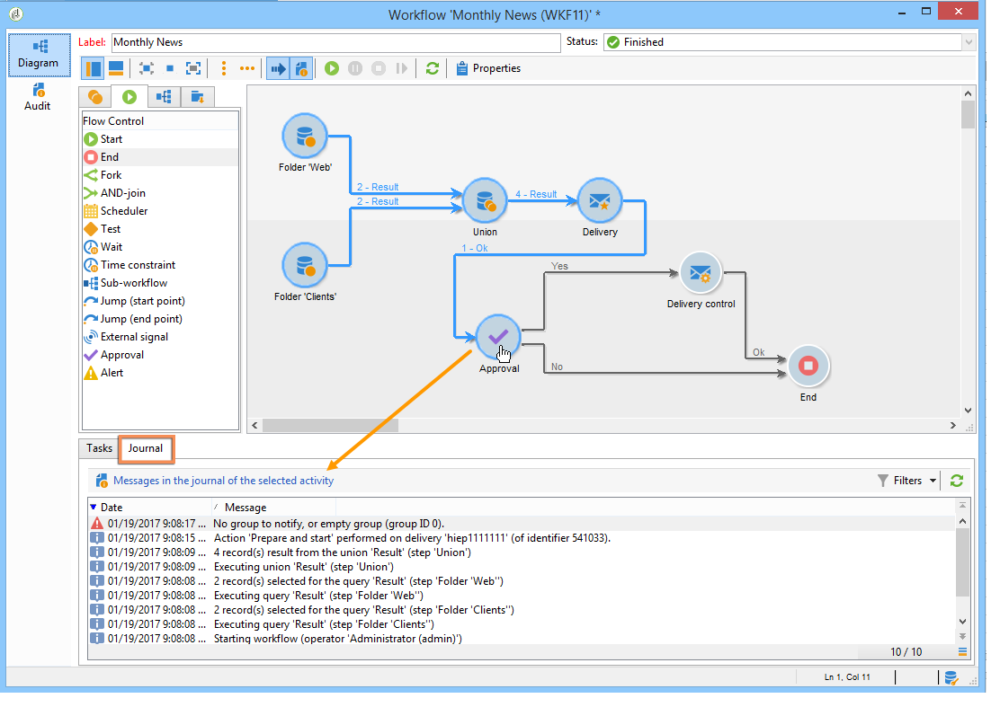
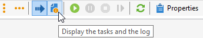
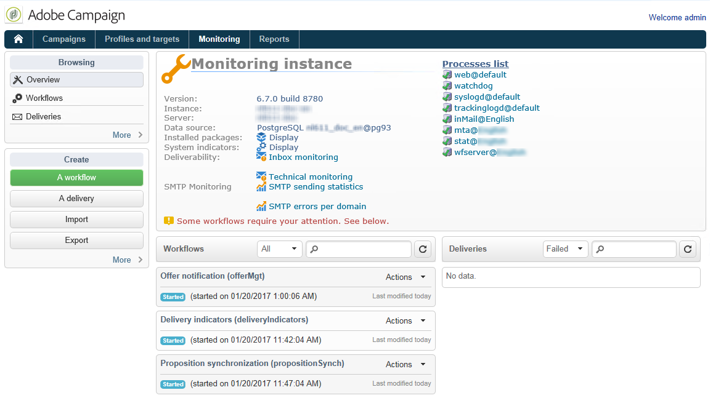

# Monitoraggio dell’esecuzione dei flussi di lavoro {#monitoring-workflow-execution}

Questa sezione presenta informazioni su come monitorare l’esecuzione dei flussi di lavoro.

In [questa sezione](../../workflow/using/supervising-workflows.md#supervising-workflows) è disponibile anche un caso d’uso su come creare un flusso di lavoro che consente di monitorare lo stato di un set di flussi di lavoro che sono &quot;in pausa&quot;, &quot;arrestati&quot; o &quot;con errori&quot;.

Inoltre, gli amministratori dell&#39;istanza possono utilizzare **Audit trail** per controllare le attività e le ultime modifiche apportate ai flussi di lavoro, lo stato dei flussi di lavoro. Per ulteriori informazioni, consulta la sezione [dedicata](../../production/using/audit-trail.md).

In [questa pagina](../../production/using/monitoring-guidelines.md) sono descritti metodi aggiuntivi per monitorare i diversi processi di Campaign.

## Visualizzazione dell&#39;avanzamento {#displaying-progress}

Puoi monitorare l’esecuzione visualizzando l’avanzamento utilizzando l’icona appropriata sulla barra degli strumenti.

L’icona **[!UICONTROL Display progress information]** ti consente di visualizzare lo stato e il risultato dell’attività nella schermata di esecuzione.


Quando questa opzione è selezionata, le attività eseguite sono visualizzate in blu, le attività in sospeso lampeggiano, gli avvisi sono visualizzati in arancione e gli errori in rosso. Questa opzione visualizza anche il risultato delle attività nella relativa transizione in uscita, seguita dall’etichetta del risultato come definito nelle proprietà dell’attività e la durata del processo se supera un secondo


## Visualizzazione dei registri {#displaying-logs}

Il registro contiene la cronologia o il percorso di audit del flusso di lavoro. Registra tutte le azioni utente, tutte le operazioni eseguite e gli errori rilevati. Puoi:

* Seleziona la scheda **[!UICONTROL Tracking]** nel dettaglio. Questo elenco contiene tutti i messaggi del flusso di lavoro.

   

* Filtrare i messaggi di registro per attività. A questo scopo, fai clic su **[!UICONTROL Display the tasks and the log]** nella barra degli strumenti sopra il diagramma per visualizzare le schede **[!UICONTROL Log]** e **[!UICONTROL Tasks]** sotto il diagramma. Seleziona un’attività per visualizzare tutti i messaggi correlati. Questo elenco contiene tutti i messaggi quando non è selezionata alcuna attività.

   

   >[!NOTE]
   >
   >Fai clic sullo sfondo del diagramma per deselezionare tutti gli elementi.

* Visualizzare solo i messaggi collegati a una determinata attività. A questo scopo, seleziona la scheda **[!UICONTROL Tasks]** , quindi seleziona un’attività nel diagramma per limitare l’elenco. Fare doppio clic su un&#39;attività per visualizzare le informazioni; l&#39;ultima scheda della finestra contiene il registro.

   

   Il pulsante **[!UICONTROL Details...]** ti consente di visualizzare tutte le informazioni aggiuntive sull’esecuzione dell’attività. Ad esempio, puoi visualizzare l’operatore di convalida e, se applicabile, il commento immesso durante l’approvazione, come nell’esempio seguente:

   

>[!NOTE]
>
>Il registro non viene eliminato al riavvio di un flusso di lavoro. Tutti i messaggi sono conservati. Se desideri eliminare i messaggi da un’esecuzione precedente, devi eliminare la cronologia.

Il registro mostra l’elenco cronologico dei messaggi di esecuzione relativi alle attività del flusso di lavoro di targeting.

* Registro di una campagna di targeting

   Una volta eseguita una campagna di targeting, fai clic sulla scheda **[!UICONTROL Tracking]** per visualizzare la traccia di esecuzione.

   

   Vengono visualizzati tutti i messaggi della campagna: campagne realizzate, avvisi o errori.

* Registro di un’attività

   Puoi anche visualizzare il registro di esecuzione e i dettagli di ogni attività. Ci sono due modi per farlo:

   1. Seleziona l’attività di destinazione e fai clic sull’icona **[!UICONTROL Display the tasks and the log]** .

      

      La sezione inferiore del diagramma mostra due schede: Log e attività.

      Le attività selezionate all’interno del diagramma fungono da filtri nel registro e nell’elenco delle attività.

      

   1. Fai clic con il pulsante destro del mouse sull’attività di destinazione e seleziona **[!UICONTROL Display logs]**.

      

      Il registro viene visualizzato in una finestra separata.

## Eliminazione dei registri {#purging-the-logs}

La cronologia del flusso di lavoro non viene eliminata automaticamente: tutti i messaggi vengono conservati per impostazione predefinita. La cronologia può essere eliminata dal menu **[!UICONTROL File > Actions]** o facendo clic sul pulsante **[!UICONTROL Actions]** situato nella barra degli strumenti sopra l’elenco. Seleziona **[!UICONTROL Purge history]**. Le opzioni disponibili nel menu **[!UICONTROL Actions]** sono descritte in dettaglio nella sezione [Barra degli strumenti Azioni](../../workflow/using/starting-a-workflow.md) .


## Tabelle di lavoro e schema del flusso di lavoro {#worktables-and-workflow-schema}

Il flusso di lavoro trasmette tabelle di lavoro che possono essere manipolate tramite determinate attività. Adobe Campaign consente, tramite le attività di gestione dei dati, di modificare, rinominare e arricchire le colonne delle tabelle di lavoro del flusso di lavoro, ad esempio per allinearle alla nomenclatura in base alle esigenze del cliente, per la raccolta di informazioni aggiuntive sul co-beneficiario di un contratto, ecc.

È inoltre possibile creare collegamenti tra diverse dimensioni di lavoro e definire modifiche di dimensione. Ad esempio, per ogni contratto registrato nella banca dati, rivolgersi al titolare principale e utilizzare i dati del co-titolare nelle informazioni aggiuntive.

Le tabelle di lavoro del flusso di lavoro vengono eliminate automaticamente quando il flusso di lavoro passa. Se si desidera mantenere una tabella di lavoro, salvarla in un elenco tramite l&#39;attività **[!UICONTROL List update]** (fare riferimento a [Aggiornamento elenco](../../workflow/using/list-update.md)).

## Gestione degli errori {#managing-errors}

Quando si verifica un errore, il flusso di lavoro viene messo in pausa e l’attività che viene eseguita quando si è verificato l’errore lampeggia in rosso. Nella panoramica del flusso di lavoro, sotto il collegamento **[!UICONTROL Monitoring]** scheda **[!UICONTROL Workflows]** , puoi visualizzare solo i flussi di lavoro con errori, come illustrato di seguito.


In Adobe Campaign Explorer, l’elenco dei flussi di lavoro visualizza una colonna **[!UICONTROL Failed]** per impostazione predefinita.


Quando un flusso di lavoro è errato, gli operatori appartenenti al gruppo di supervisione del flusso di lavoro ricevono una notifica tramite e-mail, purché il loro indirizzo e-mail sia elencato nel loro profilo. Questo gruppo viene selezionato nel campo **[!UICONTROL Supervisor(s)]** delle proprietà del flusso di lavoro.


Il contenuto della notifica è configurato nel modello **[!UICONTROL Workflow manager notification]** predefinito: Questo modello viene selezionato nella scheda **[!UICONTROL Execution]** delle proprietà del flusso di lavoro. La notifica mostra il nome del flusso di lavoro degli errori e l’attività interessata.

Esempio di notifica:


Il collegamento consente di accedere alla console Adobe Campaign in modalità Web e di lavorare sul flusso di lavoro degli errori dopo l’accesso.


Puoi configurare il flusso di lavoro in modo che non metta in pausa e continui l’esecuzione in caso di errori. A questo scopo, modifica il flusso di lavoro **[!UICONTROL Properties]** e, nella sezione **[!UICONTROL Error management]**, seleziona l’opzione **[!UICONTROL Ignore]** nel campo **[!UICONTROL In case of error]** . È quindi possibile specificare il numero di errori consecutivi che possono essere ignorati prima della sospensione del processo.

In questo caso, l&#39;attività di errore viene interrotta. Questa modalità è particolarmente adatta ai flussi di lavoro progettati per ripetere la campagna in un secondo momento (azioni periodiche).


>[!NOTE]
>
>Puoi applicare questa configurazione singolarmente per ogni attività. A questo scopo, modifica le proprietà dell’attività e seleziona la modalità di gestione degli errori nella scheda **[!UICONTROL Advanced]** .

Per ulteriori informazioni sulla risoluzione dei problemi di esecuzione dei flussi di lavoro, consulta la sezione [dedicata](../../production/using/workflow-execution.md).

## Errori di elaborazione {#processing-errors}

Per quanto riguarda le attività, l’opzione **[!UICONTROL Process errors]** visualizza una transizione specifica che verrà abilitata se viene generato un errore. In questo caso, il flusso di lavoro non passa alla modalità di errore e l’esecuzione continua.

Gli errori presi in considerazione sono errori del file system (file non spostato, directory non accessibile, ecc.).

Questa opzione non elabora gli errori relativi alla configurazione dell’attività, ovvero i valori non validi. Gli errori relativi alla configurazione errata non abilitano questa transizione (la directory non esiste, ecc.).

Se un flusso di lavoro viene messo in pausa (manualmente o automaticamente dopo un errore), il pulsante **[!UICONTROL Start]** riavvia l’esecuzione del flusso di lavoro dove è stato interrotto. L’attività errata (o attività sospesa) verrà rieseguita. Le attività precedenti non vengono rieseguite.

Per eseguire nuovamente tutte le attività del flusso di lavoro, utilizza il pulsante **[!UICONTROL Restart]** .

Se modifichi attività già eseguite, le modifiche non vengono prese in considerazione al riavvio dell’esecuzione del flusso di lavoro.

Se modifichi le attività non eseguite, vengono prese in considerazione al riavvio dell’esecuzione del flusso di lavoro.

Se modifichi le attività in pausa, non puoi tenere conto delle modifiche correttamente al riavvio del flusso di lavoro.

Se possibile, consigliamo di riavviare completamente il flusso di lavoro dopo aver apportato modifiche.

## Sorveglianza delle istanze {#instance-supervision}

La pagina **[!UICONTROL Instance supervision]** ti consente di visualizzare l’attività del server Adobe Campaign e l’elenco dei flussi di lavoro e delle consegne con errori.

Per accedere a questa pagina, vai alla scheda **[!UICONTROL Monitoring]** e fai clic sul collegamento **[!UICONTROL General view]** .



Per visualizzare tutti i flussi di lavoro, fai clic sul collegamento **[!UICONTROL Workflows]** . Utilizza l’elenco a discesa per visualizzare i flussi di lavoro nella piattaforma in base al loro stato.


Fai clic sul collegamento su un flusso di lavoro con errori per aprirlo e visualizzarne il registro.


## Impedire esecuzioni simultanee multiple {#preventing-simultaneous-multiple-executions}

Un singolo flusso di lavoro può avere diverse esecuzioni in esecuzione contemporaneamente. In alcuni casi è necessario evitare che ciò accada.

Ad esempio, puoi avere una pianificazione che attiva l’esecuzione del flusso di lavoro ogni ora, ma a volte l’esecuzione dell’intero flusso di lavoro richiede più di un’ora. Puoi saltare l’esecuzione se il flusso di lavoro è già in esecuzione.

Se all’inizio del flusso di lavoro è attiva un’attività di segnale, è possibile ignorare il segnale se il flusso di lavoro è in esecuzione.

Il principio generale è il seguente:


La soluzione è quella di utilizzare una variabile di istanza. Le variabili di istanza sono condivise da tutte le esecuzioni parallele dei flussi di lavoro.

Di seguito è riportato un semplice flusso di lavoro di test:


Il **[!UICONTROL Scheduler]** attiva un evento ogni minuto. La seguente attività **[!UICONTROL Test]** sta per testare la variabile di istanza **isRunning** per decidere se continuare o meno l&#39;esecuzione:


>[!NOTE]
>
>**** isRunningè un nome di variabile scelto per questo esempio. Questa non è una variabile incorporata.

L&#39;attività immediatamente successiva al **[!UICONTROL Test]** nel ramo **yes** deve impostare la variabile di istanza nel relativo script **Inizializzazione**:

```
instance.vars.isRunning = true
```

L&#39;ultima attività del ramo **yes** deve ripristinare la variabile su false nel relativo script **Inizializzazione**:

```
instance.vars.isRunning = false
```

Tieni presente che:

* Puoi controllare il valore corrente della variabile di istanza tramite la scheda **Variabili** nel flusso di lavoro **Proprietà**.
* Le variabili di istanza vengono reimpostate al riavvio di un flusso di lavoro.
* In JavaScript, un valore non definito è falso in un test, che consente di testare la variabile di istanza anche prima di inizializzarla.
* Puoi monitorare le attività che non vengono elaborate a causa di questo meccanismo aggiungendo un&#39;istruzione di registrazione allo script di inizializzazione della fine del &quot;no&quot;.

   ```
   logInfo("Workflow already running, parallel execution not allowed.");
   ```

Un caso d’uso è presentato in questa sezione: [Coordinamento degli aggiornamenti dei dati](../../workflow/using/coordinating-data-updates.md).

## Manutenzione del database {#database-maintenance}

I flussi di lavoro utilizzano molte tabelle di lavoro che occupano spazio e finiscono per rallentare l&#39;intera piattaforma se non viene mantenuta. Per ulteriori informazioni sulla manutenzione del database, consulta questa [sezione](../../production/using/tables-to-maintain.md) .

Il flusso di lavoro **Database cleanup** accessibile tramite il nodo **Amministrazione > Produzione > Flussi di lavoro tecnici**, ti consente di eliminare i dati obsoleti per evitare la crescita esponenziale del database. Il flusso di lavoro viene attivato automaticamente senza l’intervento dell’utente. Fare riferimento a questa sezione [sezione](../../production/using/database-cleanup-workflow.md).

È inoltre possibile creare flussi di lavoro tecnici specifici per eliminare lo spazio inutile occupato dai dati. Fai riferimento a questa [sezione](../../production/using/application-objects.md) e a questa [pagina](#purging-the-logs).

## Gestione dei flussi di lavoro in pausa {#handling-of-paused-workflows}

Per impostazione predefinita, se un flusso di lavoro viene messo in pausa, le relative tabelle di lavoro non vengono mai eliminate. Dalla build 8880, i flussi di lavoro che sono stati messi in pausa per troppo tempo vengono automaticamente arrestati e le relative tabelle di lavoro vengono eliminate. Questo comportamento viene attivato come segue:

* I flussi di lavoro interrotti da più di 7 giorni vengono visualizzati come un avviso nel dashboard di monitoraggio (e nell’API di monitoraggio) e viene inviata una notifica al gruppo di supervisori.
* Lo stesso accade ogni settimana, quando viene attivato il flusso di lavoro tecnico **[!UICONTROL cleanupPausedWorkflows]** . Per ulteriori dettagli sul flusso di lavoro, consulta [questa sezione](../../workflow/using/delivery.md).
* Dopo 4 notifiche (ovvero un mese in stato di pausa per impostazione predefinita), il flusso di lavoro viene interrotto incondizionatamente. Dopo l’arresto, nel flusso di lavoro viene visualizzato un registro. Le tabelle vengono eliminate nel flusso di lavoro di esecuzione successiva **[!UICONTROL cleanup]**

Questi periodi possono essere configurati tramite l’opzione NmsServer_PausedWorkflowPeriod .

I supervisori del flusso di lavoro vengono informati. Vengono notificati anche il creatore e l’ultimo utente che ha modificato il flusso di lavoro. Gli amministratori non ricevono le notifiche.

## Filtrare i flussi di lavoro in base al loro stato {#filtering-workflows-status}

L’interfaccia di Campaign Classic ti consente di monitorare lo stato di esecuzione di tutti i flussi di lavoro sull’istanza utilizzando viste **predefinite**. Per accedere a queste visualizzazioni, apri il nodo **[!UICONTROL Administration]** / **[!UICONTROL Audit]** / **[!UICONTROL Workflows Status]** .

Sono disponibili le seguenti visualizzazioni:

* **[!UICONTROL Running]**: elenca tutti i flussi di lavoro in esecuzione.
* **[!UICONTROL Paused]**: elenca tutti i flussi di lavoro in pausa.
* **[!UICONTROL Failed]**: elenca tutti i flussi di lavoro con errore.
* **[!UICONTROL Start Pending]**: elenca tutti i flussi di lavoro in attesa di essere avviati dal processo operationMgt. Questa visualizzazione è disponibile solo con il pacchetto **Campagne di marketing** (consulta [Installazione dei pacchetti incorporati di Campaign](../../installation/using/installing-campaign-standard-packages.md)).


Per impostazione predefinita, queste visualizzazioni sono accessibili nella cartella **[!UICONTROL Audit]** . Tuttavia, è possibile ricrearli nel percorso desiderato nella struttura delle cartelle. In questo modo, saranno disponibili per gli utenti standard senza diritti di amministrazione.

Per eseguire questa operazione:

1. Fare clic con il pulsante destro del mouse sulla cartella in cui si desidera aggiungere la visualizzazione.
1. In **[!UICONTROL Add new folder]** / **[!UICONTROL Administration]**, seleziona la visualizzazione da aggiungere.
1. Una volta aggiunta la cartella alla struttura ad albero, accertati di configurarla come visualizzazione in modo che visualizzi tutti i flussi di lavoro, indipendentemente dalla cartella di origine.Per ulteriori informazioni su come configurare le visualizzazioni, consulta [questa sezione](../../platform/using/access-management-folders.md).

Inoltre, puoi impostare cartelle di filtri che ti consentono di filtrare l’elenco dei flussi di lavoro in base al loro stato di esecuzione. Per eseguire questa operazione:

1. Accedi a una cartella di tipo flusso di lavoro, quindi seleziona il menu **[!UICONTROL Filters]** / **[!UICONTROL Advanced filter]** .
1. Configura il filtro in modo che il campo **[!UICONTROL @status]** del flusso di lavoro sia uguale allo stato scelto.
1. Salva e denomina il filtro. Sarà quindi disponibile direttamente dall’elenco dei filtri.


Per ulteriori informazioni, consulta queste sezioni:

* [Creazione di filtri avanzati](../../platform/using/creating-filters.md#creating-an-advanced-filter)
* [Salvataggio dei filtri](../../platform/using/creating-filters.md#saving-a-filter)
