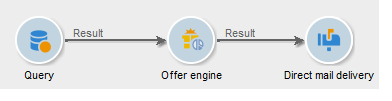

# Motore di offerta{#offer-engine}

Il **[!UICONTROL Offer engine]** attività ti consente di definire una chiamata al motore di offerta prima di una consegna.

Questa attività funziona sullo stesso principio dell’attività di arricchimento con una chiamata al motore, arricchendo i dati della popolazione in entrata con un’offerta calcolata dal motore, prima di una consegna.

Dopo aver configurato la query (consulta questa [sezione](query.md)):

1. Aggiungi e apri un **[!UICONTROL Offer engine]** attività.
1. Completa i vari campi disponibili per specificare i parametri del motore di offerta della chiamata (spazio dell’offerta, categoria o temi, data di contatto, numero di offerte da mantenere). Il motore calcola automaticamente le offerte da aggiungere in base a questi parametri.

   >[!CAUTION]
   >
   >Se utilizzi questa attività, verranno memorizzate solo le proposte di offerta utilizzate nella consegna.

   

1. Quindi configura un’attività di consegna che corrisponde al canale scelto. Fai riferimento a [Consegne cross-channel](cross-channel-deliveries.md).
