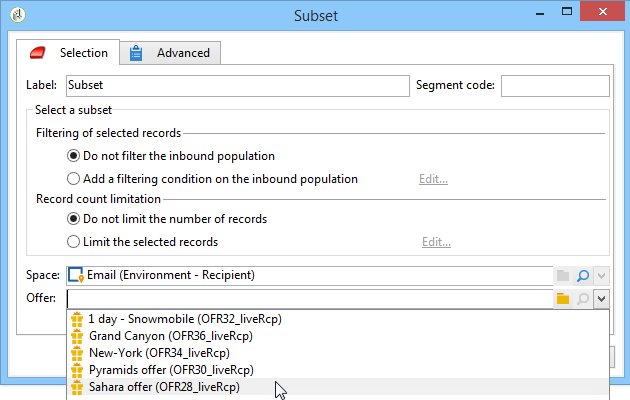

# Offerte per cella{#offers-by-cell}

L&#39;attività **[!UICONTROL Offers by cell]** consente di distribuire la popolazione in entrata (ad esempio da una query) in diversi segmenti e di specificare un&#39;offerta da presentare per ciascuno di questi segmenti.

Questa attività può essere utilizzata solo con **Interaction**. Per ulteriori informazioni, consultare la sezione [sezione](../../interaction/using/about-outbound-channels.md).

Per eseguire questa operazione:

1. Aggiungete l&#39;attività **[!UICONTROL Offers by cell]** una volta specificata la popolazione di destinazione, quindi apritela.
1. Nella scheda **[!UICONTROL General]**, selezionate lo spazio di offerta su cui desiderate presentare le offerte.
1. Nella scheda **[!UICONTROL Cells]**, specificare i diversi sottoinsiemi utilizzando il pulsante **[!UICONTROL Add]**:

   * Specificate la popolazione di sottoinsiemi utilizzando le regole di filtraggio e limitazione disponibili.
   * Selezionate quindi l’offerta da presentare al set secondario. Le offerte disponibili sono quelle idonee per lo spazio di offerta selezionato al passaggio precedente.

      

1. Quindi configurate un&#39;attività di consegna che corrisponda al canale scelto. Fare riferimento a [Consegne tra canali](../../workflow/using/cross-channel-deliveries.md).

