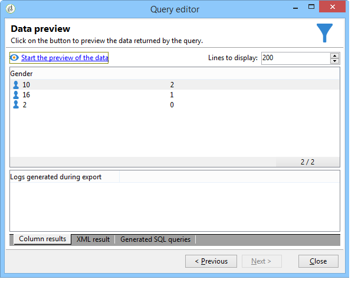

# Esecuzione del calcolo aggregato {#performing-aggregate-computing}

In questo esempio, vogliamo contare il numero di destinatari che vivono a Londra, in base al sesso.

* Quale tabella deve essere selezionata?

   Tabella destinatari (**nms:destinatario**)

* Quali campi devono essere selezionati nella colonna di output?

   Chiave primaria (con conteggio) e Sesso

* A quali condizioni vengono filtrate le informazioni?

   Basato sui destinatari che vivono a Londra

Per creare questo esempio, procedere come segue:

1. In **[!UICONTROL Data to extract]**, definire un conteggio per la chiave primaria (come illustrato nell&#39;esempio precedente). Aggiungete il campo **[!UICONTROL Gender]** nella colonna di output. Selezionare l&#39;opzione **[!UICONTROL Group]** nella colonna **[!UICONTROL Gender]**. In questo modo i destinatari verranno raggruppati per genere.

   

1. Nella finestra **[!UICONTROL Sorting]**, fare clic su **[!UICONTROL Next]**: qui non è necessario effettuare alcuna selezione.
1. Configurare il filtraggio dei dati. Qui si desidera limitare la selezione ai contatti che vivono a Londra.

   

   >[!NOTE]
   >
   >I valori seguono la distinzione tra maiuscole e minuscole. Se il valore &quot;London&quot; viene immesso nella condizione senza lettera maiuscola e l&#39;elenco dei destinatari contiene la parola &quot;London&quot; con una lettera maiuscola, la query non riuscirà.

1. Nella finestra **[!UICONTROL Data formatting]**, fare clic su **[!UICONTROL Next]**: per questo esempio non è richiesta alcuna formattazione.
1. Nella finestra di anteprima, fate clic su **[!UICONTROL Launch data preview]**.

   Esistono tre valori distinti per ciascun ordinamento per genere: **2** per le donne, **1** per gli uomini e **0** quando il genere è sconosciuto. In questo esempio, l&#39;elenco contiene 10 donne, 16 uomini e 2 persone il cui sesso non è noto.

   
