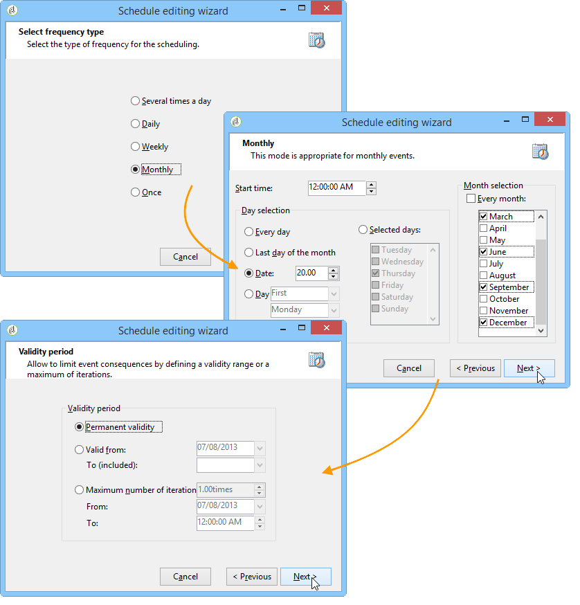

# Aggiornamento dell’elenco trimestrale tramite una query incrementale {#quarterly-list-update}

Nell&#39;esempio seguente viene utilizzata una [query incrementale](incremental-query.md) per aggiornare automaticamente un elenco di destinatari. Questi destinatari sono destinatari delle campagne di marketing stagionali.

Poiché tali campagne sono lanciate all’inizio di ogni stagione per offrire attività sportive pertinenti, tali elenchi sono aggiornati ogni trimestre. Tuttavia, un destinatario in questo caso deve essere oggetto di targeting solo una volta ogni 9 mesi per questa campagna. Questo ti consente di intervallare la frequenza di idoneità del destinatario e di offrire attività per diverse stagioni nel corso degli anni.

1. Aggiungi una query incrementale e un’attività di aggiornamento elenco in un nuovo flusso di lavoro.
1. Configura la scheda **[!UICONTROL Incremental query]** dell&#39;attività come specificato in [Crea una query](query.md#creating-a-query).
1. Selezionare la scheda **[!UICONTROL Scheduling & History]** e quindi specificare una cronologia di 270 giorni. Un destinatario che è già stato oggetto di targeting non sarà più oggetto di targeting per un periodo di 270 giorni, o circa 9 mesi.

   Quindi fare clic sul pulsante **[!UICONTROL Change...]**.

1. Per assicurarsi che l&#39;elenco venga aggiornato prima dell&#39;inizio di ogni stagione, selezionare **[!UICONTROL Monthly]**.
1. Nella schermata successiva, selezionare Marzo, Giugno, Settembre e Dicembre. Scegli il 20 del mese e scegli l’ora in cui desideri avviare il flusso di lavoro.
1. Quindi, seleziona il periodo di validità per la query. Ad esempio, se desideri che questa attività sia attiva in modo permanente, seleziona **[!UICONTROL Permanent validity]**.

   

1. Dopo aver approvato la query incrementale, configura l&#39;attività di aggiornamento dell&#39;elenco come descritto in [Aggiornamento elenco](list-update.md).

Il flusso di lavoro verrà quindi avviato automaticamente poco prima dell&#39;inizio di ogni stagione. L’elenco verrà aggiornato con i nuovi destinatari idonei a ricevere le offerte.
