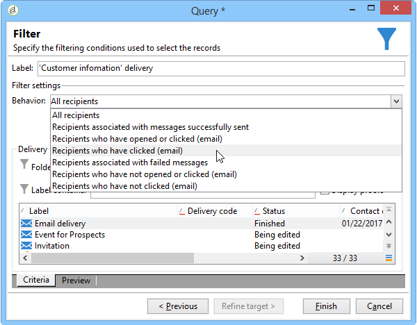
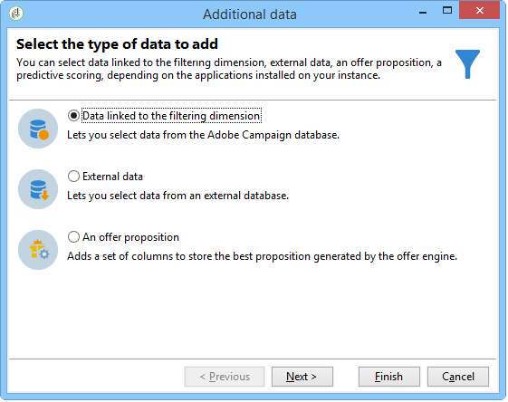
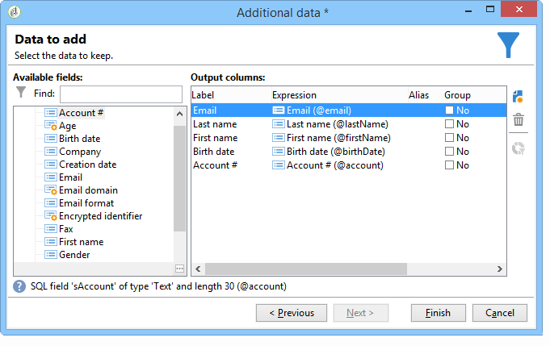
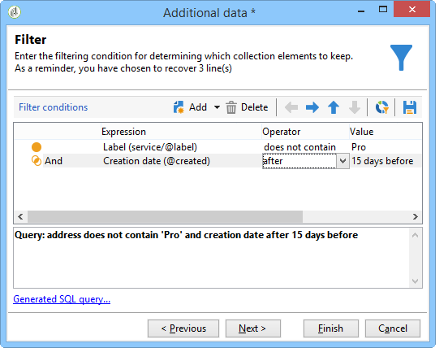

# Query{#query}

## Creazione di una query {#creating-a-query}

Una query consente di selezionare una destinazione in base ai criteri. È possibile associare un codice di segmento al risultato della query e inserirvi dati aggiuntivi.
Per ulteriori informazioni sugli esempi di query, fare riferimento a questa sezione .

>[!NOTE]
>
>Le attività di query non sono compatibili con i campi CLOB quando si utilizza  Oracle.

Per ulteriori informazioni sull&#39;utilizzo e la gestione di dati aggiuntivi, fare riferimento a [Aggiunta di dati](#adding-data).

Il collegamento **[!UICONTROL Edit query...]** consente di definire il tipo di targeting, le restrizioni e i criteri di selezione per la popolazione nel modo seguente:

1. Selezionate la dimensione di targeting e filtro. Per impostazione predefinita, la destinazione è selezionata dai destinatari. L&#39;elenco dei filtri con restrizioni è uguale a quelli utilizzati per il targeting delle consegne.

   La dimensione di targeting coincide con il tipo di elemento su cui lavoreremo, ad esempio la popolazione interessata dall&#39;operazione.

   La dimensione di filtraggio consente di raccogliere questi elementi, ad esempio informazioni relative alla persona interessata (contratti, regolamenti completi e finali, ecc.).

   Per ulteriori informazioni, fare riferimento a [Impostazione del targeting e filtro delle dimensioni](../../workflow/using/building-a-workflow.md#targeting-and-filtering-dimensions).

   

   Una query può essere basata sui dati della transizione in entrata, se necessario, selezionando **[!UICONTROL Temporary schema]** quando si scelgono le dimensioni di targeting e filtro.

   

1. Definire le popolazioni utilizzando la procedura guidata. I campi da immettere possono essere diversi a seconda del tipo di destinazione. Potete visualizzare l&#39;anteprima della popolazione di destinazione con i criteri correnti utilizzando la scheda **[!UICONTROL Preview]**.

   Per ulteriori informazioni sulla creazione e l&#39;utilizzo di filtri o query, consultare la sezione .

   

1. Se al punto 1 avete selezionato **[!UICONTROL Filtering conditions]** o utilizzate l&#39;opzione **[!UICONTROL Filters]** > **[!UICONTROL Advanced filter...]**, in seguito dovrete aggiungere manualmente i criteri di filtro.

   È inoltre possibile aggiungere condizioni di raggruppamento dei dati selezionando la casella corrispondente. A tal fine, la dimensione di filtraggio deve essere diversa dalla dimensione di targeting della query. Per ulteriori informazioni sui raggruppamenti, fare riferimento a questa sezione [sezione](../../workflow/using/querying-using-grouping-management.md).

   È inoltre possibile aggiungere altri criteri utilizzando il generatore di espressioni e combinandolo con le opzioni logiche AND, OR e EXCEPT. Potete quindi visualizzare l&#39;anteprima della **[!UICONTROL Corresponding SQL query...]** per la combinazione di criteri. Per ulteriori informazioni, consultare la sezione [sezione](../../platform/using/defining-filter-conditions.md#building-expressions).

   Salvate il filtro se desiderate riutilizzarlo in un secondo momento.

   

## Aggiunta di dati {#adding-data}

Le colonne aggiuntive consentono di raccogliere informazioni aggiuntive sulla popolazione di destinazione, ad esempio numeri di contratto, iscrizioni a newsletter o origine. Questi dati possono essere memorizzati nel database Adobe Campaign  o in un database esterno.

Il collegamento **[!UICONTROL Add data...]** consente di selezionare i dati aggiuntivi da raccogliere.

Per iniziare, seleziona il tipo di dati da aggiungere:

* Selezionare **[!UICONTROL Data linked to the filtering dimension]** per selezionare i dati nel database Adobe Campaign .
* Selezionare **[!UICONTROL External data]** per aggiungere dati da un database esterno. Questa opzione è disponibile solo se è stata acquistata l&#39;opzione **Federated Data Access**. Per ulteriori informazioni, vedere [Accesso a un database esterno (FDA)](../../workflow/using/accessing-an-external-database--fda-.md).
* Selezionate l&#39;opzione **[!UICONTROL An offer proposition]** per aggiungere un set di colonne che consente di memorizzare la proposta migliore generata dal motore delle offerte. Questa opzione è disponibile solo se è stato acquistato il modulo **Interaction**.

Se sulla piattaforma non è installato alcun modulo opzionale, questa fase non viene visualizzata. Verrai portato direttamente al prossimo stadio.

Per aggiungere dati dal database Adobe Campaign :

1. Selezionare il tipo di dati da aggiungere. Può trattarsi di dati appartenenti alla dimensione filtro o di dati memorizzati in tabelle collegate.

   

1. Se i dati appartengono alla dimensione di filtro della query, è sufficiente selezionarla nell&#39;elenco dei campi disponibili per visualizzarla nelle colonne di output.

   

   È possibile aggiungere:

   * Campo calcolato in base ai dati provenienti dalla popolazione di destinazione o da un aggregato (numero di acquisti in sospeso nell&#39;ultimo mese, importo medio di una ricevuta, ecc.). Ad esempio, passare a [Selezione di dati](../../workflow/using/targeting-data.md#selecting-data).
   * Un nuovo campo creato utilizzando il pulsante **[!UICONTROL Add]** a destra dell&#39;elenco delle colonne di output.

      Puoi anche aggiungere una raccolta di informazioni, ad esempio un elenco di contratti, le ultime 5 consegne, ecc. Le raccolte coincidono con i campi che possono avere più valori per lo stesso profilo (relazione 1-N). Per ulteriori informazioni, consultare [Modifica di dati aggiuntivi](../../workflow/using/targeting-data.md#editing-additional-data).

Per aggiungere una raccolta di informazioni collegate a una popolazione di destinazione:

1. Al primo passaggio della procedura guidata, selezionare l&#39;opzione **[!UICONTROL Data linked to the filtering dimension]**:
1. Selezionare la tabella che contiene le informazioni da raccogliere e fare clic su **[!UICONTROL Next]**.

   

1. Se necessario, specificate il numero di elementi della raccolta che desiderate mantenere selezionando uno dei valori nel campo **[!UICONTROL Data collected]**. Per impostazione predefinita, tutte le righe della raccolta vengono recuperate e filtrate in base alle condizioni specificate nel passaggio seguente.

   * Se un singolo elemento della raccolta coincide con le condizioni di filtro per questa raccolta, selezionare **[!UICONTROL Single row]** nel campo **[!UICONTROL Data collected]**.

      >[!IMPORTANT]
      >
      >Questa modalità ottimizza la query SQL generata grazie a un giunzione diretta sugli elementi della raccolta.
      >
      >Se la condizione iniziale non viene rispettata, il risultato potrebbe essere errato (righe mancanti o sovrapposte).

   * Se si sceglie di recuperare diverse righe (**[!UICONTROL Limit the line count]**) è possibile specificare il numero di righe da raccogliere.
   * Se le colonne raccolte contengono aggregati, ad esempio il numero di guasti dichiarati, la spesa media di un sito, ecc. è possibile utilizzare il valore **[!UICONTROL Aggregates]**.

   

1. Specificate la sottoselezione della raccolta. Ad esempio: acquisti effettuati solo negli ultimi 15 giorni.

   

1. Se avete selezionato l&#39;opzione **[!UICONTROL Limit the line count]**, definite l&#39;ordine in cui i dati raccolti devono essere filtrati. Una volta che il numero di righe raccolte è superiore al numero di righe specificato per mantenere, l&#39;ordine di filtraggio consente di specificare quali righe mantenere.

## Esempio: Targeting su attributi di destinatari semplici {#example--targeting-on-simple-recipient-attributes}

Nell&#39;esempio seguente, la query cerca di identificare gli uomini di età compresa tra i 18 e i 30 anni che vivono in Francia. Questa query verrà utilizzata in un flusso di lavoro allo scopo di renderli ad esempio un&#39;offerta esclusiva.

>[!NOTE]
>
>Altri esempi di query sono presentati in [questa sezione](../../workflow/using/querying-recipient-table.md).

1. Denominate la query e selezionate il collegamento **[!UICONTROL Edit query...]**.
1. Selezionare **[!UICONTROL Filtering conditions]** nell&#39;elenco dei tipi di filtro disponibili.
1. Inserire i diversi criteri per l&#39;obiettivo proposto. Qui i criteri vengono combinati utilizzando l&#39;opzione AND. Per essere inclusi nella selezione, i destinatari dovranno soddisfare le quattro condizioni seguenti:

   * Destinatari il cui titolo è &quot;Mr&quot; (si può trovare anche utilizzando il campo **Genere** e selezionando **Maschio** come valore).
   * Destinatari di età inferiore ai 30 anni.
   * Destinatari con più di 18 anni.
   * Destinatari che vivono in Francia.

   

   È possibile visualizzare l&#39;SQL corrispondente alla combinazione di criteri:

   

1. È possibile verificare che i criteri siano corretti visualizzando in anteprima i destinatari che corrispondono alla query nella scheda corrispondente:

   

1. Salvate i filtri in modo da poterli utilizzare nuovamente in un secondo momento facendo clic su **[!UICONTROL Finish]** > **[!UICONTROL OK]**.
1. Continua a modificare il flusso di lavoro aggiungendoti altre attività. Una volta avviato e completato il passaggio della query precedente, verrà visualizzato il numero di destinatari trovati. Per visualizzare ulteriori dettagli, utilizzate il menu a comparsa del mouse (fate clic con il pulsante destro del mouse sulla transizione > **[!UICONTROL Display the target...]**).

   

## Parametri di output {#output-parameters}

* tableName
* schema
* recCount

Questo insieme di tre valori identifica la popolazione oggetto della query. **[!UICONTROL tableName]** è il nome della tabella che registra gli identificatori di destinazione,  **[!UICONTROL schema]** è lo schema della popolazione (in genere nms:destinatario) ed  **[!UICONTROL recCount]** è il numero di elementi nella tabella.

Questo valore è lo schema della tabella di lavoro. Questo parametro è valido per tutte le transizioni con **[!UICONTROL tableName]** e **[!UICONTROL schema]**.

## Ottimizzazione delle query {#optimizing-queries}

La sezione seguente illustra le procedure ottimali per ottimizzare le query in esecuzione su  Adobe Campaign per limitare il carico di lavoro sul database e migliorare l&#39;esperienza utente.

### Iscrizioni e indici {#joins-and-indexes}

* Le query efficienti si basano sugli indici.
* Utilizzare un indice per tutti i join.
* La definizione dei collegamenti sullo schema determina le condizioni di join. La tabella collegata deve avere un indice univoco sulla chiave primaria e il join deve trovarsi in questo campo.
* Eseguire i join definendo i tasti sui campi numerici anziché sui campi stringa.
* Evitare di eseguire join esterni. Quando possibile, utilizzate il record Zero ID per ottenere la funzionalità di join esterno.
* Utilizzare il tipo di dati corretto per i join.

   Assicurarsi che la clausola `where` sia dello stesso tipo del campo.

   Un errore comune è: `iBlacklist='3'` dove `iBlacklist` è un campo numerico e `3` indica un valore di testo.

   Verificare di conoscere il piano di esecuzione della query. Evitate analisi complete delle tabelle, in particolare per query in tempo reale o query in tempo quasi reale eseguite ogni minuto.

Per ulteriori informazioni, consultare le sezioni [Best practice del modello dati](https://helpx.adobe.com/it/campaign/kb/acc-data-model-best-practices.html) e [Mappatura database](../../configuration/using/database-mapping.md).

### Funzioni {#functions}

* Attenzione a funzioni come `Lower(...)`. Quando si utilizza la funzione Lower, Index non viene utilizzato.
* Controllare attentamente le query utilizzando l&#39;istruzione &quot;like&quot; o le istruzioni &quot;high&quot; o &quot;lower&quot;. Applicate &quot;Upper&quot; all&#39;input dell&#39;utente, non al campo del database.

   Per ulteriori informazioni sulle funzioni, consultare [questa sezione](../../platform/using/defining-filter-conditions.md#list-of-functions).

### Dimensioni filtro {#filtering-dimensions}

Utilizzare la dimensione di filtro della query invece di utilizzare l&#39;operatore &quot;esiste come&quot;.

Nelle query, le condizioni &quot;esiste come&quot; nei filtri non sono efficienti. Sono l&#39;equivalente di una sottoquery in SQL:

`select iRecipientId from nmsRecipient where iRecipientId IN (select iRecipientId from nmsBroadLog where (...))`

È consigliabile utilizzare invece la dimensione di filtraggio della query:

L&#39;equivalente della dimensione filtro in SQL è il join interno:

`select iRecipientId from nmsRecipient INNER JOIN nmsBroadLog ON (...)`

Per ulteriori informazioni sul filtro delle dimensioni, consultare [questa sezione](../../workflow/using/building-a-workflow.md#targeting-and-filtering-dimensions).

### Architettura {#architecture}

* Creare una piattaforma di sviluppo con volumi, parametri e architetture simili come piattaforma di produzione.
* Utilizzate gli stessi valori per gli ambienti di sviluppo e produzione. Per quanto possibile, usate lo stesso:

   * Sistema operativo,
   * Versione,
   * Dati,
   * Applicazione,
   * Volumi.

   >[!NOTE]
   >
   >Una funzione che funziona in un ambiente di sviluppo potrebbe non funzionare in un ambiente di produzione in cui i dati possono essere diversi. Cercate di individuare le principali differenze al fine di anticipare i rischi e preparare soluzioni.

* Configurazioni corrispondenti ai volumi di destinazione. I grandi volumi richiedono configurazioni specifiche. Una configurazione che funzionava per 100.000 destinatari potrebbe non funzionare per 10.000.000 destinatari.

   Considerate come il sistema si ridimensionerà quando sarà attivo. Solo perché qualcosa funziona su piccola scala non significa che sarà adatto con volumi maggiori. La verifica deve essere effettuata con volumi simili al volume in produzione. È inoltre necessario valutare l&#39;effetto delle modifiche nei volumi (numero di chiamate, dimensione del database) nelle ore di picco, nei giorni di picco e per tutta la durata del progetto.
