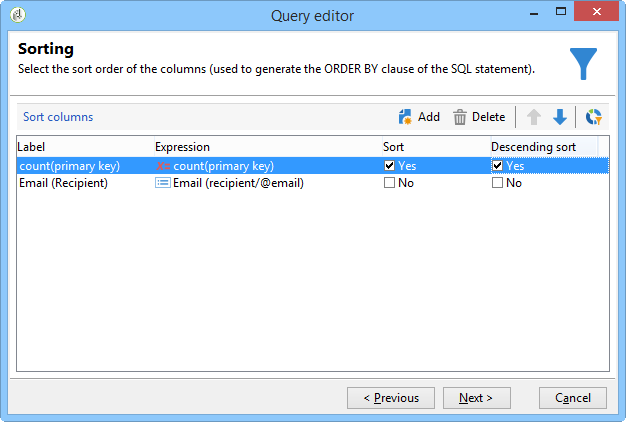
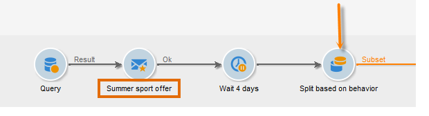

# Query delle informazioni di consegna {#querying-delivery-information}

## Numero di clic per una consegna specifica {#number-of-clicks-for-a-specific-delivery}

In questo esempio, stiamo cercando di recuperare il numero di clic per una consegna specifica. Questi clic vengono registrati grazie ai registri di tracciamento dei destinatari rilevati in un dato periodo. Il destinatario viene identificato tramite il proprio indirizzo e-mail. Questa query utilizza la tabella **[!UICONTROL Recipient tracking logs]**.

* Quale tabella deve essere selezionata?

   Tabella di tracciamento del registro dei destinatari (**[!UICONTROL nms:trackingLogRcp]**)

* Campi da selezionare per le colonne di output?

   Chiave primaria (con conteggio) ed e-mail

* Su quali criteri verranno filtrate le informazioni?

   Un periodo specifico e un elemento dell’etichetta di consegna

Per eseguire questo esempio, esegui i seguenti passaggi:

1. Apri **[!UICONTROL Generic query editor]** e seleziona lo schema **[!UICONTROL Recipient tracking logs]**.

   

1. Nella finestra **[!UICONTROL Data to extract]** vogliamo creare un aggregato per raccogliere le informazioni. A questo scopo, aggiungi la chiave primaria (situata sopra l’elemento principale **[!UICONTROL Recipient tracking logs]** ): Il conteggio dei log di tracciamento viene eseguito in questo campo **[!UICONTROL Primary key]**. L’espressione modificata sarà **[!UICONTROL x=count(primary key)]**. Collega la somma dei vari registri di tracciamento a un singolo indirizzo e-mail.

   Per eseguire questa operazione:

   * Fai clic sull&#39;icona **[!UICONTROL Add]** a destra del campo **[!UICONTROL Output columns]** . Nella finestra **[!UICONTROL Formula type]**, seleziona l’opzione **[!UICONTROL Edit the formula using an expression]** e fai clic su **[!UICONTROL Next]**. Nella finestra **[!UICONTROL Field to select]**, fai clic su **[!UICONTROL Advanced selection]**.

      

   * Nella finestra **[!UICONTROL Formula type]**, esegui un processo sulla funzione di aggregazione. Questo processo sarà un conteggio delle chiavi primarie.

      Seleziona **[!UICONTROL Process on an aggregate function]** nella sezione **[!UICONTROL Aggregate]** e fai clic su **[!UICONTROL Count]**.

      

      Fai clic su **[!UICONTROL Next]**.

   * Selezionare il campo **[!UICONTROL Primary key (@id)]**. La colonna di output **[!UICONTROL count (primary key)]** è configurata.

      

1. Selezionare l’altro campo da visualizzare nella colonna di output. Nella colonna **[!UICONTROL Available fields]**, apri il nodo **[!UICONTROL Recipient]** e scegli **[!UICONTROL Email]**. Seleziona la casella **[!UICONTROL Group]** in **[!UICONTROL Yes]** per raggruppare i registri di tracciamento per indirizzo e-mail: questo gruppo collega ogni registro al relativo destinatario.

   

1. Configura l’ordinamento delle colonne in modo che i destinatari più attivi (con il maggior numero di registri di tracciamento) vengano visualizzati per primi. Seleziona **[!UICONTROL Yes]** nella colonna **[!UICONTROL Descending sort]** .

   

1. Devi quindi filtrare i registri che ti interessano, ovvero quelli che hanno meno di 2 settimane e che riguardano le consegne relative alle vendite.

   Per eseguire questa operazione:

   * Configura il filtro dati. A questo scopo, seleziona **[!UICONTROL Filter conditions]**, quindi fai clic su **[!UICONTROL Next]**.

      

   * Recupera i registri di tracciamento in un dato periodo per una consegna specifica. Sono necessarie tre condizioni di filtraggio: due condizioni di data per impostare il periodo di ricerca tra due settimane prima della data corrente e il giorno precedente la data corrente; e un’altra condizione per limitare la ricerca a una consegna specifica.

      Nella finestra **[!UICONTROL Target element]**, configura la data a partire dalla quale verranno presi in considerazione i registri di tracciamento. Fai clic su **[!UICONTROL Add]**. Viene visualizzata una riga di condizione. Modifica la colonna **[!UICONTROL Expression]** facendo clic sulla funzione **[!UICONTROL Edit expression]** . Nella finestra **[!UICONTROL Field to select]**, scegli **[!UICONTROL Date (@logDate)]**.

      

      Seleziona l’operatore **[!UICONTROL greater than]** . Nella colonna **[!UICONTROL Value]** fare clic su **[!UICONTROL Edit expression]** e nella finestra **[!UICONTROL Formula type]** selezionare **[!UICONTROL Process on dates]**. Infine, in **[!UICONTROL Current date minus n days]**, inserisci &quot;15&quot;.

      Fai clic su **[!UICONTROL Finish]**.

      

   * Per selezionare la data di fine della ricerca del registro di tracciamento, crea una seconda condizione facendo clic su **[!UICONTROL Add]**. Nella colonna **[!UICONTROL Expression]**, scegli di nuovo **[!UICONTROL Date (@logDate)]**.

      Seleziona l’operatore **[!UICONTROL less than]** . Nella colonna **[!UICONTROL Value]**, fai clic su **[!UICONTROL Edit expression]**. Per l&#39;elaborazione della data, vai alla finestra **[!UICONTROL Formula type]** e immetti &quot;1&quot; in **[!UICONTROL Current date minus n days]**.

      Fai clic su **[!UICONTROL Finish]**.

      

      Ora vogliamo configurare la terza condizione di filtro, ovvero l’etichetta di consegna che riguarda la nostra query.

   * Fai clic sulla funzione **[!UICONTROL Add]** per creare un’altra condizione di filtro. Nella colonna **[!UICONTROL Expression]**, fai clic su **[!UICONTROL Edit expression]**. Nella finestra **[!UICONTROL Field to select]**, scegli **[!UICONTROL Label]** nel nodo **[!UICONTROL Delivery]**.

      Fai clic su **[!UICONTROL Finish]**.

      

      Cerca una consegna contenente la parola &quot;vendite&quot;. Poiché non si ricorda l&#39;etichetta esatta, è possibile scegliere l&#39;operatore **[!UICONTROL contains]** e inserire &quot;sales&quot; nella colonna **[!UICONTROL Value]**.

      

1. Fare clic su **[!UICONTROL Next]** fino a quando non si accede alla finestra **[!UICONTROL Data preview]**: non è necessaria alcuna formattazione.
1. Nella finestra **[!UICONTROL Data preview]** , fai clic su **[!UICONTROL Start the preview of the data]** per visualizzare il numero di registri di tracciamento per ciascun destinatario della consegna.

   Il risultato viene visualizzato in ordine decrescente.

   

   Il numero massimo di registri per un utente è 6 per questa consegna. 5 utenti diversi hanno aperto l’e-mail di consegna o hanno fatto clic su uno dei collegamenti nell’e-mail.

## Destinatari che non hanno aperto alcuna consegna {#recipients-who-did-not-open-any-delivery}

In questo esempio, vogliamo filtrare i destinatari che non hanno aperto un’e-mail negli ultimi 7 giorni.

Per creare questo esempio, esegui i seguenti passaggi:

1. Trascina e rilascia un’attività **[!UICONTROL Query]** in un flusso di lavoro e apri l’attività.
1. Fai clic su **[!UICONTROL Edit query]** e imposta le dimensioni di destinazione e filtro su **[!UICONTROL Recipients]**.

   

1. Seleziona **[!UICONTROL Filtering conditions]**, quindi fai clic su **[!UICONTROL Next]**.
1. Fai clic sul pulsante **[!UICONTROL Add]** e seleziona **[!UICONTROL Tracking logs]**.
1. Imposta **[!UICONTROL Operator]** dell&#39;espressione **[!UICONTROL Tracking logs]** su **[!UICONTROL Do not exist such as]**.

   

1. Aggiungi un’altra espressione. Selezionare **[!UICONTROL Type]** nella categoria **[!UICONTROL URL]**.
1. Quindi, imposta il **[!UICONTROL Operator]** su **[!UICONTROL equal to]** e il relativo **[!UICONTROL Value]** su **[!UICONTROL Open]**.

   

1. Aggiungi un’altra espressione e seleziona **[!UICONTROL Date]**. **[!UICONTROL Operator]** deve essere impostato su  **[!UICONTROL on or after]**.

   

1. Per impostare il valore degli ultimi 7 giorni, fare clic sul pulsante **[!UICONTROL Edit expression]** nel campo **[!UICONTROL Value]** .
1. Nella categoria **[!UICONTROL Function]** , seleziona **[!UICONTROL Current date minus n days]** e aggiungi il numero di giorni di destinazione. In questo caso, vogliamo mirare agli ultimi 7 giorni.

   

La transizione in uscita conterrà i destinatari che non hanno aperto un’e-mail negli ultimi 7 giorni.

Se invece desideri filtrare i destinatari che hanno aperto almeno un’e-mail, la query deve essere la seguente. In questo caso, il valore **[!UICONTROL Filtering dimension]** deve essere impostato su **[!UICONTROL Tracking logs (Recipients)]**.

## Destinatari che hanno aperto una consegna {#recipients-who-have-opened-a-delivery}

L’esempio seguente mostra come eseguire il targeting dei profili che hanno aperto una consegna nelle ultime 2 settimane:

1. Per eseguire il targeting dei profili che hanno aperto una consegna, devi utilizzare i registri di tracciamento. sono memorizzati in una tabella collegata: per iniziare, seleziona questa tabella nell’elenco a discesa del campo **[!UICONTROL Filtering dimension]** , come illustrato di seguito:

   

1. Per quanto riguarda le condizioni di filtro, fai clic sull’icona **[!UICONTROL Edit expression]** dei criteri mostrati nella struttura ad albero secondaria dei registri di tracciamento. Selezionare il campo **[!UICONTROL Date]**.

   

   Fai clic su **[!UICONTROL Finish]** per confermare la selezione.

   Per recuperare solo i registri di tracciamento di meno di due settimane, seleziona l’operatore **[!UICONTROL Greater than]** .

   

   Quindi fai clic sull&#39;icona **[!UICONTROL Edit expression]** nella colonna **[!UICONTROL Value]** per definire la formula di calcolo da applicare. Selezionare la formula **[!UICONTROL Current date minus n days]** e immettere 15 nel campo correlato.

   

   Fare clic sul pulsante **[!UICONTROL Finish]** della finestra della formula. Nella finestra di filtro, fai clic sulla scheda **[!UICONTROL Preview]** per controllare i criteri di targeting.

   

## Filtrare il comportamento dei destinatari dopo una consegna {#filtering-recipients--behavior-folllowing-a-delivery}

In un flusso di lavoro, le caselle **[!UICONTROL Query]** e **[!UICONTROL Split]** consentono di selezionare un comportamento dopo una consegna precedente. Questa selezione viene eseguita tramite il filtro **[!UICONTROL Delivery recipient]** .

* Obiettivo dell&#39;esempio

   In un flusso di lavoro di consegna, sono disponibili diversi modi per monitorare una prima comunicazione e-mail. Questo tipo di operazione comporta l&#39;utilizzo della casella **[!UICONTROL Split]**.

* Contesto

   Viene inviata una consegna &quot;Offerta sportiva estiva&quot;. Quattro giorni dopo la consegna, vengono inviate altre due consegne. Una di queste è &quot;offerta di sport acquatici&quot;, l&#39;altra è un follow-up alla prima consegna &quot;Offerta di sport estivi&quot;.

   La consegna &quot;Offerta di sport acquatici&quot; viene inviata ai destinatari che hanno fatto clic sul link &quot;Sport acquatici&quot; nella prima consegna. Questi clic mostrano che il destinatario è interessato all’argomento. Ha senso indirizzarli verso offerte simili. Tuttavia, i destinatari che non hanno fatto clic nell’&quot;offerta sportiva estiva&quot; riceveranno di nuovo lo stesso contenuto.

I passaggi seguenti mostrano come configurare la casella **[!UICONTROL Split]** integrando due comportamenti diversi:

1. Inserisci la casella **[!UICONTROL Split]** nel flusso di lavoro. Questa casella suddivide i destinatari della prima consegna in due consegne successive. La suddivisione si verifica in base alle condizioni di filtro collegate al comportamento del destinatario durante la prima consegna.

   

1. Apri la casella **[!UICONTROL Split]** . Nella scheda **[!UICONTROL General]** , immetti un’etichetta: **Dividi in base al comportamento**, ad esempio.

   

1. Nella scheda **[!UICONTROL Subsets]** , definisci il primo ramo diviso. Ad esempio, immetti l’etichetta **Clic** per questo ramo.
1. Selezionare l&#39;opzione **[!UICONTROL Add a filtering condition on the incoming population]**. Fai clic su **[!UICONTROL Edit]**.
1. Nella finestra **[!UICONTROL Targeting and filtering dimension]** fare doppio clic sul filtro **[!UICONTROL Recipients of a delivery]**.

   

1. Nella finestra **[!UICONTROL Target element]**, seleziona il comportamento da applicare a questo ramo: **[!UICONTROL Recipients having clicked (email)]**.

   Di seguito, seleziona l’opzione **[!UICONTROL Delivery specified by the transition]** . Questa funzionalità ripristina automaticamente le persone target durante la prima consegna.

   Questa è la consegna &quot;Offerta Sport acquatici&quot;.

   

1. Definire il secondo ramo. Questo ramo includerà l’e-mail di follow-up con lo stesso contenuto della prima consegna. Vai alla scheda **[!UICONTROL Subsets]** e fai clic su **[!UICONTROL Add]** per crearla.

   

1. Viene visualizzata un’altra sottoscheda. Assegnare il nome &quot;**Non fare clic su**&quot;.
1. Fai clic su **[!UICONTROL Add a filtering condition for the incoming population]**. Quindi fai clic su **[!UICONTROL Edit...]**.

   

1. Fare clic su **[!UICONTROL Delivery recipients]** nella finestra **[!UICONTROL Targeting and filtering dimension]**.
1. Nella finestra **[!UICONTROL Target element]**, selezionare il comportamento **[!UICONTROL Recipients who did not click (email)]**. Seleziona l’opzione **[!UICONTROL Delivery specified by the transition]** come mostrato per l’ultimo ramo.

   La casella **[!UICONTROL Split]** è ora completamente configurata.

   

Di seguito è riportato l’elenco dei vari componenti configurati per impostazione predefinita:

* **[!UICONTROL All recipients]**
* **[!UICONTROL Recipients of successfully sent messages,]**
* **[!UICONTROL Recipients who opened or clicked (email),]**
* **[!UICONTROL Recipients who clicked (email),]**
* **[!UICONTROL Recipients of a failed message,]**
* **[!UICONTROL Recipients who didn't open or click (email),]**
* **[!UICONTROL Recipients who didn't click (email).]**

   
