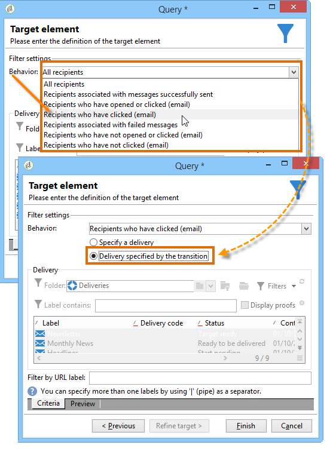

# Query delle informazioni di consegna {#querying-delivery-information}

## Numero di clic per una consegna specifica {#number-of-clicks-for-a-specific-delivery}

In questo esempio, stiamo cercando di recuperare il numero di clic per una consegna specifica. Questi clic vengono registrati grazie ai registri di monitoraggio dei destinatari registrati in un determinato periodo. Il destinatario viene identificato tramite il proprio indirizzo e-mail. Questa query utilizza la **[!UICONTROL Recipient tracking logs]** tabella.

* Quale tabella deve essere selezionata?

   Tabella di tracciamento del registro del destinatario (**[!UICONTROL nms:trackingLogRcp]**)

* Campi da selezionare per le colonne di output?

   Chiave primaria (con conteggio) e E-mail

* Su quali criteri verranno filtrate le informazioni?

   Un periodo specifico e un elemento dell&#39;etichetta di consegna

Per eseguire questo esempio, eseguire i seguenti passaggi:

1. Aprire **[!UICONTROL Generic query editor]** e selezionare lo **[!UICONTROL Recipient tracking logs]** schema.

   

1. Nella **[!UICONTROL Data to extract]** finestra, vogliamo creare un aggregato per raccogliere le informazioni. A questo scopo, aggiungete la chiave primaria (situata sopra l’ **[!UICONTROL Recipient tracking logs]** elemento principale): Il conteggio dei log di tracciamento viene eseguito in questo **[!UICONTROL Primary key]** campo. L&#39;espressione modificata sarà **[!UICONTROL x=count(primary key)]**. Collega la somma dei vari registri di tracciamento a un unico indirizzo e-mail.

   Per eseguire questa operazione:

   * Fare clic sull&#39; **[!UICONTROL Add]** icona a destra del **[!UICONTROL Output columns]** campo. Nella **[!UICONTROL Formula type]** finestra, selezionate l’ **[!UICONTROL Edit the formula using an expression]** opzione e fate clic su **[!UICONTROL Next]**. In the **[!UICONTROL Field to select]** window, click **[!UICONTROL Advanced selection]**.

      

   * Nella **[!UICONTROL Formula type]** finestra, eseguire un processo sulla funzione di aggregazione. Questo processo sarà un conteggio delle chiavi primarie.

      Selezionate **[!UICONTROL Process on an aggregate function]** nella **[!UICONTROL Aggregate]** sezione e fate clic su **[!UICONTROL Count]**.

      

      Fai clic su **[!UICONTROL Next]**.

   * Selezionare il **[!UICONTROL Primary key (@id)]** campo. La colonna **[!UICONTROL count (primary key)]** di output è configurata.

      

1. Selezionare l&#39;altro campo da visualizzare nella colonna di output. Nella **[!UICONTROL Available fields]** colonna, aprite il **[!UICONTROL Recipient]** nodo e scegliete **[!UICONTROL Email]**. Selezionate la **[!UICONTROL Group]** casella per **[!UICONTROL Yes]** raggruppare i registri di tracciamento per indirizzo e-mail: questo gruppo collega ogni registro al destinatario.

   

1. Configura l’ordinamento delle colonne in modo che vengano visualizzati per primi i destinatari più attivi (con il maggior numero di registri di tracciamento). Controlla **[!UICONTROL Yes]** nella **[!UICONTROL Descending sort]** colonna.

   

1. Devi quindi filtrare i registri che ti interessano, vale a dire quelli che hanno meno di 2 settimane e che riguardano le consegne relative alle vendite.

   Per eseguire questa operazione:

   * Configurare il filtraggio dei dati. A tale scopo, selezionare **[!UICONTROL Filter conditions]** quindi fare clic su **[!UICONTROL Next]**.

      

   * Recupero dei registri di monitoraggio in un determinato periodo per una consegna specifica. Sono necessarie tre condizioni di filtraggio: due condizioni di data per impostare il periodo di ricerca tra due settimane prima della data corrente e il giorno prima della data corrente; e un&#39;altra condizione per limitare la ricerca a una consegna specifica.

      Nella **[!UICONTROL Target element]** finestra, configura la data a partire dalla quale verranno presi in considerazione i registri di tracciamento. Fai clic su **[!UICONTROL Add]**. Viene visualizzata una linea di condizione. Modificare la **[!UICONTROL Expression]** colonna facendo clic sulla **[!UICONTROL Edit expression]** funzione. Nella **[!UICONTROL Field to select]** finestra, scegliete **[!UICONTROL Date (@logDate)]**.

      

      Selezionare l&#39; **[!UICONTROL greater than]** operatore. Nella **[!UICONTROL Value]** colonna fare clic **[!UICONTROL Edit expression]** e nella **[!UICONTROL Formula type]** finestra selezionare **[!UICONTROL Process on dates]**. Infine, in **[!UICONTROL Current date minus n days]**, immettete &quot;15&quot;.

      Fai clic su **[!UICONTROL Finish]**.

      

   * Per selezionare la data di fine della ricerca nel registro di tracciamento, crea una seconda condizione facendo clic su **[!UICONTROL Add]**. Nella **[!UICONTROL Expression]** colonna, scegliete di **[!UICONTROL Date (@logDate)]** nuovo.

      Selezionare l&#39; **[!UICONTROL less than]** operatore. In the **[!UICONTROL Value]** column, click **[!UICONTROL Edit expression]**. Per l&#39;elaborazione della data, andate alla **[!UICONTROL Formula type]** finestra e immettete &quot;1&quot; in **[!UICONTROL Current date minus n days]**.

      Fai clic su **[!UICONTROL Finish]**.

      

      Ora vogliamo configurare la terza condizione del filtro, ovvero l&#39;etichetta di consegna che la nostra query solleva.

   * Fare clic sulla **[!UICONTROL Add]** funzione per creare un&#39;altra condizione di filtro. In the **[!UICONTROL Expression]** column, click **[!UICONTROL Edit expression]**. Nella **[!UICONTROL Field to select]** finestra, scegliete **[!UICONTROL Label]** nel **[!UICONTROL Delivery]** nodo.

      Fai clic su **[!UICONTROL Finish]**.

      

      Cercare una consegna contenente la parola &quot;sales&quot;. Poiché non si ricorda l&#39;etichetta esatta, è possibile scegliere l&#39; **[!UICONTROL contains]** operatore e inserire &quot;sales&quot; nella **[!UICONTROL Value]** colonna.

      

1. Fate clic **[!UICONTROL Next]** fino a raggiungere la **[!UICONTROL Data preview]** finestra: qui non è necessaria alcuna formattazione.
1. Nella **[!UICONTROL Data preview]** finestra, fai clic **[!UICONTROL Start the preview of the data]** per visualizzare il numero di registri di tracciamento per ciascun destinatario della consegna.

   Il risultato viene visualizzato in ordine decrescente.

   

   Il numero massimo di registri per un utente è 6 per questa consegna. 5 diversi utenti hanno aperto il messaggio e-mail di consegna o hanno fatto clic su uno dei collegamenti presenti nell’e-mail.

## Destinatari che non hanno aperto alcuna consegna {#recipients-who-did-not-open-any-delivery}

In questo esempio, vogliamo filtrare i destinatari che non hanno aperto un messaggio e-mail negli ultimi 7 giorni.

Per creare questo esempio, procedere come segue:

1. Trascinate e rilasciate un&#39; **[!UICONTROL Query]** attività in un flusso di lavoro e aprite l&#39;attività.
1. Fate clic **[!UICONTROL Edit query]** e impostate le dimensioni di destinazione e di filtro su **[!UICONTROL Recipients]**.

   

1. Selezionate **[!UICONTROL Filtering conditions]** quindi fate clic su **[!UICONTROL Next]**.
1. Click the **[!UICONTROL Add]** button and select **[!UICONTROL Tracking logs]**.
1. Impostate l&#39; **[!UICONTROL Operator]** espressione su **[!UICONTROL Tracking logs]** **[!UICONTROL Do not exist such as]**.

   

1. Aggiungete un&#39;altra espressione. Selezionare **[!UICONTROL Type]** nella **[!UICONTROL URL]** categoria.
1. Quindi, impostare **[!UICONTROL Operator]** su **[!UICONTROL equal to]** e **[!UICONTROL Value]** su **[!UICONTROL Open]**.

   

1. Aggiungete un&#39;altra espressione e selezionate **[!UICONTROL Date]**. **[!UICONTROL Operator]** deve essere impostato su **[!UICONTROL on or after]**.

   

1. Per impostare il valore degli ultimi 7 giorni, fare clic sul **[!UICONTROL Edit expression]** pulsante nel **[!UICONTROL Value]** campo.
1. Nella **[!UICONTROL Function]** categoria, selezionate **[!UICONTROL Current date minus n days]** e aggiungete il numero di giorni di destinazione. Qui vogliamo concentrarci sugli ultimi 7 giorni.

   

La transizione in uscita conterrà i destinatari che non hanno aperto un messaggio e-mail negli ultimi 7 giorni.

Se invece si desidera filtrare i destinatari che hanno aperto almeno un messaggio e-mail, la query deve essere la seguente. Si prega di notare che, in questo caso, **[!UICONTROL Filtering dimension]** dovrebbe essere impostato su **[!UICONTROL Tracking logs (Recipients)]**.

## Destinatari che hanno aperto una consegna {#recipients-who-have-opened-a-delivery}

L&#39;esempio seguente mostra come eseguire il targeting dei profili che hanno aperto una consegna nelle ultime 2 settimane:

1. Per eseguire il targeting dei profili che hanno aperto una consegna, è necessario utilizzare i registri di tracciamento. sono memorizzati in una tabella collegata: per iniziare, seleziona questa tabella nell’elenco a discesa del **[!UICONTROL Filtering dimension]** campo, come illustrato di seguito:

   

1. Per quanto riguarda le condizioni di filtraggio, fate clic sull’ **[!UICONTROL Edit expression]** icona dei criteri visualizzati nella struttura ad albero secondaria dei registri di tracciamento. Selezionare il **[!UICONTROL Date]** campo.

   

   Click **[!UICONTROL Finish]** to confirm selection.

   Per recuperare solo i registri di monitoraggio di meno di due settimane, selezionare l&#39; **[!UICONTROL Greater than]** operatore.

   

   Fare clic sull&#39; **[!UICONTROL Edit expression]** icona nella **[!UICONTROL Value]** colonna per definire la formula di calcolo da applicare. Selezionare la **[!UICONTROL Current date minus n days]** formula e immettere 15 nel campo correlato.

   

   Fare clic sul **[!UICONTROL Finish]** pulsante della finestra della formula. Nella finestra di filtro, fate clic sulla **[!UICONTROL Preview]** scheda per controllare i criteri di targeting.

   

## Filtrare il comportamento dei destinatari dopo la consegna {#filtering-recipients--behavior-folllowing-a-delivery}

In un flusso di lavoro, le **[!UICONTROL Query]** e **[!UICONTROL Split]** le caselle consentono di selezionare un comportamento dopo una consegna precedente. Questa selezione viene effettuata tramite il **[!UICONTROL Delivery recipient]** filtro.

* Obiettivo dell&#39;esempio

   In un flusso di lavoro di distribuzione, esistono diversi modi per monitorare una prima comunicazione e-mail. Questo tipo di operazione prevede l&#39;uso della **[!UICONTROL Split]** casella.

* Contesto

   Viene inviata una consegna &quot;Offerta sportiva estiva&quot;. Quattro giorni dopo la consegna, vengono inviate altre due consegne. Uno di questi è &quot;offerta di sport acquatici&quot;, l&#39;altro è un seguito alla prima &quot;offerta sportiva estiva&quot; consegna.

   La consegna &quot;Offerta Sport acquatici&quot; viene inviata ai destinatari che hanno fatto clic sul collegamento &quot;Sport acquatici&quot; nella prima consegna. Questi clic mostrano che il destinatario è interessato all&#39;argomento. Ha senso indirizzarli verso offerte simili. Tuttavia, i destinatari che non hanno cliccato nell&#39;&quot;offerta sportiva estiva&quot; riceveranno di nuovo lo stesso contenuto.

La procedura seguente illustra come configurare la **[!UICONTROL Split]** casella integrando due diversi comportamenti:

1. Inserite la **[!UICONTROL Split]** casella nel flusso di lavoro. Questa casella consente di suddividere i destinatari della prima consegna nelle due consegne successive. La suddivisione si verifica in base alle condizioni di filtraggio collegate al comportamento del destinatario durante la prima consegna.

   

1. Aprite la **[!UICONTROL Split]** scatola. Nella **[!UICONTROL General]** scheda, immettere un&#39;etichetta: **Dividi in base al comportamento** , ad esempio.

   

1. Nella **[!UICONTROL Subsets]** scheda, definire il primo ramo diviso. Ad esempio, immettere l&#39;etichetta **Clic** per il ramo.
1. Select the **[!UICONTROL Add a filtering condition on the incoming population]** option. Click **[!UICONTROL Edit]**.
1. Nella **[!UICONTROL Targeting and filtering dimension]** finestra, fate doppio clic sul **[!UICONTROL Recipients of a delivery]** filtro.

   

1. Nella **[!UICONTROL Target element]** finestra, selezionate il comportamento che desiderate applicare a questo ramo: **[!UICONTROL Recipients having clicked (email)]**.

   Sotto, selezionate l’ **[!UICONTROL Delivery specified by the transition]** opzione. Questa funzionalità recupererà automaticamente le persone di destinazione durante la prima consegna.

   Questa è la consegna &quot;Offerta Sport acquatici&quot;.

   

1. Definire il secondo ramo. Questo ramo includerà l&#39;e-mail di follow-up con lo stesso contenuto del primo invio. Passate alla **[!UICONTROL Subsets]** scheda e fate clic **[!UICONTROL Add]** per crearla.

   

1. Viene visualizzata un&#39;altra sottoscheda. Denominatelo &quot;**Not click**&quot;.
1. Fai clic su **[!UICONTROL Add a filtering condition for the incoming population]**. Quindi fai clic su **[!UICONTROL Edit...]**.

   

1. Fate clic **[!UICONTROL Delivery recipients]** nella **[!UICONTROL Targeting and filtering dimension]** finestra.
1. Nella **[!UICONTROL Target element]** finestra, selezionare il **[!UICONTROL Recipients who did not click (email)]** comportamento. Selezionate l’ **[!UICONTROL Delivery specified by the transition]** opzione come mostrato per l’ultimo ramo.

   La **[!UICONTROL Split]** casella è ora completamente configurata.

   

Di seguito è riportato l’elenco dei vari componenti configurati per impostazione predefinita:

* **[!UICONTROL All recipients]**
* **[!UICONTROL Recipients of successfully sent messages,]**
* **[!UICONTROL Recipients who opened or clicked (email),]**
* **[!UICONTROL Recipients who clicked (email),]**
* **[!UICONTROL Recipients of a failed message,]**
* **[!UICONTROL Recipients who didn't open or click (email),]**
* **[!UICONTROL Recipients who didn't click (email).]**

   
